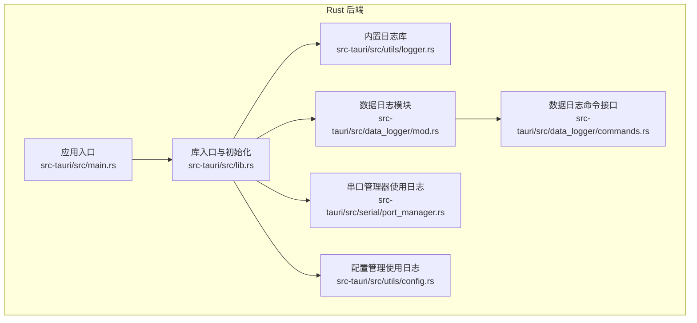
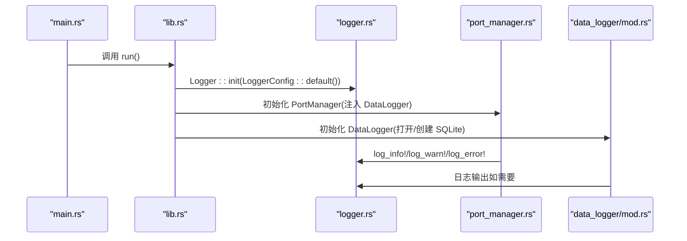
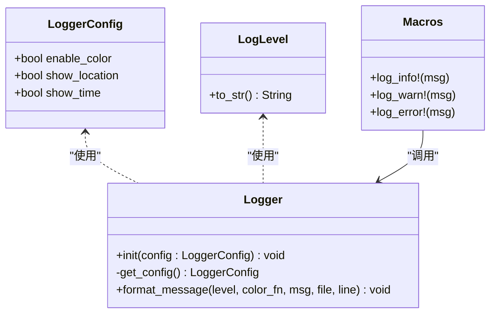
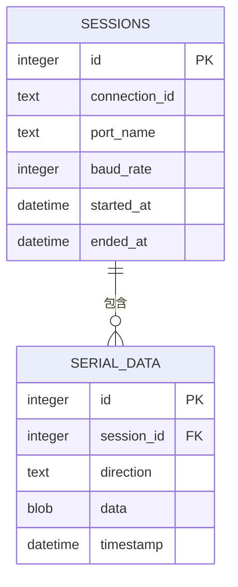
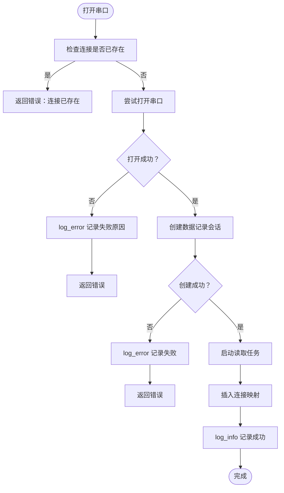
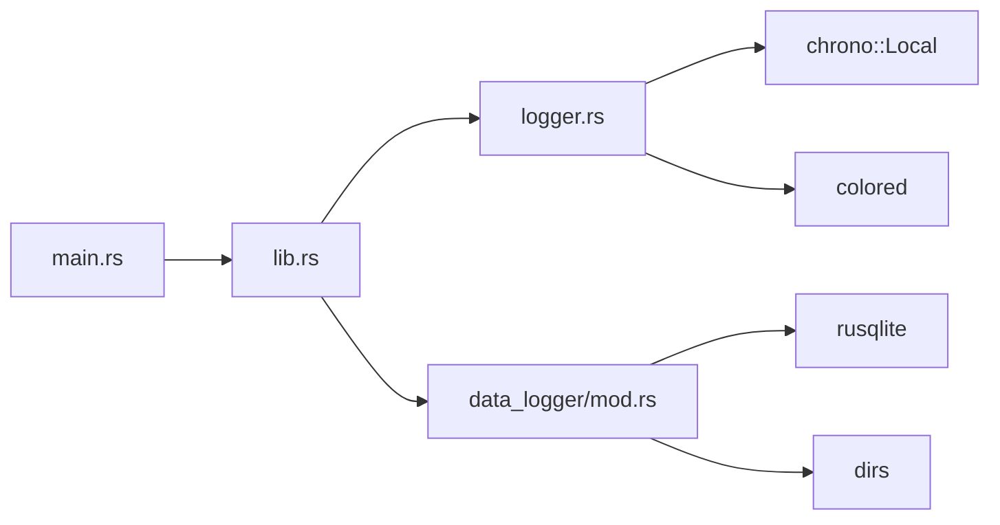

# 日志系统

<cite>
**本文引用的文件**
- [src-tauri/src/utils/logger.rs](file://src-tauri/src/utils/logger.rs)
- [src-tauri/src/lib.rs](file://src-tauri/src/lib.rs)
- [src-tauri/src/main.rs](file://src-tauri/src/main.rs)
- [src-tauri/src/data_logger/mod.rs](file://src-tauri/src/data_logger/mod.rs)
- [src-tauri/src/data_logger/commands.rs](file://src-tauri/src/data_logger/commands.rs)
- [src-tauri/src/serial/port_manager.rs](file://src-tauri/src/serial/port_manager.rs)
- [src-tauri/src/utils/config.rs](file://src-tauri/src/utils/config.rs)
- [src-tauri/Cargo.toml](file://src-tauri/Cargo.toml)
</cite>

## 目录
1. [简介](#简介)
2. [项目结构](#项目结构)
3. [核心组件](#核心组件)
4. [架构总览](#架构总览)
5. [详细组件分析](#详细组件分析)
6. [依赖关系分析](#依赖关系分析)
7. [性能考虑](#性能考虑)
8. [故障排查指南](#故障排查指南)
9. [结论](#结论)
10. [附录](#附录)

## 简介
本文件面向 KonSerial 的日志系统，聚焦以下方面进行系统化说明：
- 日志级别设计与使用场景：当前实现包含 INFO、WARN、ERROR 三档级别，用于区分普通信息、警告与错误。
- 过滤机制：当前日志库未实现运行时级别过滤；建议通过外部日志框架扩展或在宏中增加条件判断。
- 输出格式：时间戳、级别、可选文件位置与消息正文；支持彩色输出开关。
- 结构化日志：当前以文本格式输出为主，未内置 JSON 结构化字段；可通过扩展宏或外部日志框架实现。
- 文件轮转与清理：当前未实现日志文件落盘与轮转；如需持久化日志文件，建议引入外部日志库并配置文件输出与轮转策略。
- 异步写入与缓冲：当前日志直接 println 输出，未实现异步写入与缓冲队列；高吞吐场景建议引入异步日志库。
- 配置项与运行时调整：日志配置项（颜色、时间、位置）可在初始化时设置；当前未暴露运行时动态调整接口。
- 使用示例、调试技巧与性能监控：结合现有代码路径给出实践建议。

## 项目结构
KonSerial 的日志系统主要由两部分组成：
- 内置轻量日志库：提供 INFO/WARN/ERROR 三档级别与基础格式化输出。
- 数据日志模块：基于 SQLite 的串口数据持久化，包含会话管理、数据写入、查询与导出等能力。

图表来源
- [src-tauri/src/main.rs:1-7](file://src-tauri/src/main.rs#L1-L7)
- [src-tauri/src/lib.rs:24-84](file://src-tauri/src/lib.rs#L24-L84)
- [src-tauri/src/utils/logger.rs:1-132](file://src-tauri/src/utils/logger.rs#L1-L132)
- [src-tauri/src/data_logger/mod.rs:1-273](file://src-tauri/src/data_logger/mod.rs#L1-L273)
- [src-tauri/src/data_logger/commands.rs:1-49](file://src-tauri/src/data_logger/commands.rs#L1-L49)
- [src-tauri/src/serial/port_manager.rs:1-402](file://src-tauri/src/serial/port_manager.rs#L1-L402)
- [src-tauri/src/utils/config.rs:1-176](file://src-tauri/src/utils/config.rs#L1-L176)

章节来源
- [src-tauri/src/main.rs:1-7](file://src-tauri/src/main.rs#L1-L7)
- [src-tauri/src/lib.rs:24-84](file://src-tauri/src/lib.rs#L24-L84)

## 核心组件
- 内置日志库
  - 提供 LoggerConfig 配置项：enable_color、show_location、show_time。
  - 提供 LogLevel 枚举：Info、Warn、Error。
  - 提供 format_message 格式化函数与三个宏：log_info、log_warn、log_error。
  - 初始化方式：在应用启动时调用 Logger::init 并传入 LoggerConfig。
- 数据日志模块
  - 基于 SQLite 的持久化存储，支持会话管理、数据写入（RX/TX）、查询与导出。
  - 通过 Tauri 命令对外提供接口，供前端调用。
- 串口管理器
  - 在关键生命周期（打开/关闭、错误）使用内置日志输出。
- 配置管理
  - 在加载/保存配置时使用内置日志输出。

章节来源
- [src-tauri/src/utils/logger.rs:23-83](file://src-tauri/src/utils/logger.rs#L23-L83)
- [src-tauri/src/data_logger/mod.rs:47-111](file://src-tauri/src/data_logger/mod.rs#L47-L111)
- [src-tauri/src/serial/port_manager.rs:196-272](file://src-tauri/src/serial/port_manager.rs#L196-L272)
- [src-tauri/src/utils/config.rs:65-94](file://src-tauri/src/utils/config.rs#L65-L94)

## 架构总览
下图展示应用启动、日志初始化与串口管理器使用日志的关键流程：

图表来源
- [src-tauri/src/main.rs:4-6](file://src-tauri/src/main.rs#L4-L6)
- [src-tauri/src/lib.rs:26-45](file://src-tauri/src/lib.rs#L26-L45)
- [src-tauri/src/utils/logger.rs:44-50](file://src-tauri/src/utils/logger.rs#L44-L50)
- [src-tauri/src/serial/port_manager.rs:203-269](file://src-tauri/src/serial/port_manager.rs#L203-L269)
- [src-tauri/src/data_logger/mod.rs:64-111](file://src-tauri/src/data_logger/mod.rs#L64-L111)

## 详细组件分析

### 内置日志库（logger.rs）
- 设计要点
  - 使用 OnceLock 存储全局 LoggerConfig，避免重复初始化。
  - format_message 组装输出：可选时间戳、级别（可带颜色）、可选文件位置、消息正文。
  - 三个宏分别对应 Info/Warn/Error 级别，并注入 file!() 与 line!()。
- 使用场景
  - 应用启动/关闭、串口连接状态变更、错误提示等。
- 过滤机制
  - 当前未实现运行时级别过滤；如需按级别过滤，可在宏中增加条件判断或引入外部日志框架。
- 输出格式
  - 时间戳格式为“HH:MM:SS”。
  - 级别颜色：Info 蓝色、Warn 黄色、Error 红色。
- 结构化日志
  - 当前未实现 JSON 结构化字段；如需结构化，可在 format_message 中扩展字段并输出 JSON。

图表来源
- [src-tauri/src/utils/logger.rs:24-83](file://src-tauri/src/utils/logger.rs#L24-L83)
- [src-tauri/src/utils/logger.rs:85-131](file://src-tauri/src/utils/logger.rs#L85-L131)

章节来源
- [src-tauri/src/utils/logger.rs:7-83](file://src-tauri/src/utils/logger.rs#L7-L83)
- [src-tauri/src/utils/logger.rs:85-131](file://src-tauri/src/utils/logger.rs#L85-L131)

### 数据日志模块（data_logger/mod.rs）
- 设计要点
  - 基于 SQLite 的线程安全数据持久化，使用 Mutex 包裹 Connection。
  - WAL 模式 + NORMAL 同步 + 外键约束，提升并发与一致性。
  - 表结构：sessions（会话）、serial_data（数据记录），并建立索引。
  - 支持：创建/结束会话、记录 RX/TX、查询会话列表与会话数据、删除会话、导出 CSV。
- 使用场景
  - 串口数据的长期存储与回放，支持前端查询与导出。
- 性能特性
  - 使用 WAL 模式减少写放大；索引加速查询。
- 文件轮转与清理
  - 当前未实现文件轮转；如需轮转，可在 SQLite 外部引入日志文件落盘与轮转策略。

图表来源
- [src-tauri/src/data_logger/mod.rs:86-106](file://src-tauri/src/data_logger/mod.rs#L86-L106)

章节来源
- [src-tauri/src/data_logger/mod.rs:47-111](file://src-tauri/src/data_logger/mod.rs#L47-L111)
- [src-tauri/src/data_logger/mod.rs:142-164](file://src-tauri/src/data_logger/mod.rs#L142-L164)
- [src-tauri/src/data_logger/mod.rs:168-244](file://src-tauri/src/data_logger/mod.rs#L168-L244)
- [src-tauri/src/data_logger/mod.rs:248-272](file://src-tauri/src/data_logger/mod.rs#L248-L272)

### 串口管理器（serial/port_manager.rs）
- 设计要点
  - 管理多个串口连接，维护连接状态、字节计数、读取任务。
  - 在打开/关闭串口、发生错误时使用内置日志输出。
  - 读取循环中将 RX 数据持久化到 SQLite，并通过 Tauri 事件推送前端。
- 使用日志的时机
  - 打开串口开始、打开成功、打开失败、关闭、错误等。
- 性能特性
  - 读取循环使用固定超时，保证能及时响应关闭信号；TX/RX 数据同步持久化。

图表来源
- [src-tauri/src/serial/port_manager.rs:196-272](file://src-tauri/src/serial/port_manager.rs#L196-L272)

章节来源
- [src-tauri/src/serial/port_manager.rs:196-272](file://src-tauri/src/serial/port_manager.rs#L196-L272)
- [src-tauri/src/serial/port_manager.rs:274-303](file://src-tauri/src/serial/port_manager.rs#L274-L303)

### 配置管理（utils/config.rs）
- 设计要点
  - 提供 AppConfig 结构体，包含 serial/ui/data 三类配置。
  - 提供 init/new/save/load/reload 等方法，支持跨平台配置路径。
  - 在加载/保存配置时使用内置日志输出。
- 与日志的关系
  - 配置初始化与持久化过程中的异常与结果通过日志输出，便于追踪。

章节来源
- [src-tauri/src/utils/config.rs:65-94](file://src-tauri/src/utils/config.rs#L65-L94)
- [src-tauri/src/utils/config.rs:127-143](file://src-tauri/src/utils/config.rs#L127-L143)

## 依赖关系分析
- 内置日志库依赖
  - chrono：用于本地时间格式化。
  - colored：用于彩色输出。
- 数据日志模块依赖
  - rusqlite：SQLite 访问。
  - dirs：跨平台配置目录定位。
- 应用入口与初始化
  - main.rs 调用 lib.rs 的 run()，在其中初始化 Logger 与 DataLogger。

图表来源
- [src-tauri/src/utils/logger.rs:2-3](file://src-tauri/src/utils/logger.rs#L2-L3)
- [src-tauri/src/data_logger/mod.rs:6-8](file://src-tauri/src/data_logger/mod.rs#L6-L8)
- [src-tauri/src/lib.rs:10-13](file://src-tauri/src/lib.rs#L10-L13)
- [src-tauri/src/main.rs:4-6](file://src-tauri/src/main.rs#L4-L6)

章节来源
- [src-tauri/Cargo.toml:20-36](file://src-tauri/Cargo.toml#L20-L36)
- [src-tauri/src/lib.rs:10-13](file://src-tauri/src/lib.rs#L10-L13)

## 性能考虑
- 当前实现
  - 日志直接 println 输出，无异步写入与缓冲队列，适合开发与调试阶段。
  - 数据日志采用 SQLite，WAL 模式提升并发写入性能；但未实现文件轮转与压缩。
- 建议优化
  - 引入异步日志库（如 tracing + tokio sink 或类似），将日志写入放入后台任务队列，避免阻塞主线程。
  - 对高频日志（如每包 RX/TX）进行采样或批量写入，降低 I/O 压力。
  - 对 SQLite 数据库增加定期 VACUUM/ANALYZE 与归档策略，控制数据库体积增长。
  - 在生产环境启用更细粒度的日志级别过滤，减少冗余日志输出。

## 故障排查指南
- 日志不输出或颜色异常
  - 检查 LoggerConfig::enable_color 是否开启；确认终端支持彩色输出。
  - 确认 Logger::init 是否在应用启动早期被调用。
- 日志缺少时间戳或文件位置
  - 检查 LoggerConfig::show_time 与 LoggerConfig::show_location 设置。
- 数据日志未写入
  - 检查 DataLogger::new 初始化是否成功，数据库路径是否存在且可写。
  - 检查 SQLite PRAGMA 设置（WAL、外键）是否生效。
- 串口读取循环无数据
  - 检查读取超时设置与 running 标志，确认连接状态正常。
- 配置加载/保存失败
  - 查看配置文件路径与权限，确认 JSON 格式正确。

章节来源
- [src-tauri/src/utils/logger.rs:44-50](file://src-tauri/src/utils/logger.rs#L44-L50)
- [src-tauri/src/data_logger/mod.rs:64-111](file://src-tauri/src/data_logger/mod.rs#L64-L111)
- [src-tauri/src/serial/port_manager.rs:284-303](file://src-tauri/src/serial/port_manager.rs#L284-L303)
- [src-tauri/src/utils/config.rs:127-143](file://src-tauri/src/utils/config.rs#L127-L143)

## 结论
- 当前日志系统以轻量级实现为主，满足开发与调试阶段的信息输出需求。
- 日志级别与格式化能力清晰，但缺乏运行时过滤、文件落盘与轮转、异步写入等生产级特性。
- 数据日志模块具备良好的 SQLite 基础设施，适合后续扩展为完整的数据采集与审计能力。
- 建议在保持现有 API 的前提下，逐步引入异步日志与外部日志框架，增强可运维性与可观测性。

## 附录

### 日志级别与使用场景
- INFO：普通运行信息（如应用启动、连接成功、操作完成）。
- WARN：潜在问题或非致命异常（如配置缺失、资源不足）。
- ERROR：错误事件（如打开串口失败、数据库写入失败）。

章节来源
- [src-tauri/src/utils/logger.rs:7-21](file://src-tauri/src/utils/logger.rs#L7-L21)
- [src-tauri/src/serial/port_manager.rs:267-269](file://src-tauri/src/serial/port_manager.rs#L267-L269)

### 输出格式与结构化建议
- 当前格式：可选时间戳、级别（可带颜色）、可选文件位置、消息正文。
- 结构化建议：在 format_message 中增加字段（如 level、timestamp、module、message），输出 JSON。

章节来源
- [src-tauri/src/utils/logger.rs:52-82](file://src-tauri/src/utils/logger.rs#L52-L82)

### 文件轮转与清理策略（建议）
- 建议方案：引入外部日志库（如 tracing + tokio sink），配置文件输出与轮转（按大小/时间）。
- 清理策略：保留最近 N 天/文件数量，定期清理过期日志。

章节来源
- [src-tauri/src/data_logger/mod.rs:11-18](file://src-tauri/src/data_logger/mod.rs#L11-L18)

### 异步日志写入与缓冲（建议）
- 建议方案：使用异步通道（如 mpsc）收集日志条目，后台任务统一写入；实现背压与批量刷盘。
- 缓冲管理：设置最大缓冲条数与超时刷新，避免内存膨胀。

章节来源
- [src-tauri/src/utils/logger.rs:44-50](file://src-tauri/src/utils/logger.rs#L44-L50)

### 配置选项与运行时调整
- 日志配置项：enable_color、show_location、show_time。
- 运行时调整：当前未暴露运行时动态调整接口；可在 LoggerConfig 上增加 setter 或引入外部日志框架。

章节来源
- [src-tauri/src/utils/logger.rs:24-39](file://src-tauri/src/utils/logger.rs#L24-L39)

### 使用示例与调试技巧
- 使用示例
  - 在应用启动时初始化日志：参考 [src-tauri/src/lib.rs:26-29](file://src-tauri/src/lib.rs#L26-L29)。
  - 在串口打开/关闭时输出日志：参考 [src-tauri/src/serial/port_manager.rs:203-269](file://src-tauri/src/serial/port_manager.rs#L203-L269)。
  - 在配置加载/保存时输出日志：参考 [src-tauri/src/utils/config.rs:67-93](file://src-tauri/src/utils/config.rs#L67-L93)。
- 调试技巧
  - 通过 show_location 快速定位日志来源文件与行号。
  - 在开发阶段开启彩色输出，提高可读性。
  - 对高频日志进行采样或聚合，避免刷屏。

章节来源
- [src-tauri/src/lib.rs:26-45](file://src-tauri/src/lib.rs#L26-L45)
- [src-tauri/src/serial/port_manager.rs:203-269](file://src-tauri/src/serial/port_manager.rs#L203-L269)
- [src-tauri/src/utils/config.rs:67-93](file://src-tauri/src/utils/config.rs#L67-L93)