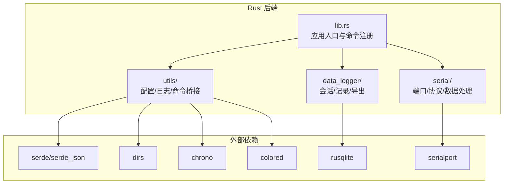
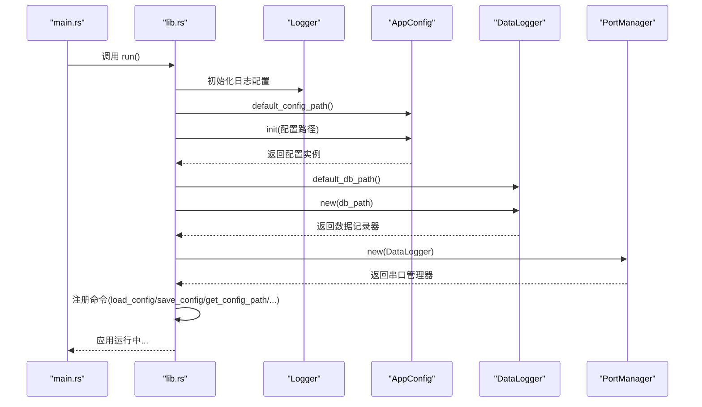
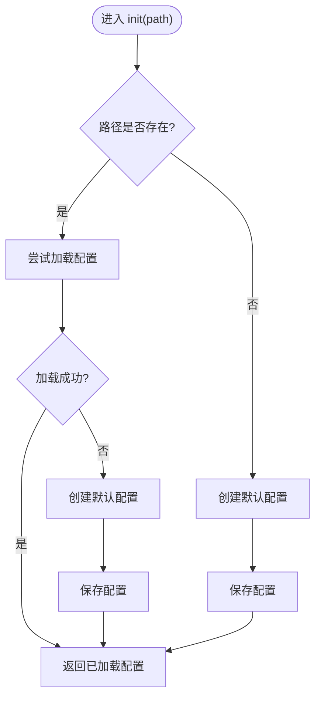
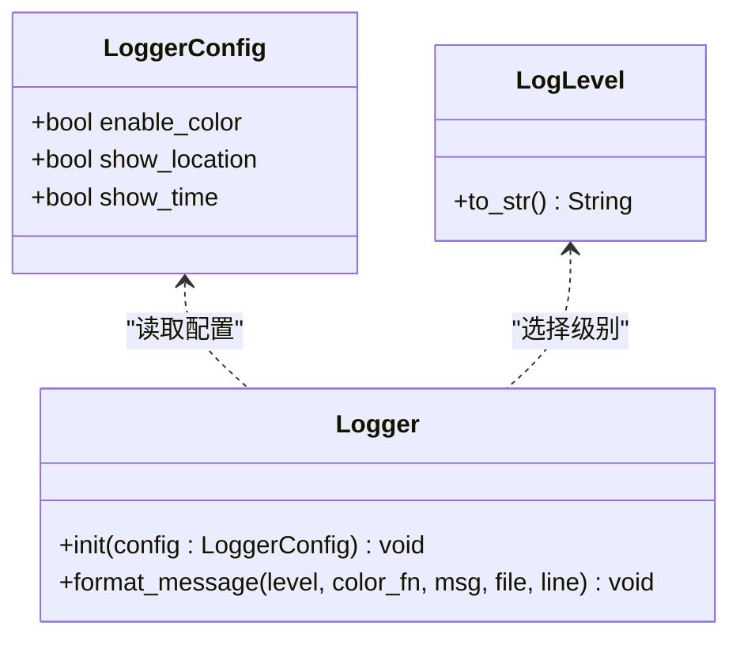
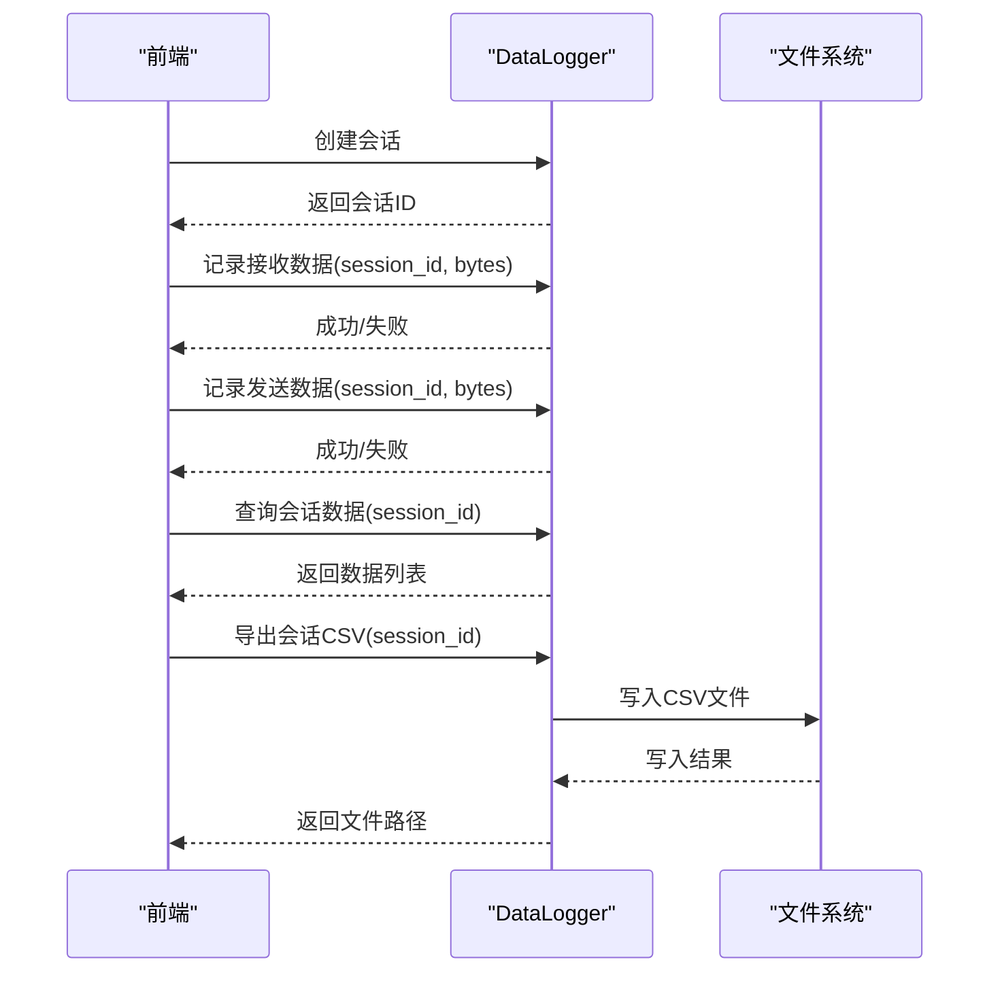
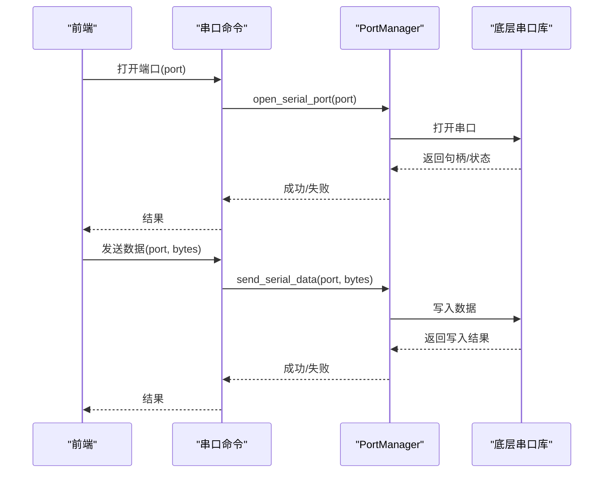
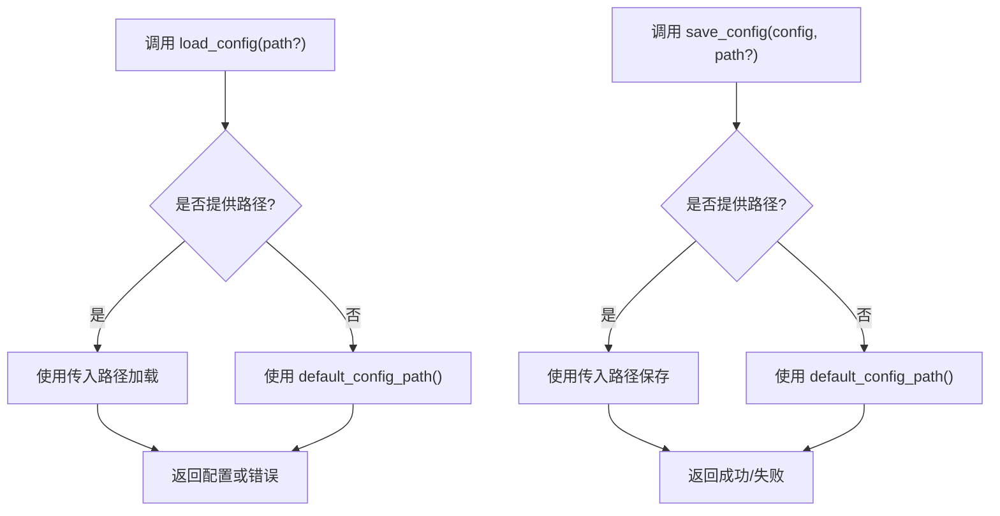
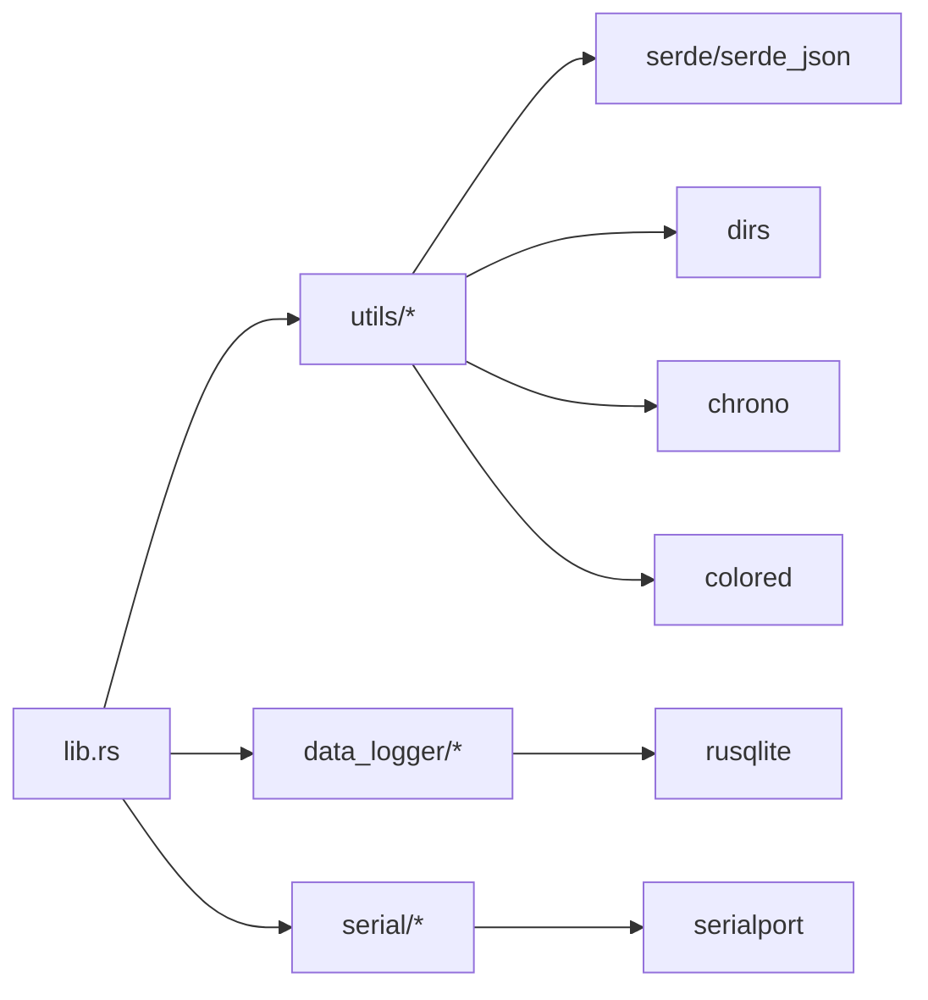

# 通用工具函数

<cite>
**本文引用的文件**
- [src-tauri/src/utils/mod.rs](file://src-tauri/src/utils/mod.rs)
- [src-tauri/src/utils/commands.rs](file://src-tauri/src/utils/commands.rs)
- [src-tauri/src/utils/config.rs](file://src-tauri/src/utils/config.rs)
- [src-tauri/src/utils/logger.rs](file://src-tauri/src/utils/logger.rs)
- [src-tauri/src/lib.rs](file://src-tauri/src/lib.rs)
- [src-tauri/Cargo.toml](file://src-tauri/Cargo.toml)
- [src-tauri/src/data_logger/mod.rs](file://src-tauri/src/data_logger/mod.rs)
- [src-tauri/src/serial/commands.rs](file://src-tauri/src/serial/commands.rs)
- [src-tauri/src/serial/port_manager.rs](file://src-tauri/src/serial/port_manager.rs)
- [src-tauri/src/serial/data_process.rs](file://src-tauri/src/serial/data_process.rs)
- [src-tauri/src/serial/protocol.rs](file://src-tauri/src/serial/protocol.rs)
</cite>

## 目录
1. [简介](#简介)
2. [项目结构](#项目结构)
3. [核心组件](#核心组件)
4. [架构总览](#架构总览)
5. [详细组件分析](#详细组件分析)
6. [依赖关系分析](#依赖关系分析)
7. [性能考量](#性能考量)
8. [故障排查指南](#故障排查指南)
9. [结论](#结论)
10. [附录](#附录)

## 简介
本文件聚焦 KonSerial 的通用工具函数与基础设施能力，围绕以下主题展开：配置管理与持久化、日志系统、数据记录与导出、串口通信与端口管理、以及与前端交互的命令注册机制。文档以“可读性优先”的方式组织内容，既适合开发者深入理解实现细节，也便于非技术读者快速掌握关键流程。

## 项目结构
KonSerial 的后端采用 Tauri + Rust 架构，核心逻辑集中在 src-tauri 子树中。通用工具函数主要分布在 utils 子模块，配合 data_logger、serial 等子模块共同完成配置、日志、数据记录与串口通信等基础能力。

图表来源
- [src-tauri/src/lib.rs:24-83](file://src-tauri/src/lib.rs#L24-L83)
- [src-tauri/src/utils/mod.rs:1-6](file://src-tauri/src/utils/mod.rs#L1-L6)
- [src-tauri/Cargo.toml:20-40](file://src-tauri/Cargo.toml#L20-L40)

章节来源
- [src-tauri/src/lib.rs:1-84](file://src-tauri/src/lib.rs#L1-L84)
- [src-tauri/src/utils/mod.rs:1-6](file://src-tauri/src/utils/mod.rs#L1-L6)
- [src-tauri/Cargo.toml:1-40](file://src-tauri/Cargo.toml#L1-L40)

## 核心组件
- 配置管理模块：负责配置的初始化、加载、保存、重载与路径管理，支持跨平台默认配置路径。
- 日志模块：提供统一的日志格式化输出，支持时间戳、级别、位置信息与颜色控制。
- 数据记录模块：提供会话管理、收发数据记录、查询与 CSV 导出能力。
- 串口通信模块：提供端口枚举、打开关闭、连接状态查询、发送数据等命令。
- 命令桥接模块：将上述功能暴露为 Tauri 命令，供前端调用。

章节来源
- [src-tauri/src/utils/config.rs:1-176](file://src-tauri/src/utils/config.rs#L1-L176)
- [src-tauri/src/utils/logger.rs:1-132](file://src-tauri/src/utils/logger.rs#L1-L132)
- [src-tauri/src/data_logger/mod.rs:14-257](file://src-tauri/src/data_logger/mod.rs#L14-L257)
- [src-tauri/src/serial/commands.rs:16-82](file://src-tauri/src/serial/commands.rs#L16-L82)
- [src-tauri/src/utils/commands.rs:1-31](file://src-tauri/src/utils/commands.rs#L1-L31)

## 架构总览
下图展示了应用启动时的关键步骤：初始化日志、加载/创建配置、初始化数据记录器与串口管理器，并注册所有可用命令。

图表来源
- [src-tauri/src/main.rs:1-7](file://src-tauri/src/main.rs#L1-L7)
- [src-tauri/src/lib.rs:24-83](file://src-tauri/src/lib.rs#L24-L83)
- [src-tauri/src/utils/config.rs:12-94](file://src-tauri/src/utils/config.rs#L12-L94)
- [src-tauri/src/data_logger/mod.rs:14-115](file://src-tauri/src/data_logger/mod.rs#L14-L115)
- [src-tauri/src/serial/port_manager.rs](file://src-tauri/src/serial/port_manager.rs)

章节来源
- [src-tauri/src/lib.rs:24-83](file://src-tauri/src/lib.rs#L24-L83)

## 详细组件分析

### 配置管理模块（AppConfig）
- 功能要点
  - 跨平台默认配置路径：通过标准库与第三方库组合生成用户目录下的配置路径。
  - 配置结构：包含串口、界面、数据处理三类配置，均支持序列化/反序列化。
  - 生命周期：init/new/save/load/reload，覆盖常见使用场景。
  - 路径管理：保存配置文件绝对路径，便于后续 save/reload 使用。
- 关键流程
  - 初始化：若目标路径存在且可读，则加载；否则创建默认配置并保存。
  - 保存：自动创建父目录，序列化为 JSON 并写入文件。
  - 加载：读取文件内容并反序列化，同时回填配置路径。
  - 重载：从已知路径重新读取并更新当前内存中的配置。
- 错误处理
  - 文件系统错误、JSON 解析错误均向上抛出，便于上层统一处理。
  - 日志记录：成功/失败均有明确日志提示，便于排障。

图表来源
- [src-tauri/src/utils/config.rs:65-94](file://src-tauri/src/utils/config.rs#L65-L94)

章节来源
- [src-tauri/src/utils/config.rs:1-176](file://src-tauri/src/utils/config.rs#L1-L176)

### 日志模块（Logger）
- 功能要点
  - 可配置项：是否启用颜色、是否显示时间、是否显示源文件位置。
  - 日志级别：Info/Warn/Error 三种级别，分别对应不同颜色。
  - 宏封装：log_info!/log_warn!/log_error! 提供便捷调用。
  - 线程安全：通过静态单例保存配置，避免重复初始化。
- 输出格式
  - 可选时间戳、级别、文件位置与消息正文，支持彩色输出。
- 使用建议
  - 在应用启动时一次性初始化，避免重复初始化带来的开销。
  - 对于生产环境，建议关闭颜色输出以提升兼容性。

图表来源
- [src-tauri/src/utils/logger.rs:23-83](file://src-tauri/src/utils/logger.rs#L23-L83)

章节来源
- [src-tauri/src/utils/logger.rs:1-132](file://src-tauri/src/utils/logger.rs#L1-L132)

### 数据记录模块（DataLogger）
- 功能要点
  - 会话管理：创建会话、结束会话、列出会话。
  - 数据记录：记录接收/发送的数据，支持按会话查询。
  - 导出能力：将指定会话导出为 CSV 文件。
  - 默认数据库路径：跨平台生成默认数据库路径。
- 数据模型
  - 会话信息与数据记录结构由模块内部定义，导出时将字节数据转为十六进制字符串。
- 错误处理
  - 所有操作返回 Result 类型，便于上层统一处理异常。

图表来源
- [src-tauri/src/data_logger/mod.rs:115-257](file://src-tauri/src/data_logger/mod.rs#L115-L257)

章节来源
- [src-tauri/src/data_logger/mod.rs:14-257](file://src-tauri/src/data_logger/mod.rs#L14-L257)

### 串口通信模块（PortManager 与命令）
- 功能要点
  - 端口枚举：列出可用串口名称。
  - 端口信息：获取串口详细信息（如厂商、产品等）。
  - 连接管理：打开/关闭指定串口，关闭全部串口。
  - 连接状态：查询当前连接状态与全局运行信息。
  - 发送数据：向指定串口发送字节数据。
- 与数据记录集成
  - PortManager 在初始化时注入 DataLogger，以便在读写时记录数据。
- 命令注册
  - 所有串口相关命令通过 Tauri 注册，供前端调用。

图表来源
- [src-tauri/src/serial/commands.rs:50-74](file://src-tauri/src/serial/commands.rs#L50-L74)
- [src-tauri/src/serial/port_manager.rs](file://src-tauri/src/serial/port_manager.rs)

章节来源
- [src-tauri/src/serial/commands.rs:16-82](file://src-tauri/src/serial/commands.rs#L16-L82)
- [src-tauri/src/serial/port_manager.rs](file://src-tauri/src/serial/port_manager.rs)

### 命令桥接模块（utils::commands）
- 功能要点
  - 配置命令：加载配置、保存配置、获取默认配置路径。
  - 与 Tauri 集成：通过 #[tauri::command] 注解暴露为命令。
  - 参数处理：支持可选路径参数，若未提供则使用默认路径。
- 错误处理
  - 统一将底层错误转换为字符串返回，便于前端展示。

图表来源
- [src-tauri/src/utils/commands.rs:3-29](file://src-tauri/src/utils/commands.rs#L3-L29)

章节来源
- [src-tauri/src/utils/commands.rs:1-31](file://src-tauri/src/utils/commands.rs#L1-L31)

## 依赖关系分析
- 模块耦合
  - lib.rs 作为入口，集中初始化日志、配置、数据记录器与串口管理器，并注册所有命令。
  - utils 子模块为其他模块提供通用能力（配置、日志），保持较高内聚与低耦合。
- 外部依赖
  - 配置与序列化：serde/serde_json
  - 数据库：rusqlite（SQLite）
  - 串口通信：serialport
  - 路径与用户目录：dirs
  - 时间与颜色：chrono、colored
  - CLI 插件：tauri-plugin-cli（仅非移动端）

图表来源
- [src-tauri/src/lib.rs:24-83](file://src-tauri/src/lib.rs#L24-L83)
- [src-tauri/Cargo.toml:20-40](file://src-tauri/Cargo.toml#L20-L40)

章节来源
- [src-tauri/src/lib.rs:1-84](file://src-tauri/src/lib.rs#L1-L84)
- [src-tauri/Cargo.toml:1-40](file://src-tauri/Cargo.toml#L1-L40)

## 性能考量
- 配置读写
  - JSON 序列化/反序列化为 O(n)，其中 n 为配置大小；建议避免频繁保存，可在应用退出时批量保存。
  - 保存前自动创建父目录，减少运行时异常开销。
- 日志输出
  - 彩色输出与时间戳会带来额外开销，建议在生产环境关闭颜色与位置信息。
- 数据记录
  - SQLite 写入为顺序 IO，建议批量写入或异步调度，避免阻塞主线程。
- 串口通信
  - 发送/接收应结合缓冲区与背压策略，避免内存占用过高。
- 路径与系统调用
  - default_config_path/default_db_path 仅在应用启动时调用一次，避免重复计算。

## 故障排查指南
- 配置无法保存
  - 检查配置路径是否存在且具备写权限；确认父目录已创建。
  - 查看日志中关于“配置文件路径未设置”或“新配置创建失败”的提示。
- 配置加载失败
  - 检查 JSON 格式是否正确；确认字段类型匹配。
- 日志无输出或格式异常
  - 确认 Logger 已初始化；检查配置项（颜色、时间、位置）设置。
- 数据导出为空
  - 确认会话 ID 正确；检查会话是否已结束或数据是否被清理。
- 串口无法打开
  - 检查端口名称是否正确；确认端口未被其他程序占用；查看底层串口库返回的错误信息。

章节来源
- [src-tauri/src/utils/config.rs:127-143](file://src-tauri/src/utils/config.rs#L127-L143)
- [src-tauri/src/utils/logger.rs:44-50](file://src-tauri/src/utils/logger.rs#L44-L50)
- [src-tauri/src/data_logger/mod.rs:257-267](file://src-tauri/src/data_logger/mod.rs#L257-L267)
- [src-tauri/src/serial/commands.rs:50-74](file://src-tauri/src/serial/commands.rs#L50-L74)

## 结论
KonSerial 的通用工具函数以模块化设计为核心，围绕配置、日志、数据记录与串口通信构建了清晰的基础设施层。通过 Tauri 命令桥接，前端可以稳定地调用后端能力。建议在实际使用中遵循“最小化保存、异步处理、统一错误处理”的原则，以获得更好的稳定性与性能表现。

## 附录
- 命令清单（与前端交互）
  - 配置相关：load_config、save_config、get_config_path
  - 串口相关：list_serial_ports、get_serial_ports_info、refresh_serial_ports、open_serial_port、close_serial_port、close_all_serial_ports、get_connection_info、get_all_connections、get_global_runtime_info、send_serial_data、is_serial_connected
  - 数据记录相关：get_sessions、get_session_data、delete_session、export_session_csv
- 最佳实践
  - 在应用启动阶段完成日志与配置初始化，避免中途重复初始化。
  - 将高频写操作（如数据记录）异步化，必要时批量提交。
  - 对外暴露的命令应统一错误处理，返回人类可读的信息。
  - 对敏感路径与权限进行校验，防止越权访问。

章节来源
- [src-tauri/src/lib.rs:56-80](file://src-tauri/src/lib.rs#L56-L80)
- [src-tauri/src/utils/commands.rs:1-31](file://src-tauri/src/utils/commands.rs#L1-L31)
- [src-tauri/src/serial/commands.rs:16-82](file://src-tauri/src/serial/commands.rs#L16-L82)
- [src-tauri/src/data_logger/mod.rs:168-257](file://src-tauri/src/data_logger/mod.rs#L168-L257)