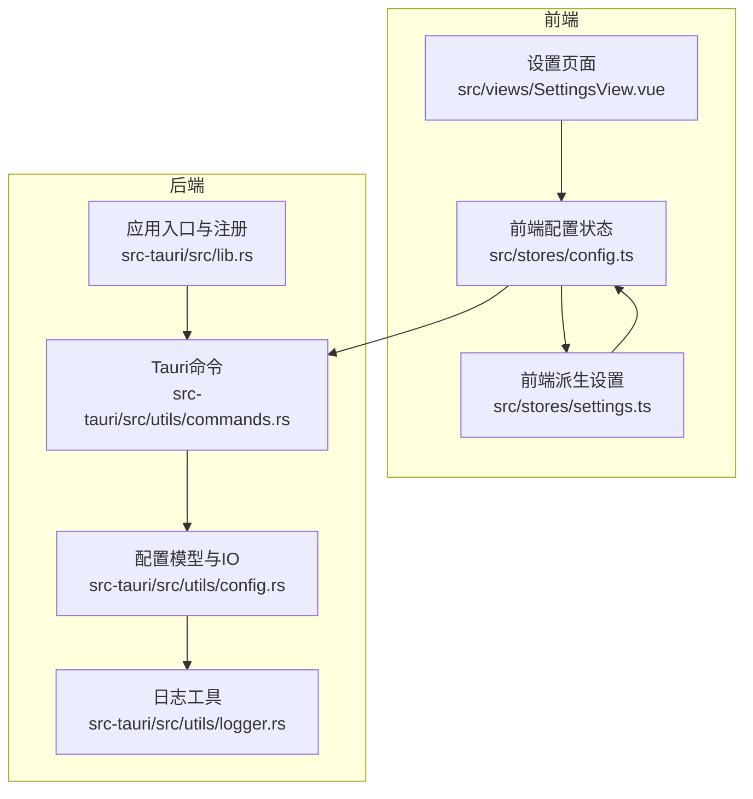
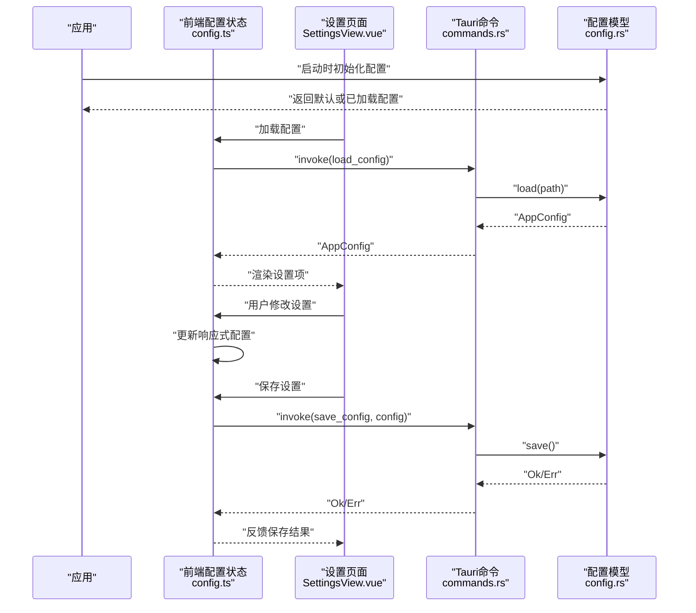
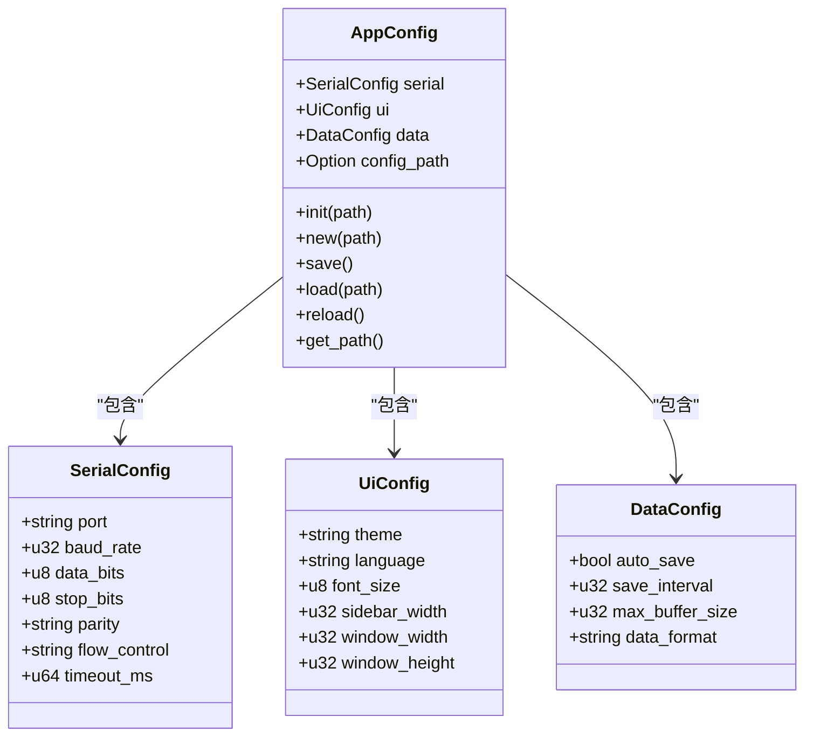
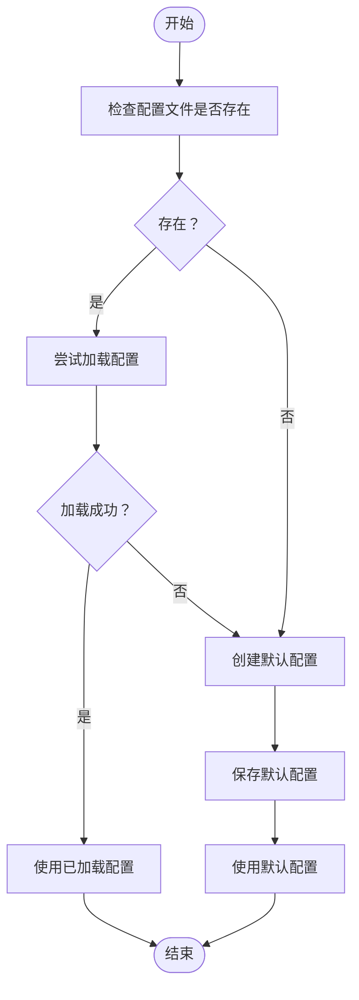
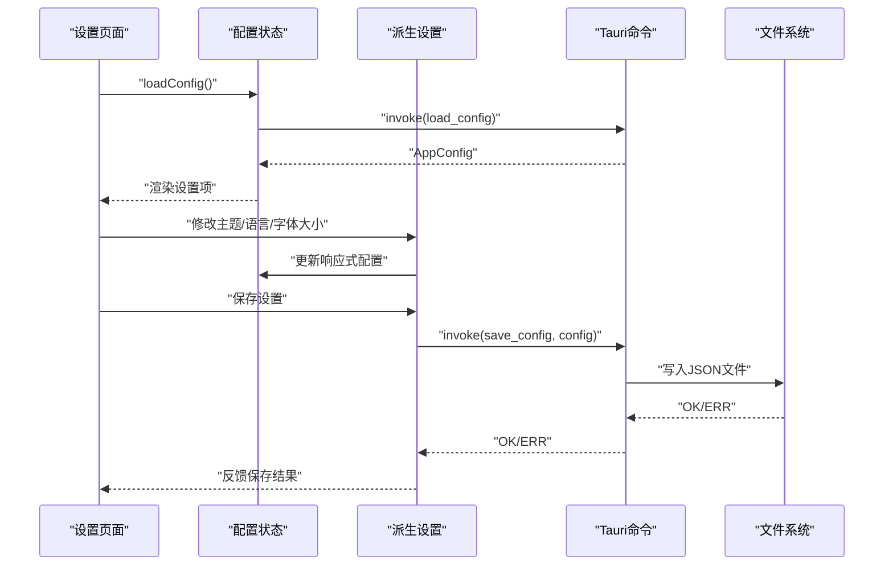
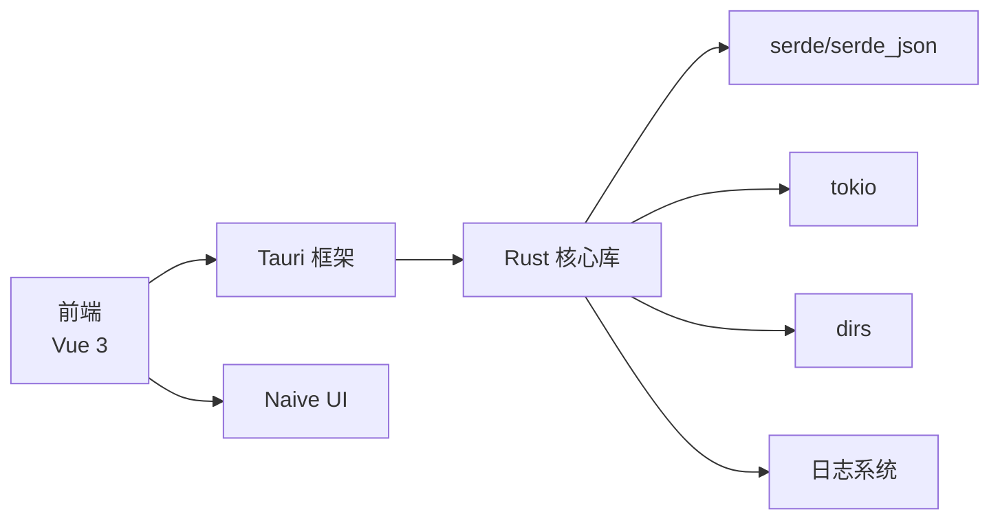

# 配置管理系统

<cite>
**本文档引用的文件**
- [config.ts](file://src/stores/config.ts)
- [config.rs](file://src-tauri/src/utils/config.rs)
- [commands.rs](file://src-tauri/src/utils/commands.rs)
- [lib.rs](file://src-tauri/src/lib.rs)
- [settings.ts](file://src/stores/settings.ts)
- [SettingsView.vue](file://src/views/SettingsView.vue)
- [logger.rs](file://src-tauri/src/utils/logger.rs)
- [Cargo.toml](file://src-tauri/Cargo.toml)
- [tauri.conf.json](file://src-tauri/tauri.conf.json)
- [DESIGN.md](file://DESIGN.md)
- [README.md](file://README.md)
</cite>

## 目录
1. [简介](#简介)
2. [项目结构](#项目结构)
3. [核心组件](#核心组件)
4. [架构总览](#架构总览)
5. [详细组件分析](#详细组件分析)
6. [依赖分析](#依赖分析)
7. [性能考量](#性能考量)
8. [故障排除指南](#故障排除指南)
9. [结论](#结论)
10. [附录](#附录)

## 简介
本文件面向 KonSerial 的配置管理系统，系统性阐述配置文件的加载、保存与验证机制；配置项的数据结构设计、默认值设置与动态更新策略；配置文件的存储位置、格式规范与版本兼容性处理；配置项的类型安全检查、边界验证与错误恢复机制；以及配置热重载的实现原理、并发访问控制与性能优化策略。文档同时提供配置文件示例、API 使用方法与故障排除指南，帮助开发者与用户高效理解与使用该系统。

## 项目结构
KonSerial 的配置管理采用“前端状态 + 后端持久化”的双层架构：
- 前端使用 Vue 3 的响应式状态管理，负责即时更新 UI 与触发保存动作。
- 后端使用 Rust + Tauri，负责配置文件的读写、默认值生成与错误处理。

**图表来源**
- [config.ts:1-89](file://src/stores/config.ts#L1-L89)
- [settings.ts:1-125](file://src/stores/settings.ts#L1-L125)
- [SettingsView.vue:1-383](file://src/views/SettingsView.vue#L1-L383)
- [lib.rs:1-84](file://src-tauri/src/lib.rs#L1-L84)
- [config.rs:1-176](file://src-tauri/src/utils/config.rs#L1-L176)
- [commands.rs:1-31](file://src-tauri/src/utils/commands.rs#L1-L31)
- [logger.rs:1-132](file://src-tauri/src/utils/logger.rs#L1-L132)

**章节来源**
- [config.ts:1-89](file://src/stores/config.ts#L1-L89)
- [settings.ts:1-125](file://src/stores/settings.ts#L1-L125)
- [SettingsView.vue:1-383](file://src/views/SettingsView.vue#L1-L383)
- [lib.rs:1-84](file://src-tauri/src/lib.rs#L1-L84)
- [config.rs:1-176](file://src-tauri/src/utils/config.rs#L1-L176)
- [commands.rs:1-31](file://src-tauri/src/utils/commands.rs#L1-L31)
- [logger.rs:1-132](file://src-tauri/src/utils/logger.rs#L1-L132)

## 核心组件
- 前端配置状态与命令封装：提供配置加载、保存与部分字段的即时更新能力，并在设置页面中触发持久化。
- 后端配置模型与 IO：定义配置结构、默认值、跨平台路径、加载/保存/重载逻辑与错误处理。
- Tauri 命令桥接：将前端调用映射到后端实现，确保跨平台一致性与安全性。
- 日志与错误处理：统一的日志格式与错误传播，便于定位问题。

**章节来源**
- [config.ts:1-89](file://src/stores/config.ts#L1-L89)
- [config.rs:1-176](file://src-tauri/src/utils/config.rs#L1-L176)
- [commands.rs:1-31](file://src-tauri/src/utils/commands.rs#L1-L31)
- [logger.rs:1-132](file://src-tauri/src/utils/logger.rs#L1-L132)

## 架构总览
配置系统的关键流程如下：
- 应用启动时，后端根据平台确定配置文件路径并尝试加载；若失败则创建默认配置并保存。
- 前端在设置页面加载配置，用户修改设置后即时反映到 UI，并可手动保存或由设置派生层自动保存。
- Tauri 命令负责将前端请求转发至后端，后端完成 JSON 序列化/反序列化与文件 IO。

**图表来源**
- [lib.rs:25-45](file://src-tauri/src/lib.rs#L25-L45)
- [config.ts:42-64](file://src/stores/config.ts#L42-L64)
- [commands.rs:5-23](file://src-tauri/src/utils/commands.rs#L5-L23)
- [config.rs:127-152](file://src-tauri/src/utils/config.rs#L127-L152)

## 详细组件分析

### 数据结构设计与默认值
- 配置分层：serial（串口）、ui（界面）、data（数据处理），每层包含若干字段，均具备明确类型与默认值。
- 默认值策略：
  - 后端在创建新配置时为各字段设定合理默认值（如波特率、数据位、窗口尺寸、自动保存开关等）。
  - 部分字段通过 serde 的默认函数提供默认值（如超时毫秒数）。
- 类型安全：Rust 结构体与 serde 的强类型序列化/反序列化保证字段类型与格式正确。

**图表来源**
- [config.rs:18-63](file://src-tauri/src/utils/config.rs#L18-L63)

**章节来源**
- [config.rs:18-124](file://src-tauri/src/utils/config.rs#L18-L124)

### 存储位置与格式规范
- 跨平台存储路径：通过系统配置目录确定路径，避免硬编码。
  - Linux: ~/.config/konserial/config.json
  - macOS: ~/Library/Application Support/konserial/config.json
  - Windows: C:\Users\<User>\AppData\Roaming\konserial\config.json
- 文件格式：JSON，使用 serde_json 进行序列化/反序列化，支持美化输出。
- 路径管理：配置对象内部保存 config_path，用于后续保存与重载。

**章节来源**
- [config.rs:8-16](file://src-tauri/src/utils/config.rs#L8-L16)
- [config.rs:127-152](file://src-tauri/src/utils/config.rs#L127-L152)

### 加载、保存与重载机制
- 加载：若目标文件存在且可读，反序列化为 AppConfig；否则记录错误并创建默认配置。
- 保存：先确保父目录存在，再将配置序列化为 JSON 写入文件。
- 重载：从已知路径重新读取并替换内存中的配置，保留 config_path。

**图表来源**
- [config.rs:65-94](file://src-tauri/src/utils/config.rs#L65-L94)

**章节来源**
- [config.rs:65-176](file://src-tauri/src/utils/config.rs#L65-L176)

### 前端状态与动态更新
- 前端使用 ref 维护全局配置对象，提供加载、保存与部分字段的即时更新函数。
- 设置页面通过计算属性与响应式绑定，将 UI 修改映射到配置对象。
- 设置派生层（settings.ts）将配置映射为 UI 主题、语言、字体大小等派生设置，并提供持久化保存。

**图表来源**
- [config.ts:42-89](file://src/stores/config.ts#L42-L89)
- [settings.ts:1-125](file://src/stores/settings.ts#L1-L125)
- [SettingsView.vue:1-383](file://src/views/SettingsView.vue#L1-L383)
- [commands.rs:5-23](file://src-tauri/src/utils/commands.rs#L5-L23)

**章节来源**
- [config.ts:1-89](file://src/stores/config.ts#L1-L89)
- [settings.ts:1-125](file://src/stores/settings.ts#L1-L125)
- [SettingsView.vue:1-383](file://src/views/SettingsView.vue#L1-L383)

### 类型安全、边界验证与错误恢复
- 类型安全：Rust 结构体与 serde 的强类型约束，确保 JSON 字段与结构体字段一一对应。
- 边界验证：前端对数值范围进行限制（如字体大小、缓冲区大小、保存间隔），后端通过合理的默认值与 serde 默认函数减少越界风险。
- 错误恢复：
  - 加载失败时回退到默认配置并保存，保证系统可用。
  - 保存失败时记录错误日志，前端捕获异常并提示用户。
  - 日志系统提供统一的格式化输出，便于排查问题。

**章节来源**
- [config.rs:127-152](file://src-tauri/src/utils/config.rs#L127-L152)
- [logger.rs:85-131](file://src-tauri/src/utils/logger.rs#L85-L131)
- [SettingsView.vue:144-172](file://src/views/SettingsView.vue#L144-L172)

### 并发访问控制与性能优化
- 并发控制：后端使用 Mutex 包裹串口管理器等共享资源，避免竞态；配置文件 IO 为单次写入，不涉及长期锁持有。
- 性能优化：
  - JSON 序列化采用美化输出，便于阅读但不牺牲核心性能；生产环境可按需调整。
  - 前端使用响应式更新，仅在必要时触发保存，降低 IO 次数。
  - 日志输出采用一次性格式化，避免频繁分配。

**章节来源**
- [lib.rs:43-43](file://src-tauri/src/lib.rs#L43-L43)
- [logger.rs:52-82](file://src-tauri/src/utils/logger.rs#L52-L82)

## 依赖分析
- Rust 依赖：serde、serde_json、tokio、dirs、rusqlite、chrono、colored 等，支撑配置序列化、文件系统、日志与数据库等功能。
- Tauri 插件：fs、dialog、opener、clipboard-manager 等，提供文件系统访问、对话框与剪贴板能力。
- 前端依赖：Vue 3、Naive UI、国际化等，支撑设置页面与 UI 呈现。

**图表来源**
- [Cargo.toml:20-40](file://src-tauri/Cargo.toml#L20-L40)
- [logger.rs:1-132](file://src-tauri/src/utils/logger.rs#L1-L132)

**章节来源**
- [Cargo.toml:20-40](file://src-tauri/Cargo.toml#L20-L40)
- [tauri.conf.json:24-33](file://src-tauri/tauri.conf.json#L24-L33)

## 性能考量
- 配置文件体积：JSON 格式简洁，字段数量有限，读写开销极低。
- 序列化成本：serde_json 的序列化/反序列化为 O(n) 时间复杂度，n 为配置项数量，对现代硬件几乎无压力。
- IO 策略：保存前自动创建父目录，避免重复 IO；重载时仅从已知路径读取，减少路径解析成本。
- 前端更新：响应式更新与批量保存策略，避免频繁触发 IO。

[本节为通用性能讨论，不直接分析特定文件]

## 故障排除指南
- 配置文件无法加载
  - 检查配置文件是否存在与可读；若不存在，系统会自动创建默认配置并保存。
  - 查看日志输出，确认加载失败原因。
- 保存失败
  - 检查目标目录权限；确保父目录存在。
  - 若路径为空，后端会返回错误，前端捕获并提示。
- 超时/边界问题
  - 前端对数值范围进行限制；后端提供默认值，避免越界。
- 日志定位
  - 使用统一的日志宏输出 INFO/WARN/ERROR 级别日志，包含时间、级别与位置信息。

**章节来源**
- [config.rs:76-91](file://src-tauri/src/utils/config.rs#L76-L91)
- [config.rs:139-142](file://src-tauri/src/utils/config.rs#L139-L142)
- [logger.rs:85-131](file://src-tauri/src/utils/logger.rs#L85-L131)

## 结论
KonSerial 的配置管理系统通过前后端协同，实现了跨平台、类型安全、易于扩展的配置持久化方案。后端负责严格的类型约束与默认值保障，前端负责直观的交互与即时反馈。配合完善的日志与错误处理机制，系统在易用性与可靠性之间取得了良好平衡。未来可考虑引入版本兼容性策略与增量更新机制，进一步提升系统的演进能力。

[本节为总结性内容，不直接分析特定文件]

## 附录

### 配置文件示例
- 配置文件采用 JSON 格式，包含三部分：serial、ui、data。
- 示例字段包括：串口名称、波特率、数据位、停止位、校验位、流控、超时；主题、语言、字体大小、侧边栏宽度、窗口宽高；自动保存开关、保存间隔、最大缓冲区大小、数据格式等。

**章节来源**
- [config.rs:18-63](file://src-tauri/src/utils/config.rs#L18-L63)

### API 使用方法
- 加载配置
  - 前端：调用 loadConfig()，内部通过 invoke('load_config') 触发后端加载。
  - 后端：load(path) 从指定路径读取并反序列化为 AppConfig。
- 保存配置
  - 前端：调用 saveConfig()，内部通过 invoke('save_config', { config }) 触发后端保存。
  - 后端：save() 将配置序列化为 JSON 并写入文件。
- 获取默认路径
  - 前端：调用 invoke('get_config_path') 获取默认配置路径字符串。
  - 后端：default_config_path() 返回跨平台路径。

**章节来源**
- [config.ts:42-64](file://src/stores/config.ts#L42-L64)
- [commands.rs:5-29](file://src-tauri/src/utils/commands.rs#L5-L29)
- [config.rs:12-16](file://src-tauri/src/utils/config.rs#L12-L16)
- [config.rs:127-152](file://src-tauri/src/utils/config.rs#L127-L152)

### 版本兼容性处理
- 当前版本：0.1.0，配置结构相对简单，字段较少。
- 建议策略（设计层面）：
  - 引入版本字段，新增字段时提供默认值，旧配置可平滑升级。
  - 对未知字段进行忽略处理，避免破坏现有配置。
  - 提供迁移脚本或命令，支持从旧版本自动迁移到新版本。

**章节来源**
- [tauri.conf.json:3-4](file://src-tauri/tauri.conf.json#L3-L4)
- [DESIGN.md:1-10](file://DESIGN.md#L1-L10)

### 热重载与并发控制
- 热重载：后端提供 reload() 方法，从已知路径重新加载配置并替换内存中的配置，保留 config_path。
- 并发控制：串口管理器等共享资源使用 Mutex 包裹，避免并发访问冲突；配置文件 IO 为短时写入，不引入长期锁。

**章节来源**
- [config.rs:154-169](file://src-tauri/src/utils/config.rs#L154-L169)
- [lib.rs:43-43](file://src-tauri/src/lib.rs#L43-L43)