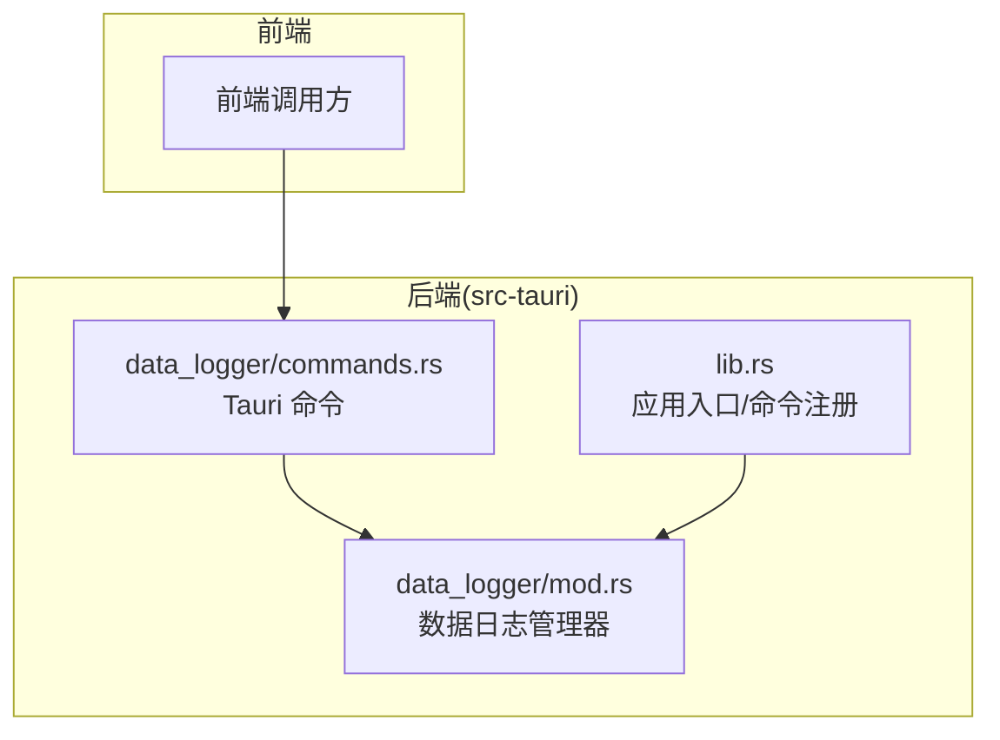
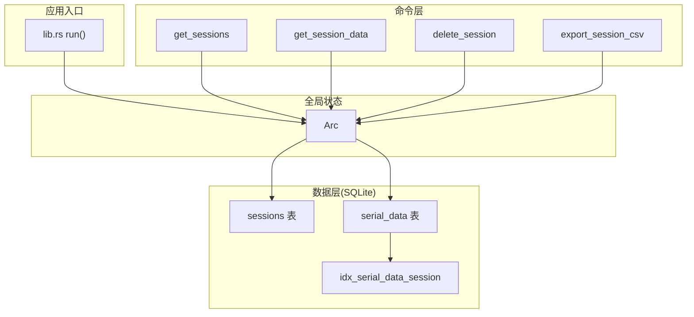
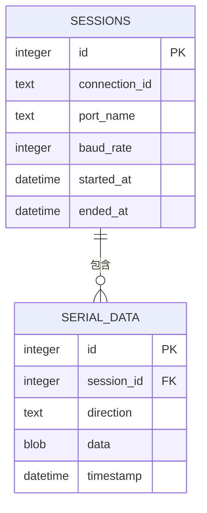
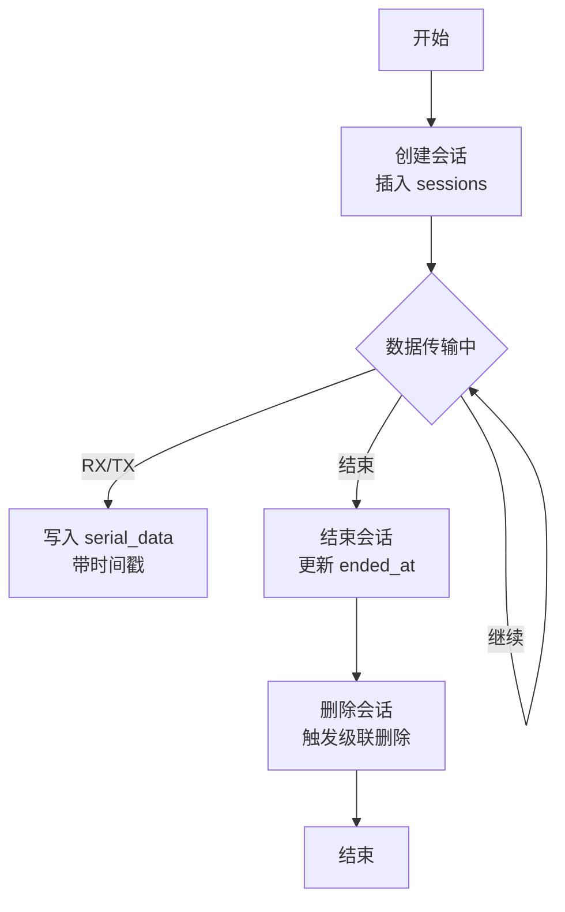
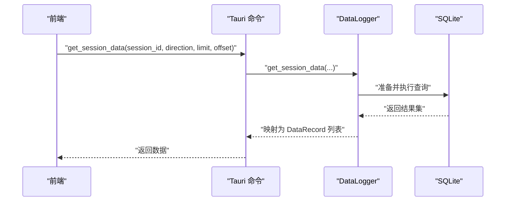
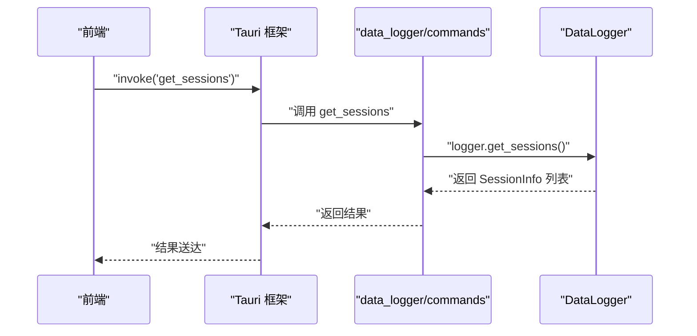
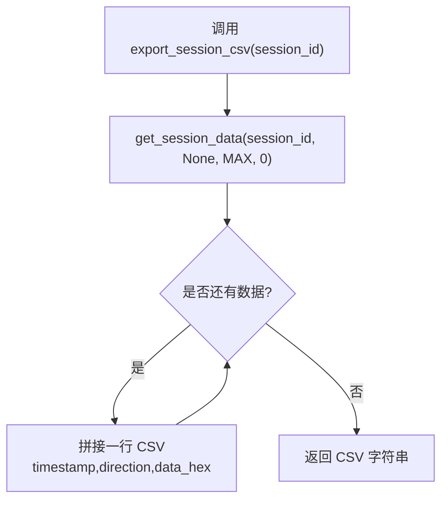
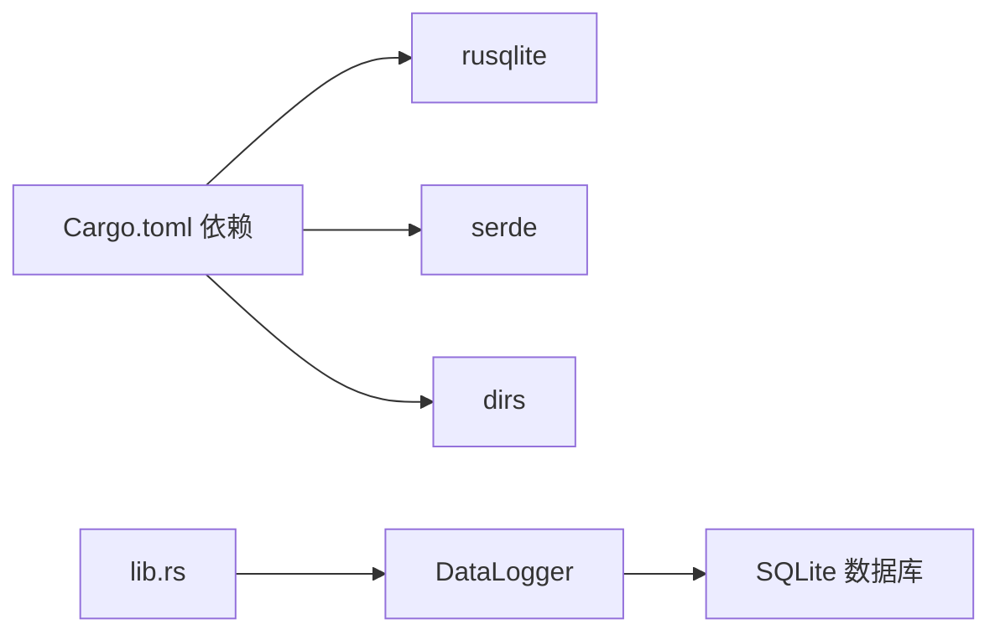

# 数据记录模块

<cite>
**本文引用的文件**
- [src-tauri/src/data_logger/mod.rs](file://src-tauri/src/data_logger/mod.rs)
- [src-tauri/src/data_logger/commands.rs](file://src-tauri/src/data_logger/commands.rs)
- [src-tauri/src/lib.rs](file://src-tauri/src/lib.rs)
- [src-tauri/Cargo.toml](file://src-tauri/Cargo.toml)
- [DESIGN.md](file://DESIGN.md)
- [README.md](file://README.md)
</cite>

## 目录
1. [简介](#简介)
2. [项目结构](#项目结构)
3. [核心组件](#核心组件)
4. [架构总览](#架构总览)
5. [详细组件分析](#详细组件分析)
6. [依赖关系分析](#依赖关系分析)
7. [性能考量](#性能考量)
8. [故障排查指南](#故障排查指南)
9. [结论](#结论)
10. [附录](#附录)

## 简介
本文件面向 KonSerial 的数据记录模块，聚焦基于 SQLite 的数据持久化设计、会话管理与数据存储策略，系统阐述数据记录生命周期、会话创建与数据归档机制，以及 Tauri 命令系统的实现细节（会话查询、数据检索与文件导出）。同时给出数据模型设计、索引策略与查询优化建议，并讨论备份恢复、存储空间管理与性能监控的实践方向。最后提供数据库架构图与数据流示意图，帮助读者快速理解与落地实现。

## 项目结构
数据记录模块位于 Rust 后端 src-tauri 中，采用模块化组织：
- data_logger 模块：负责 SQLite 数据库初始化、表结构创建、会话与数据记录的增删查改、CSV 导出等
- data_logger/commands 模块：封装为 Tauri 命令，供前端调用
- lib.rs：应用入口，注册全局状态与命令，初始化 DataLogger

**图表来源**
- [src-tauri/src/data_logger/mod.rs:1-273](file://src-tauri/src/data_logger/mod.rs#L1-L273)
- [src-tauri/src/data_logger/commands.rs:1-49](file://src-tauri/src/data_logger/commands.rs#L1-L49)
- [src-tauri/src/lib.rs:1-84](file://src-tauri/src/lib.rs#L1-L84)

**章节来源**
- [src-tauri/src/data_logger/mod.rs:1-273](file://src-tauri/src/data_logger/mod.rs#L1-L273)
- [src-tauri/src/data_logger/commands.rs:1-49](file://src-tauri/src/data_logger/commands.rs#L1-L49)
- [src-tauri/src/lib.rs:1-84](file://src-tauri/src/lib.rs#L1-L84)

## 核心组件
- DataLogger：线程安全的 SQLite 管理器，负责数据库初始化、表结构创建、会话与数据记录的 CRUD、查询与导出
- Tauri 命令：get_sessions、get_session_data、delete_session、export_session_csv
- 全局状态注入：lib.rs 中将 DataLogger 注入为 Arc<DataLogger>，通过 State 注入到命令中

关键职责与行为：
- 数据库初始化：确保目录存在、开启 WAL 模式、启用外键约束、创建 sessions 与 serial_data 表、建立复合索引
- 会话管理：创建会话、结束会话（更新结束时间）
- 数据记录：记录 RX/TX 数据，带时间戳
- 查询统计：按会话聚合 RX/TX 字节数
- 数据检索：支持按会话、方向、分页查询
- 归档与删除：删除会话级联删除数据；导出 CSV

**章节来源**
- [src-tauri/src/data_logger/mod.rs:47-273](file://src-tauri/src/data_logger/mod.rs#L47-L273)
- [src-tauri/src/data_logger/commands.rs:1-49](file://src-tauri/src/data_logger/commands.rs#L1-L49)
- [src-tauri/src/lib.rs:35-55](file://src-tauri/src/lib.rs#L35-L55)

## 架构总览
数据记录模块的运行时架构如下：

**图表来源**
- [src-tauri/src/lib.rs:35-55](file://src-tauri/src/lib.rs#L35-L55)
- [src-tauri/src/data_logger/commands.rs:1-49](file://src-tauri/src/data_logger/commands.rs#L1-L49)
- [src-tauri/src/data_logger/mod.rs:85-106](file://src-tauri/src/data_logger/mod.rs#L85-L106)

## 详细组件分析

### 数据模型与表结构
- sessions 表：记录一次串口会话的基本信息，含连接标识、端口名、波特率、开始/结束时间
- serial_data 表：记录每次收发的数据，包含会话外键、方向（TX/RX）、原始字节数据、时间戳
- 索引：对 (session_id, timestamp) 建立复合索引，支撑按会话与时间排序的高效查询

**图表来源**
- [src-tauri/src/data_logger/mod.rs:85-106](file://src-tauri/src/data_logger/mod.rs#L85-L106)

**章节来源**
- [src-tauri/src/data_logger/mod.rs:85-106](file://src-tauri/src/data_logger/mod.rs#L85-L106)

### 会话生命周期管理
- 创建会话：插入一条 sessions 记录，返回自增 ID
- 结束会话：更新该会话的结束时间为当前时间
- 删除会话：删除 sessions 记录，由于外键约束 + ON DELETE CASCADE，自动删除对应 serial_data

**图表来源**
- [src-tauri/src/data_logger/mod.rs:115-140](file://src-tauri/src/data_logger/mod.rs#L115-L140)
- [src-tauri/src/data_logger/mod.rs:248-255](file://src-tauri/src/data_logger/mod.rs#L248-L255)

**章节来源**
- [src-tauri/src/data_logger/mod.rs:115-140](file://src-tauri/src/data_logger/mod.rs#L115-L140)
- [src-tauri/src/data_logger/mod.rs:248-255](file://src-tauri/src/data_logger/mod.rs#L248-L255)

### 数据记录与查询流程
- 写入：log_rx/log_tx 分别插入 RX/TX 方向记录
- 查询：get_session_data 支持按方向过滤、分页（limit/offset），按时间升序返回
- 统计：get_sessions 通过 LEFT JOIN 与 SUM(CASE WHEN ...) 聚合 RX/TX 字节数

**图表来源**
- [src-tauri/src/data_logger/commands.rs:15-30](file://src-tauri/src/data_logger/commands.rs#L15-L30)
- [src-tauri/src/data_logger/mod.rs:203-244](file://src-tauri/src/data_logger/mod.rs#L203-L244)

**章节来源**
- [src-tauri/src/data_logger/commands.rs:15-30](file://src-tauri/src/data_logger/commands.rs#L15-L30)
- [src-tauri/src/data_logger/mod.rs:203-244](file://src-tauri/src/data_logger/mod.rs#L203-L244)

### Tauri 命令系统与数据记录
- 命令注册：在 lib.rs 中集中注册数据记录相关命令
- 命令实现：commands.rs 将前端请求转发至 DataLogger，并做参数适配（如 limit/offset 默认值）

**图表来源**
- [src-tauri/src/lib.rs:75-80](file://src-tauri/src/lib.rs#L75-L80)
- [src-tauri/src/data_logger/commands.rs:7-13](file://src-tauri/src/data_logger/commands.rs#L7-L13)
- [src-tauri/src/data_logger/mod.rs:168-201](file://src-tauri/src/data_logger/mod.rs#L168-L201)

**章节来源**
- [src-tauri/src/lib.rs:75-80](file://src-tauri/src/lib.rs#L75-L80)
- [src-tauri/src/data_logger/commands.rs:7-13](file://src-tauri/src/data_logger/commands.rs#L7-L13)
- [src-tauri/src/data_logger/mod.rs:168-201](file://src-tauri/src/data_logger/mod.rs#L168-L201)

### 数据导出（CSV）
- 导出流程：先全量拉取会话数据，再拼接 CSV 字符串（包含时间戳、方向、十六进制数据列）
- 注意：当前实现一次性拉取全部数据，适合中小规模会话；大规模会话建议分页导出或流式写入

**图表来源**
- [src-tauri/src/data_logger/mod.rs:257-271](file://src-tauri/src/data_logger/mod.rs#L257-L271)

**章节来源**
- [src-tauri/src/data_logger/mod.rs:257-271](file://src-tauri/src/data_logger/mod.rs#L257-L271)

## 依赖关系分析
- 外部依赖：rusqlite（SQLite 驱动，启用 bundled 特性）、dirs（跨平台配置目录）、serde（序列化）
- 内部依赖：lib.rs 注入 DataLogger 为全局状态，各命令通过 State 获取
- 运行时依赖：WAL 模式、外键约束、复合索引

**图表来源**
- [src-tauri/Cargo.toml:20-36](file://src-tauri/Cargo.toml#L20-L36)
- [src-tauri/src/lib.rs:35-55](file://src-tauri/src/lib.rs#L35-L55)

**章节来源**
- [src-tauri/Cargo.toml:20-36](file://src-tauri/Cargo.toml#L20-L36)
- [src-tauri/src/lib.rs:35-55](file://src-tauri/src/lib.rs#L35-L55)

## 性能考量
- 存储模式与同步策略
  - WAL 模式提升并发读写性能，适合频繁写入场景
  - synchronous=NORMAL 平衡性能与可靠性
- 索引策略
  - idx_serial_data_session(session_id, timestamp) 支撑按会话与时间排序查询
  - 建议：若存在大量按时间范围查询，可评估引入时间范围分区或二级索引
- 查询优化
  - get_session_data 支持方向过滤与分页，避免一次性拉取超大数据集
  - get_sessions 使用 LEFT JOIN + 聚合统计，注意大数据量时的索引与连接成本
- 导出性能
  - export_session_csv 当前一次性全量拉取，建议改为分页导出或流式写入，避免内存峰值
- 存储空间管理
  - 建议：提供会话过期策略（如保留 N 天）与手动清理接口
  - 建议：定期 VACUUM/ANALYZE 以回收空间与更新统计信息
- 监控指标
  - 建议：记录写入速率、查询耗时、数据库文件大小、索引命中率等

[本节为通用性能指导，不直接分析特定文件，故无“章节来源”]

## 故障排查指南
- 数据库初始化失败
  - 检查默认数据库路径是否存在写权限
  - 确认 PRAGMA 设置是否成功（WAL、外键、同步）
- 查询异常
  - 检查 sessions 与 serial_data 的外键关系
  - 确认复合索引是否生效（可通过 EXPLAIN QUERY PLAN 分析）
- 导出 CSV 卡顿
  - 检查会话数据量，建议分页导出或流式写入
- 删除会话无效
  - 确认 foreign_keys=ON 与 ON DELETE CASCADE 是否启用
- 前端调用失败
  - 检查命令注册是否正确（lib.rs 中 invoke_handler）
  - 检查 State 注入是否成功（Arc<DataLogger>）

**章节来源**
- [src-tauri/src/data_logger/mod.rs:76-82](file://src-tauri/src/data_logger/mod.rs#L76-L82)
- [src-tauri/src/data_logger/mod.rs:103-106](file://src-tauri/src/data_logger/mod.rs#L103-L106)
- [src-tauri/src/lib.rs:75-80](file://src-tauri/src/lib.rs#L75-L80)

## 结论
数据记录模块以 SQLite 为核心，围绕会话与数据记录两条主线，提供了完善的生命周期管理与查询能力。通过 WAL 模式、外键约束与复合索引，兼顾了写入性能与数据一致性。Tauri 命令层清晰地将前端请求路由到 DataLogger，实现了前后端职责分离。建议在生产环境中进一步完善导出策略、存储空间管理与性能监控，以应对更大规模的数据记录场景。

[本节为总结性内容，不直接分析特定文件，故无“章节来源”]

## 附录

### 数据库初始化与表结构（要点）
- 目录创建：确保数据库父目录存在
- PRAGMA：journal_mode=WAL、synchronous=NORMAL、foreign_keys=ON
- 表结构：sessions、serial_data
- 索引：idx_serial_data_session(session_id, timestamp)

**章节来源**
- [src-tauri/src/data_logger/mod.rs:67-106](file://src-tauri/src/data_logger/mod.rs#L67-L106)

### Tauri 命令清单
- get_sessions：获取会话列表（按开始时间倒序）
- get_session_data：按会话与方向查询数据，支持分页
- delete_session：删除会话及其所有数据
- export_session_csv：导出会话为 CSV 文本

**章节来源**
- [src-tauri/src/data_logger/commands.rs:7-48](file://src-tauri/src/data_logger/commands.rs#L7-L48)

### 默认数据库路径（跨平台）
- Linux/macOS/Windows：均位于应用配置目录下的 konserial 子目录中

**章节来源**
- [src-tauri/src/data_logger/mod.rs:11-18](file://src-tauri/src/data_logger/mod.rs#L11-L18)