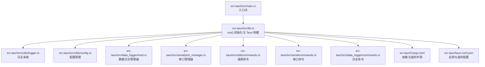
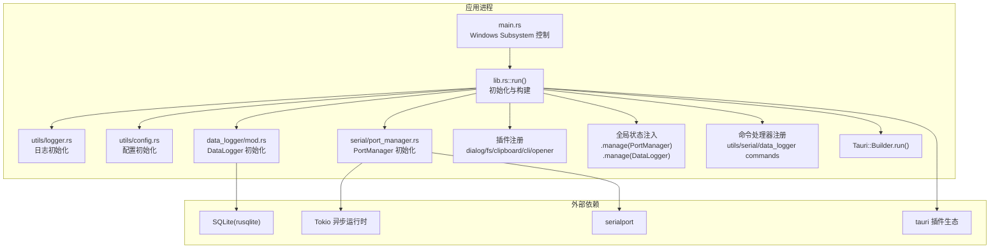
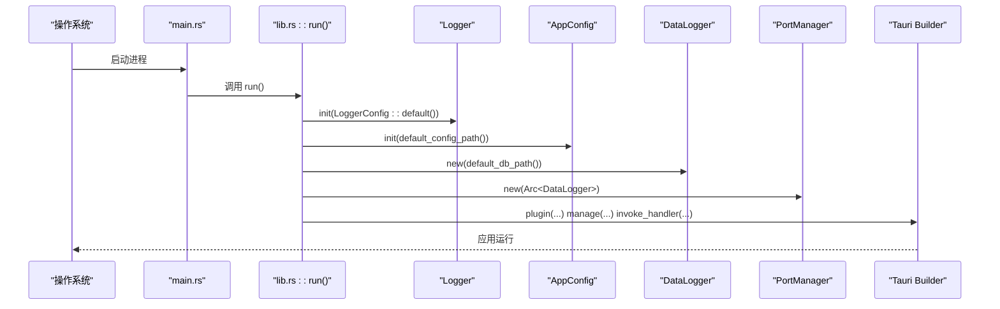
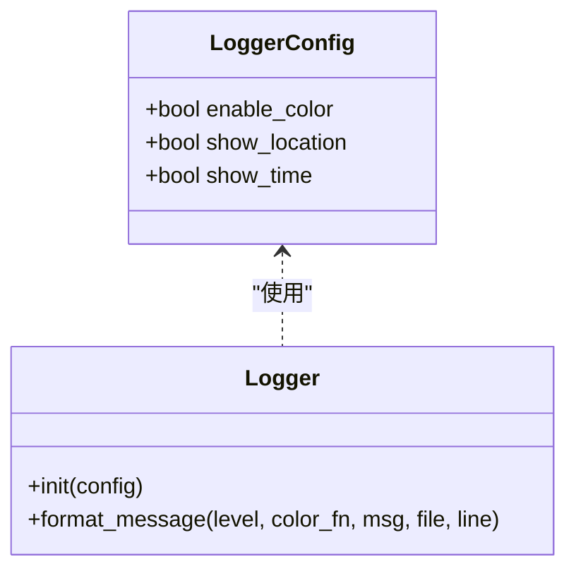
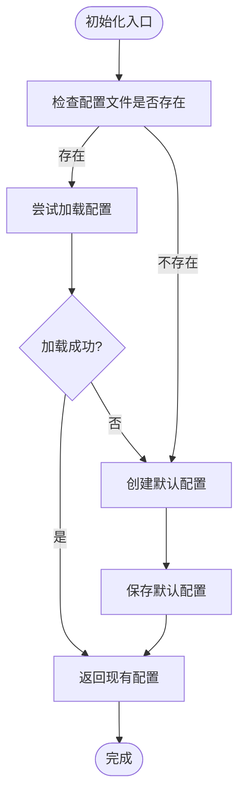
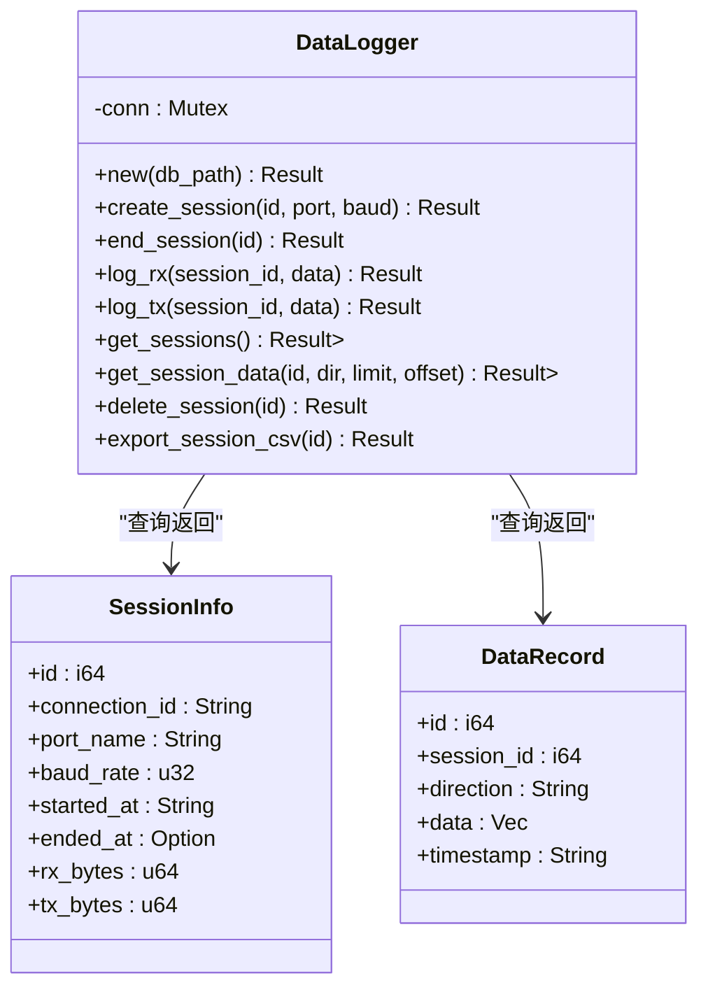
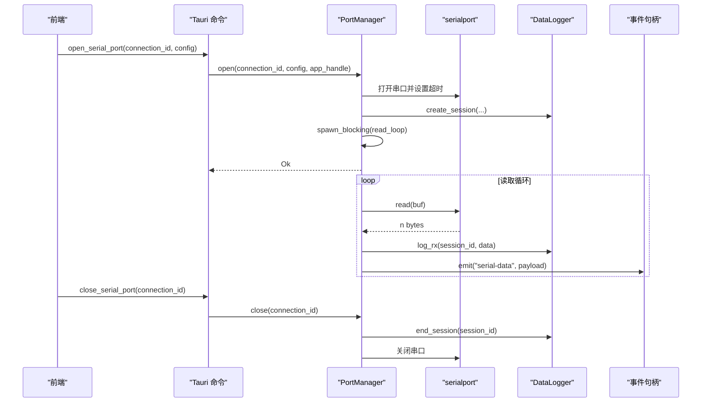
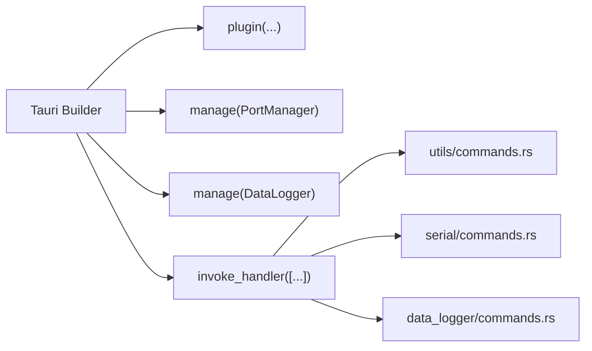
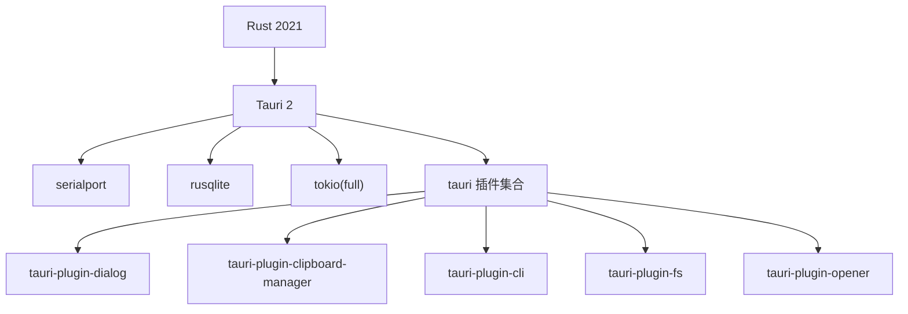

# 核心库设计

<cite>
**本文引用的文件**
- [src-tauri/src/lib.rs](file://src-tauri/src/lib.rs)
- [src-tauri/src/main.rs](file://src-tauri/src/main.rs)
- [src-tauri/Cargo.toml](file://src-tauri/Cargo.toml)
- [src-tauri/tauri.conf.json](file://src-tauri/tauri.conf.json)
- [src-tauri/src/utils/mod.rs](file://src-tauri/src/utils/mod.rs)
- [src-tauri/src/serial/mod.rs](file://src-tauri/src/serial/mod.rs)
- [src-tauri/src/data_logger/mod.rs](file://src-tauri/src/data_logger/mod.rs)
- [src-tauri/src/utils/logger.rs](file://src-tauri/src/utils/logger.rs)
- [src-tauri/src/utils/config.rs](file://src-tauri/src/utils/config.rs)
- [src-tauri/src/serial/port_manager.rs](file://src-tauri/src/serial/port_manager.rs)
- [src-tauri/src/utils/commands.rs](file://src-tauri/src/utils/commands.rs)
- [src-tauri/src/serial/commands.rs](file://src-tauri/src/serial/commands.rs)
- [src-tauri/src/data_logger/commands.rs](file://src-tauri/src/data_logger/commands.rs)
- [src-tauri/build.rs](file://src-tauri/build.rs)
- [DESIGN.md](file://DESIGN.md)
</cite>

## 目录
1. [简介](#简介)
2. [项目结构](#项目结构)
3. [核心组件](#核心组件)
4. [架构总览](#架构总览)
5. [详细组件分析](#详细组件分析)
6. [依赖关系分析](#依赖关系分析)
7. [性能考量](#性能考量)
8. [故障排查指南](#故障排查指南)
9. [结论](#结论)
10. [附录](#附录)

## 简介
本文件面向 KonSerial 核心库（Rust 后端）的设计与实现，聚焦于：
- 入口点与初始化流程
- 模块组织与职责边界
- Tauri 应用启动与全局状态管理
- 日志系统、配置管理与数据持久化
- Tokio 异步运行时与并发安全（Arc、Mutex、RwLock）
- 插件集成与命令处理器注册
- 生命周期管理、错误处理策略与性能优化建议
- 核心库架构图与初始化流程图

## 项目结构
KonSerial 后端位于 src-tauri 目录，采用“模块化 + 命令驱动”的组织方式：
- 核心入口：lib.rs 中的 run() 函数负责初始化与 Tauri Builder 配置
- 子模块：utils（日志、配置、通用命令）、serial（串口管理、命令、数据处理、协议）、data_logger（SQLite 数据记录与命令）、visualization（预留）
- 插件：通过 tauri::Builder::plugin 注入
- 全局状态：通过 .manage 注入 PortManager 与 DataLogger，供命令处理器访问

**图表来源**
- [src-tauri/src/main.rs:1-7](file://src-tauri/src/main.rs#L1-L7)
- [src-tauri/src/lib.rs:24-83](file://src-tauri/src/lib.rs#L24-L83)
- [src-tauri/src/utils/logger.rs:1-132](file://src-tauri/src/utils/logger.rs#L1-L132)
- [src-tauri/src/utils/config.rs:1-176](file://src-tauri/src/utils/config.rs#L1-L176)
- [src-tauri/src/data_logger/mod.rs:1-273](file://src-tauri/src/data_logger/mod.rs#L1-L273)
- [src-tauri/src/serial/port_manager.rs:1-402](file://src-tauri/src/serial/port_manager.rs#L1-L402)
- [src-tauri/src/utils/commands.rs:1-31](file://src-tauri/src/utils/commands.rs#L1-L31)
- [src-tauri/src/serial/commands.rs:1-129](file://src-tauri/src/serial/commands.rs#L1-L129)
- [src-tauri/src/data_logger/commands.rs:1-49](file://src-tauri/src/data_logger/commands.rs#L1-L49)
- [src-tauri/Cargo.toml:1-40](file://src-tauri/Cargo.toml#L1-L40)
- [src-tauri/tauri.conf.json:1-47](file://src-tauri/tauri.conf.json#L1-L47)

**章节来源**
- [src-tauri/src/lib.rs:24-83](file://src-tauri/src/lib.rs#L24-L83)
- [src-tauri/src/main.rs:4-6](file://src-tauri/src/main.rs#L4-L6)
- [src-tauri/Cargo.toml:20-39](file://src-tauri/Cargo.toml#L20-L39)
- [src-tauri/tauri.conf.json:24-33](file://src-tauri/tauri.conf.json#L24-L33)

## 核心组件
- 入口与初始化：main.rs 调用 konserial_lib::run()；lib.rs::run() 完成日志、配置、数据库、串口管理器初始化，并注册插件与命令，最后启动 Tauri 应用。
- 日志系统：utils/logger.rs 提供 LoggerConfig、日志级别宏与线程安全初始化。
- 配置管理：utils/config.rs 提供 AppConfig 结构与 init/new/save/load/reload 等方法，支持跨平台默认路径。
- 数据日志：data_logger::DataLogger 基于 SQLite，提供会话管理、数据写入、查询、删除与导出。
- 串口管理：serial::PortManager 管理多连接，提供打开/关闭、发送、读取循环、全局运行时信息等。
- 命令接口：各模块 commands.rs 将内部逻辑暴露为 Tauri 命令，供前端调用。

**章节来源**
- [src-tauri/src/lib.rs:24-83](file://src-tauri/src/lib.rs#L24-L83)
- [src-tauri/src/utils/logger.rs:41-83](file://src-tauri/src/utils/logger.rs#L41-L83)
- [src-tauri/src/utils/config.rs:65-175](file://src-tauri/src/utils/config.rs#L65-L175)
- [src-tauri/src/data_logger/mod.rs:47-272](file://src-tauri/src/data_logger/mod.rs#L47-L272)
- [src-tauri/src/serial/port_manager.rs:161-401](file://src-tauri/src/serial/port_manager.rs#L161-L401)
- [src-tauri/src/utils/commands.rs:3-31](file://src-tauri/src/utils/commands.rs#L3-L31)
- [src-tauri/src/serial/commands.rs:15-128](file://src-tauri/src/serial/commands.rs#L15-L128)
- [src-tauri/src/data_logger/commands.rs:7-48](file://src-tauri/src/data_logger/commands.rs#L7-L48)

## 架构总览
下图展示了核心库的启动与模块交互关系，以及全局状态注入点。

**图表来源**
- [src-tauri/src/main.rs:1-7](file://src-tauri/src/main.rs#L1-L7)
- [src-tauri/src/lib.rs:24-83](file://src-tauri/src/lib.rs#L24-L83)
- [src-tauri/src/utils/logger.rs:41-83](file://src-tauri/src/utils/logger.rs#L41-L83)
- [src-tauri/src/utils/config.rs:65-175](file://src-tauri/src/utils/config.rs#L65-L175)
- [src-tauri/src/data_logger/mod.rs:47-111](file://src-tauri/src/data_logger/mod.rs#L47-L111)
- [src-tauri/src/serial/port_manager.rs:173-180](file://src-tauri/src/serial/port_manager.rs#L173-L180)
- [src-tauri/Cargo.toml:20-39](file://src-tauri/Cargo.toml#L20-L39)

## 详细组件分析

### 入口与初始化流程
- 入口：Windows 下通过 subsystem 控制窗口行为；main.rs 调用 konserial_lib::run()。
- 初始化顺序：
  1) 日志系统初始化（Logger::init）
  2) 配置初始化（AppConfig::init 默认路径）
  3) 数据库初始化（DataLogger::new 默认路径）
  4) 串口管理器初始化（Arc<Mutex<PortManager>>），注入 DataLogger
  5) 插件注册（dialog、clipboard、cli、fs、opener）
  6) 全局状态注入（PortManager、DataLogger）
  7) 命令处理器注册（greet、配置、串口、数据日志）
  8) 启动 Tauri 应用

**图表来源**
- [src-tauri/src/main.rs:4-6](file://src-tauri/src/main.rs#L4-L6)
- [src-tauri/src/lib.rs:24-83](file://src-tauri/src/lib.rs#L24-L83)
- [src-tauri/src/utils/logger.rs:44-46](file://src-tauri/src/utils/logger.rs#L44-L46)
- [src-tauri/src/utils/config.rs:67-94](file://src-tauri/src/utils/config.rs#L67-L94)
- [src-tauri/src/data_logger/mod.rs:64-111](file://src-tauri/src/data_logger/mod.rs#L64-L111)
- [src-tauri/src/serial/port_manager.rs:174-180](file://src-tauri/src/serial/port_manager.rs#L174-L180)

**章节来源**
- [src-tauri/src/main.rs:1-7](file://src-tauri/src/main.rs#L1-L7)
- [src-tauri/src/lib.rs:24-83](file://src-tauri/src/lib.rs#L24-L83)

### 日志系统
- LoggerConfig 支持颜色、位置、时间显示开关，默认启用。
- Logger::init 使用 OnceLock 保证线程安全的单次初始化。
- 提供 log_info/log_warn/log_error 宏，自动注入文件名与行号。

**图表来源**
- [src-tauri/src/utils/logger.rs:23-40](file://src-tauri/src/utils/logger.rs#L23-L40)
- [src-tauri/src/utils/logger.rs:41-83](file://src-tauri/src/utils/logger.rs#L41-L83)

**章节来源**
- [src-tauri/src/utils/logger.rs:41-132](file://src-tauri/src/utils/logger.rs#L41-L132)

### 配置管理器
- AppConfig 包含 serial/ui/data 三类配置，支持默认值与 serde 序列化。
- default_config_path 跨平台生成配置文件路径。
- init/new/save/load/reload 提供完整的生命周期管理。

**图表来源**
- [src-tauri/src/utils/config.rs:65-94](file://src-tauri/src/utils/config.rs#L65-L94)
- [src-tauri/src/utils/config.rs:96-143](file://src-tauri/src/utils/config.rs#L96-L143)

**章节来源**
- [src-tauri/src/utils/config.rs:1-176](file://src-tauri/src/utils/config.rs#L1-L176)

### 数据日志管理器
- DataLogger 基于 SQLite，提供会话与数据表、索引、WAL/外键配置。
- 支持创建会话、结束会话、记录 RX/TX、查询会话与数据、删除会话、导出 CSV。
- 通过 Mutex 保证连接访问的线程安全。

**图表来源**
- [src-tauri/src/data_logger/mod.rs:47-272](file://src-tauri/src/data_logger/mod.rs#L47-L272)

**章节来源**
- [src-tauri/src/data_logger/mod.rs:1-273](file://src-tauri/src/data_logger/mod.rs#L1-L273)

### 串口管理器
- PortManager 管理多连接，使用 Arc<RwLock<...>> 维护连接表与可用端口缓存。
- open/close/close_all/send/is_connected 等方法通过 State<Arc<Mutex<PortManager>>> 注入。
- 读取循环在独立线程中运行，通过 tokio::task::spawn_blocking，使用 Atomic 标记与计数器。
- 通过 Tauri AppHandle 发送 serial-data 事件到前端，同时持久化到 SQLite。

**图表来源**
- [src-tauri/src/serial/commands.rs:49-59](file://src-tauri/src/serial/commands.rs#L49-L59)
- [src-tauri/src/serial/port_manager.rs:196-272](file://src-tauri/src/serial/port_manager.rs#L196-L272)
- [src-tauri/src/serial/port_manager.rs:274-303](file://src-tauri/src/serial/port_manager.rs#L274-L303)
- [src-tauri/src/data_logger/mod.rs:115-140](file://src-tauri/src/data_logger/mod.rs#L115-L140)

**章节来源**
- [src-tauri/src/serial/port_manager.rs:1-402](file://src-tauri/src/serial/port_manager.rs#L1-L402)
- [src-tauri/src/serial/commands.rs:1-129](file://src-tauri/src/serial/commands.rs#L1-L129)

### 插件系统与命令处理器
- 插件：dialog、clipboard、cli、fs、opener 按需注册。
- 全局状态：PortManager、DataLogger 通过 .manage 注入，命令处理器通过 State/Arc<Mutex<...>> 访问。
- 命令处理器：greet、配置命令、串口命令、数据日志命令集中注册。

**图表来源**
- [src-tauri/src/lib.rs:47-82](file://src-tauri/src/lib.rs#L47-L82)
- [src-tauri/src/utils/commands.rs:3-31](file://src-tauri/src/utils/commands.rs#L3-L31)
- [src-tauri/src/serial/commands.rs:15-128](file://src-tauri/src/serial/commands.rs#L15-L128)
- [src-tauri/src/data_logger/commands.rs:7-48](file://src-tauri/src/data_logger/commands.rs#L7-L48)

**章节来源**
- [src-tauri/src/lib.rs:47-82](file://src-tauri/src/lib.rs#L47-L82)

## 依赖关系分析
- 语言与框架：Rust 2021、Tauri 2、Tokio 异步运行时
- 串口：serialport
- 数据库：rusqlite（带 bundled 特性）
- 日志与颜色：log、env_logger、colored、chrono
- 插件：tauri-plugin-dialog、tauri-plugin-clipboard-manager、tauri-plugin-cli、tauri-plugin-fs、tauri-plugin-opener
- CLI 参数：tauri.conf.json 中定义 --config/-c 参数

**图表来源**
- [src-tauri/Cargo.toml:20-39](file://src-tauri/Cargo.toml#L20-L39)
- [src-tauri/tauri.conf.json:24-33](file://src-tauri/tauri.conf.json#L24-L33)

**章节来源**
- [src-tauri/Cargo.toml:1-40](file://src-tauri/Cargo.toml#L1-L40)
- [src-tauri/tauri.conf.json:1-47](file://src-tauri/tauri.conf.json#L1-L47)

## 性能考量
- 异步读取：串口读取在独立线程中运行，避免阻塞 Tokio 主循环；通过 Atomic 计数器减少锁竞争。
- 并发安全：PortManager 使用 Arc<RwLock<...>> 管理连接表，读多写少场景下提升吞吐。
- 数据持久化：SQLite WAL 模式与外键约束在一致性与性能间取得平衡；索引加速查询。
- 事件推送：通过 Tauri 事件向前端推送数据，避免阻塞 IO。
- 资源释放：关闭串口时终止读取任务并结束会话，防止资源泄漏。

[本节为通用性能建议，不直接分析具体文件]

## 故障排查指南
- 配置加载失败：检查 default_config_path 是否可写，确认 JSON 格式正确；查看日志输出定位错误。
- 串口打开失败：确认端口名称、权限与占用情况；检查超时与流控设置。
- 数据库初始化失败：确认数据库目录可写，WAL/外键设置是否生效。
- 命令调用异常：检查命令注册是否完整，前端传参类型与范围是否匹配。
- 日志无输出：确认 Logger::init 已在 run() 最早阶段调用，且配置允许时间/位置信息。

**章节来源**
- [src-tauri/src/utils/config.rs:67-94](file://src-tauri/src/utils/config.rs#L67-L94)
- [src-tauri/src/serial/port_manager.rs:214-272](file://src-tauri/src/serial/port_manager.rs#L214-L272)
- [src-tauri/src/data_logger/mod.rs:64-111](file://src-tauri/src/data_logger/mod.rs#L64-L111)
- [src-tauri/src/utils/logger.rs:44-46](file://src-tauri/src/utils/logger.rs#L44-L46)

## 结论
KonSerial 核心库以清晰的模块化设计与严格的初始化流程为基础，结合 Tauri 的命令与事件机制，实现了稳定的串口通信、数据持久化与可视化支持。通过 Tokio 异步运行时与 Arc/Mutex/RwLock 的合理使用，兼顾了并发安全性与性能表现。插件体系与全局状态注入进一步增强了扩展能力与可维护性。

[本节为总结性内容，不直接分析具体文件]

## 附录
- 构建脚本：build.rs 调用 tauri_build::build，配合 tauri.conf.json 与 Cargo.toml 完成打包与签名配置。
- 设计文档：DESIGN.md 提供了整体架构、模块职责与实现思路，可作为本文件的背景参考。

**章节来源**
- [src-tauri/build.rs:1-4](file://src-tauri/build.rs#L1-L4)
- [DESIGN.md:101-139](file://DESIGN.md#L101-L139)