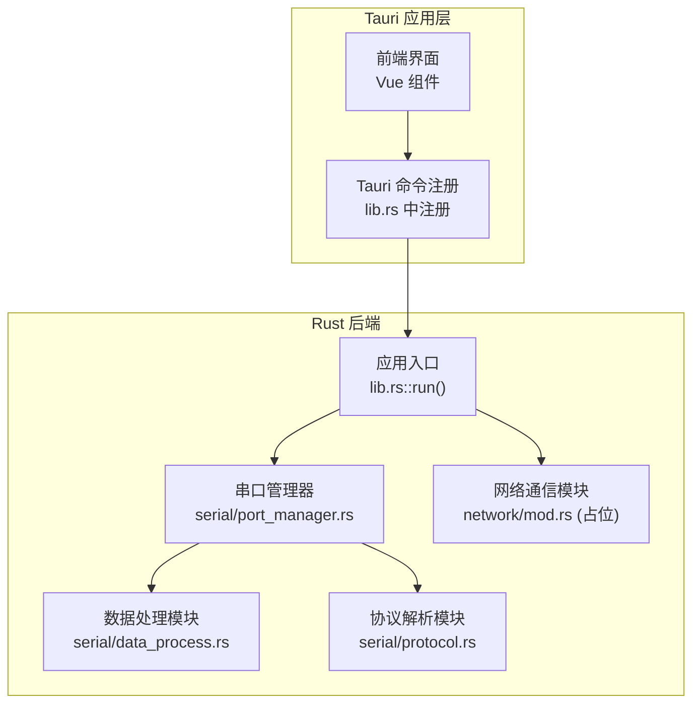
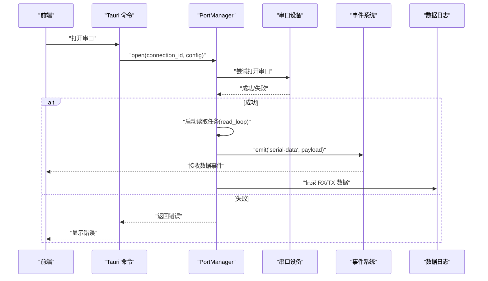
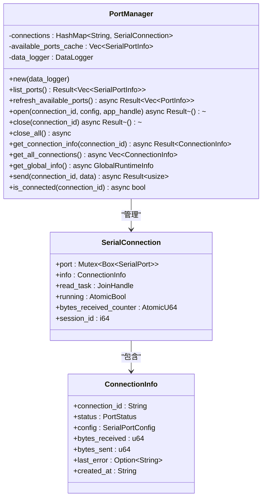
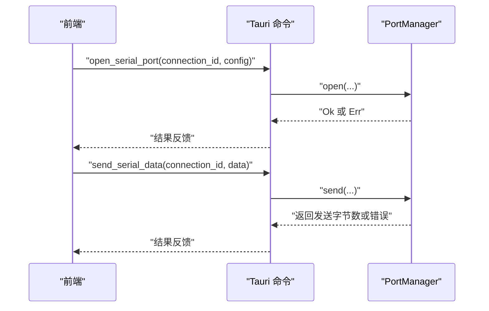
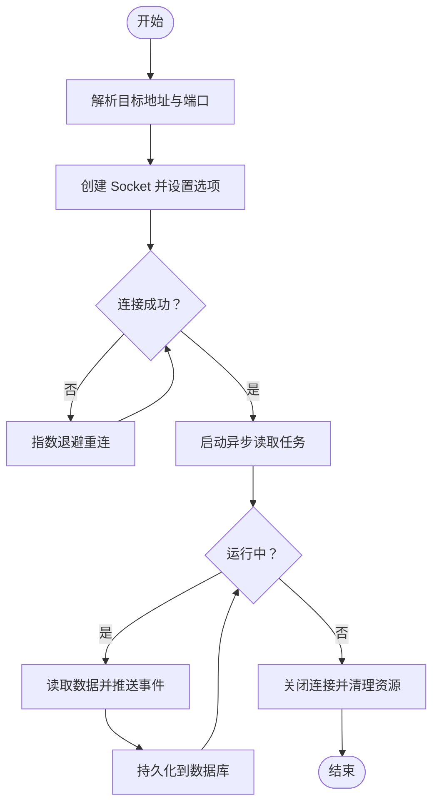
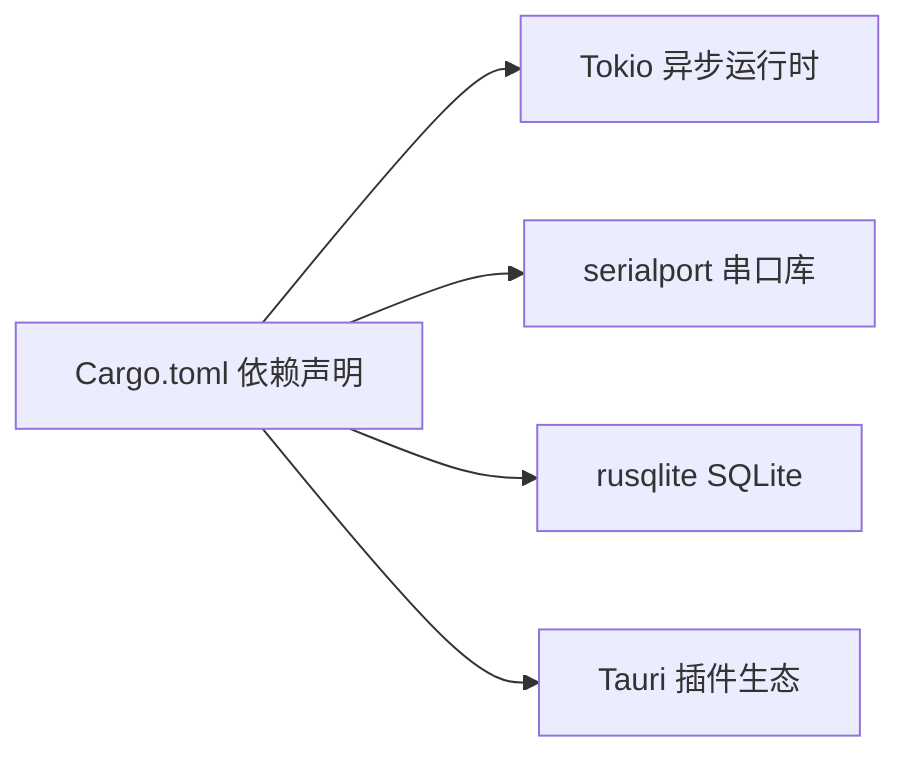

# 网络通信模块

<cite>
**本文档引用的文件**
- [src-tauri/src/lib.rs](file://src-tauri/src/lib.rs)
- [src-tauri/src/network/mod.rs](file://src-tauri/src/network/mod.rs)
- [src-tauri/src/serial/port_manager.rs](file://src-tauri/src/serial/port_manager.rs)
- [src-tauri/src/serial/commands.rs](file://src-tauri/src/serial/commands.rs)
- [src-tauri/Cargo.toml](file://src-tauri/Cargo.toml)
- [src-tauri/src/main.rs](file://src-tauri/src/main.rs)
</cite>

## 目录
1. [简介](#简介)
2. [项目结构](#项目结构)
3. [核心组件](#核心组件)
4. [架构总览](#架构总览)
5. [详细组件分析](#详细组件分析)
6. [依赖关系分析](#依赖关系分析)
7. [性能考虑](#性能考虑)
8. [故障排除指南](#故障排除指南)
9. [结论](#结论)

## 简介
本文件面向 KonSerial 的网络通信模块，基于当前仓库中的实际代码进行技术文档梳理。根据现有源码，网络模块目前处于占位状态，尚未实现具体功能；而串口通信模块已完整实现，可作为理解后端通信架构与连接管理的良好参考。本文将以串口通信模块为蓝本，系统性地阐述连接生命周期、异步处理、错误处理与性能优化等关键主题，并给出网络模块未来扩展的建议与架构图。

## 项目结构
KonSerial 的后端采用 Tauri + Rust 实现，网络模块位于 `src-tauri/src/network/mod.rs`，当前仅包含模块声明与注释，未见具体实现。串口通信模块位于 `src-tauri/src/serial/` 目录下，包含端口管理、命令接口、数据处理与协议解析四个子模块。整体架构围绕 `PortManager` 展开，负责多连接管理、异步读写、事件推送与数据持久化。

**图表来源**
- [src-tauri/src/lib.rs:47-82](file://src-tauri/src/lib.rs#L47-L82)
- [src-tauri/src/serial/port_manager.rs:162-180](file://src-tauri/src/serial/port_manager.rs#L162-L180)
- [src-tauri/src/network/mod.rs:1-3](file://src-tauri/src/network/mod.rs#L1-L3)

**章节来源**
- [src-tauri/src/lib.rs:47-82](file://src-tauri/src/lib.rs#L47-L82)
- [src-tauri/src/network/mod.rs:1-3](file://src-tauri/src/network/mod.rs#L1-L3)

## 核心组件
- 串口管理器（PortManager）：负责多连接生命周期管理、异步读写、状态跟踪与事件推送。
- 串口命令接口：通过 Tauri 命令暴露串口操作能力，供前端调用。
- 数据处理与协议解析：为串口数据提供解析与封装能力（网络模块可复用该思路）。
- 网络模块占位：当前仅声明模块，后续可在此基础上实现 TCP/UDP 客户端与服务端功能。

**章节来源**
- [src-tauri/src/serial/port_manager.rs:162-180](file://src-tauri/src/serial/port_manager.rs#L162-L180)
- [src-tauri/src/serial/commands.rs:15-129](file://src-tauri/src/serial/commands.rs#L15-L129)
- [src-tauri/src/network/mod.rs:1-3](file://src-tauri/src/network/mod.rs#L1-L3)

## 架构总览
下图展示了串口通信模块的运行时架构，包括连接状态机、异步读取任务、事件推送与数据持久化。网络模块可沿用相同模式：以连接为中心的状态管理、独立的读取任务、事件驱动的数据推送与持久化。

**图表来源**
- [src-tauri/src/serial/commands.rs:49-59](file://src-tauri/src/serial/commands.rs#L49-L59)
- [src-tauri/src/serial/port_manager.rs:196-272](file://src-tauri/src/serial/port_manager.rs#L196-L272)
- [src-tauri/src/serial/port_manager.rs:274-303](file://src-tauri/src/serial/port_manager.rs#L274-L303)

## 详细组件分析

### 串口管理器（PortManager）
PortManager 是串口通信的核心组件，负责：
- 多连接管理：以连接 ID 为键的并发安全映射。
- 连接生命周期：打开、读取、发送、关闭与错误处理。
- 异步读取：独立线程中的读取循环，周期性检查运行标志与超时。
- 事件推送：通过 Tauri 事件向前端推送数据。
- 数据持久化：将收发数据写入 SQLite 会话。

**图表来源**
- [src-tauri/src/serial/port_manager.rs:162-180](file://src-tauri/src/serial/port_manager.rs#L162-L180)
- [src-tauri/src/serial/port_manager.rs:96-104](file://src-tauri/src/serial/port_manager.rs#L96-L104)
- [src-tauri/src/serial/port_manager.rs:77-87](file://src-tauri/src/serial/port_manager.rs#L77-L87)

**章节来源**
- [src-tauri/src/serial/port_manager.rs:162-180](file://src-tauri/src/serial/port_manager.rs#L162-L180)
- [src-tauri/src/serial/port_manager.rs:196-272](file://src-tauri/src/serial/port_manager.rs#L196-L272)
- [src-tauri/src/serial/port_manager.rs:274-303](file://src-tauri/src/serial/port_manager.rs#L274-L303)
- [src-tauri/src/serial/port_manager.rs:305-331](file://src-tauri/src/serial/port_manager.rs#L305-L331)
- [src-tauri/src/serial/port_manager.rs:333-344](file://src-tauri/src/serial/port_manager.rs#L333-L344)
- [src-tauri/src/serial/port_manager.rs:346-354](file://src-tauri/src/serial/port_manager.rs#L346-L354)
- [src-tauri/src/serial/port_manager.rs:357-367](file://src-tauri/src/serial/port_manager.rs#L357-L367)
- [src-tauri/src/serial/port_manager.rs:370-392](file://src-tauri/src/serial/port_manager.rs#L370-L392)
- [src-tauri/src/serial/port_manager.rs:394-401](file://src-tauri/src/serial/port_manager.rs#L394-L401)

### 串口命令接口
Tauri 命令接口提供了对串口管理器的统一访问入口，包括：
- 列出串口、刷新串口列表
- 打开/关闭指定串口
- 获取连接状态与全局运行时信息
- 发送数据与查询连接状态

**图表来源**
- [src-tauri/src/serial/commands.rs:49-59](file://src-tauri/src/serial/commands.rs#L49-L59)
- [src-tauri/src/serial/commands.rs:110-118](file://src-tauri/src/serial/commands.rs#L110-L118)

**章节来源**
- [src-tauri/src/serial/commands.rs:15-129](file://src-tauri/src/serial/commands.rs#L15-L129)

### 网络模块设计建议（基于串口实现的迁移）
虽然当前网络模块尚未实现，但可借鉴串口模块的设计模式快速落地。以下为网络模块的推荐架构与流程：

- 连接模型
  - 以连接 ID 为中心的多连接管理，类似 PortManager 的 HashMap 设计。
  - 支持 TCP/UDP 客户端模式，分别对应不同的 Socket 类型与读写策略。
- 生命周期管理
  - 打开：解析目标地址与端口，创建 Socket 并设置超时与缓冲区大小。
  - 维护：独立异步任务持续读取，周期性检查连接状态与心跳。
  - 断开：优雅关闭 Socket，清理资源与会话记录。
- 异步处理
  - 使用 Tokio 的异步 I/O，避免阻塞主线程。
  - 读取循环采用固定缓冲区与超时控制，确保及时响应关闭信号。
- 错误重连与超时
  - 对瞬时错误进行指数退避重连，避免频繁重试导致资源耗尽。
  - 设置连接超时、读写超时与空闲超时，防止资源泄漏。
- 事件与持久化
  - 通过事件系统向前端推送数据，保持与串口模块一致的用户体验。
  - 将收发数据持久化到 SQLite，便于回放与分析。

[此图为概念性流程示意，不直接映射具体源码文件]

## 依赖关系分析
- 运行时依赖
  - Tokio：提供异步运行时与任务管理。
  - serialport：串口通信库（串口模块使用）。
  - rusqlite：SQLite 数据库（数据日志模块使用）。
  - Tauri 插件：对话框、剪贴板、文件系统等（应用层使用）。
- 模块耦合
  - PortManager 与 DataLogger、Tauri 事件系统耦合紧密，体现“连接即会话”的设计理念。
  - 网络模块应遵循同样模式：以连接为中心，结合事件与持久化。

**图表来源**
- [src-tauri/Cargo.toml:20-36](file://src-tauri/Cargo.toml#L20-L36)

**章节来源**
- [src-tauri/Cargo.toml:20-36](file://src-tauri/Cargo.toml#L20-L36)

## 性能考虑
- 异步 I/O 与线程池
  - 使用 Tokio 的异步 I/O，避免阻塞主线程；对于 CPU 密集型任务使用 `spawn_blocking`。
- 缓冲区与超时
  - 串口模块采用固定缓冲区与短超时，确保及时响应关闭信号；网络模块可按 MTU 与业务场景调整缓冲区大小。
- 事件频率控制
  - 频繁数据推送可能导致前端卡顿，可通过节流或批量推送优化。
- 内存与资源
  - 连接过多时注意内存占用，定期清理无用会话与连接。
- 网络优化建议
  - TCP Nagle 关闭、TCP_NODELAY 设置（如需低延迟）。
  - UDP 广播/组播时合理设置 TTL 与接口绑定。
  - 复用连接与连接池，减少握手开销。

[本节为通用性能指导，不直接分析具体文件]

## 故障排除指南
- 常见问题
  - 串口被占用：检查是否已有进程占用，或尝试重启设备。
  - 权限不足：Linux 下需要添加用户到 dialout 组；Windows 下检查驱动。
  - 超时错误：适当增大超时时间，检查线缆与设备稳定性。
  - 事件丢失：检查前端事件监听与节流策略。
- 日志与诊断
  - 应用启动日志与错误日志可用于定位问题。
  - 串口模块在打开失败时会记录错误详情，网络模块可复用该模式。
- 重连策略
  - 瞬时错误自动重连，永久错误提示用户并停止重试。
  - 记录每次重连的时间与原因，便于后续分析。

**章节来源**
- [src-tauri/src/serial/port_manager.rs:266-271](file://src-tauri/src/serial/port_manager.rs#L266-L271)
- [src-tauri/src/lib.rs:25-45](file://src-tauri/src/lib.rs#L25-L45)

## 结论
- 当前网络模块处于占位阶段，尚未实现具体功能。
- 串口模块提供了完整的连接生命周期、异步处理与事件推送范式，可作为网络模块开发的蓝图。
- 建议在网络模块中复用串口模块的设计思想：以连接为中心、异步读取、事件驱动与数据持久化。
- 在实现 TCP/UDP 客户端时，重点关注连接建立、心跳与超时、错误重连与资源清理等关键环节。

[本节为总结性内容，不直接分析具体文件]