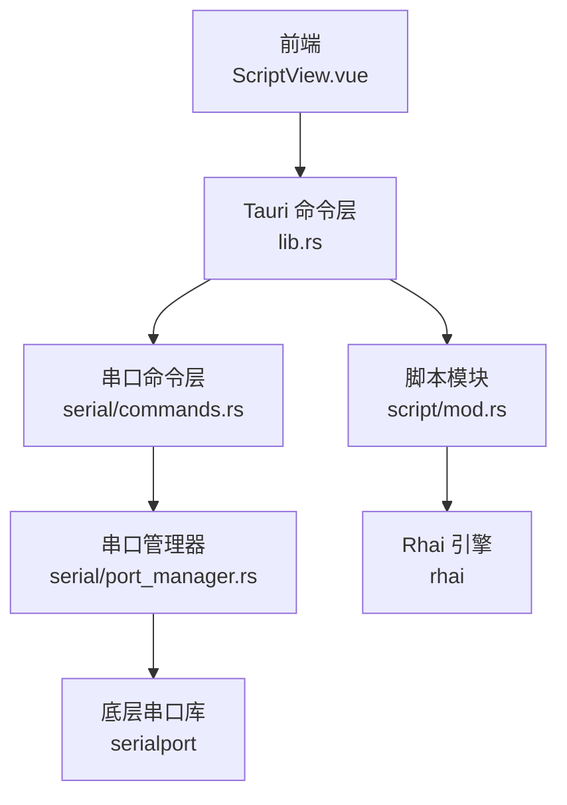
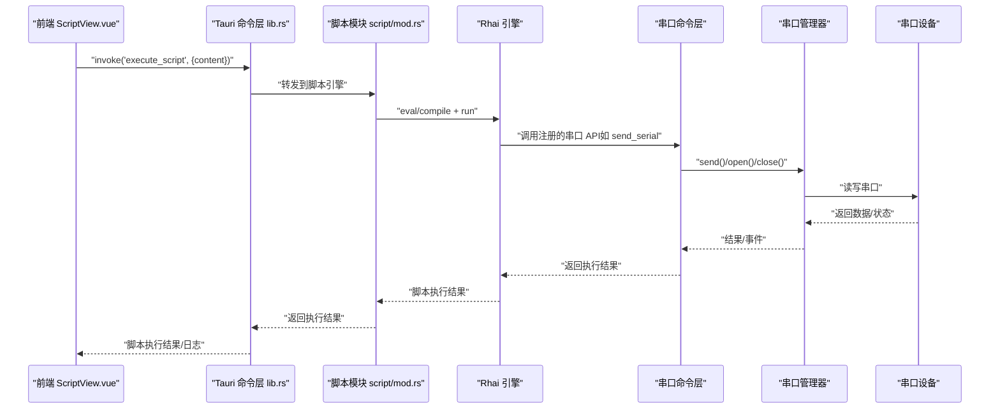
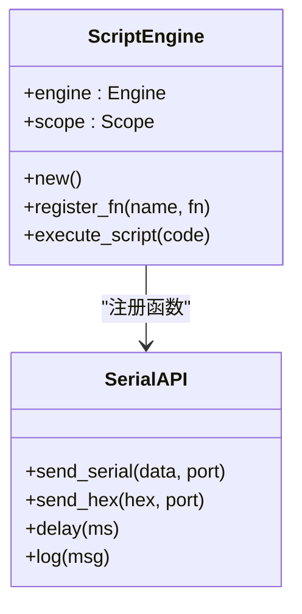
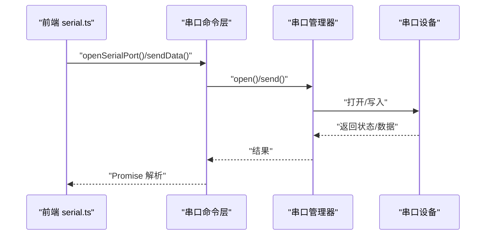
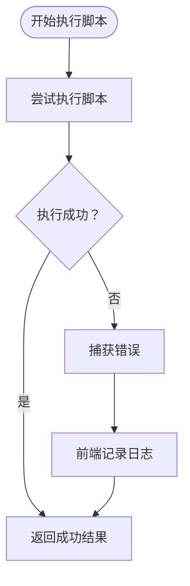
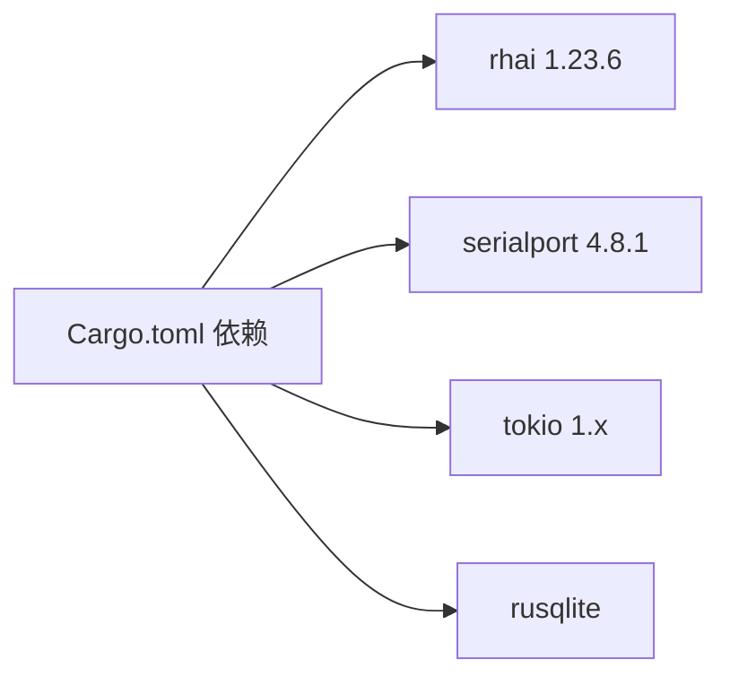

# 脚本引擎模块

<cite>
**本文引用的文件**   
- [Cargo.toml](file://src-tauri/Cargo.toml)
- [lib.rs](file://src-tauri/src/lib.rs)
- [mod.rs](file://src-tauri/src/script/mod.rs)
- [commands.rs](file://src-tauri/src/serial/commands.rs)
- [port_manager.rs](file://src-tauri/src/serial/port_manager.rs)
- [serial.ts](file://src/stores/serial.ts)
- [ScriptView.vue](file://src/views/ScriptView.vue)
- [DESIGN.md](file://DESIGN.md)
</cite>

## 目录
1. [简介](#简介)
2. [项目结构](#项目结构)
3. [核心组件](#核心组件)
4. [架构总览](#架构总览)
5. [详细组件分析](#详细组件分析)
6. [依赖关系分析](#依赖关系分析)
7. [性能考量](#性能考量)
8. [故障排查指南](#故障排查指南)
9. [结论](#结论)
10. [附录](#附录)

## 简介
本文件面向 KonSerial 的“脚本引擎模块”，系统性阐述其与 Rhai 脚本引擎的集成方式、脚本执行环境与 API 设计、语法与内置能力、与串口通信的交互机制、安全沙箱与执行限制、错误处理、调试与性能监控，以及最佳实践与参考示例。当前仓库中脚本引擎处于设计阶段，核心思路已在设计文档中给出；前端脚本视图与串口状态管理已具备基础形态，便于后续扩展。

## 项目结构
脚本引擎模块位于 Rust 后端的 src-tauri 子树中，前端脚本编辑与日志展示位于前端 src/views 与 src/stores。整体采用 Tauri 架构，前端通过 invoke 调用后端命令，后端通过 Rhai 引擎执行脚本并调用串口命令。

**图表来源**
- [lib.rs:47-80](file://src-tauri/src/lib.rs#L47-L80)
- [mod.rs:1-2](file://src-tauri/src/script/mod.rs#L1-L2)
- [commands.rs:15-129](file://src-tauri/src/serial/commands.rs#L15-L129)
- [port_manager.rs:162-401](file://src-tauri/src/serial/port_manager.rs#L162-L401)
- [Cargo.toml:29](file://src-tauri/Cargo.toml#L29)

**章节来源**
- [lib.rs:47-80](file://src-tauri/src/lib.rs#L47-L80)
- [mod.rs:1-2](file://src-tauri/src/script/mod.rs#L1-L2)
- [commands.rs:15-129](file://src-tauri/src/serial/commands.rs#L15-L129)
- [port_manager.rs:162-401](file://src-tauri/src/serial/port_manager.rs#L162-L401)
- [Cargo.toml:29](file://src-tauri/Cargo.toml#L29)

## 核心组件
- 脚本模块入口：提供脚本引擎集成与 API 注册的占位模块，当前仅声明用途。
- Rhai 引擎：作为嵌入式脚本引擎，提供安全、快速的脚本执行能力，并支持注册函数与作用域。
- 串口命令层：提供串口枚举、打开/关闭、发送、状态查询等命令，供脚本调用。
- 串口管理器：封装多连接串口生命周期、读写循环、事件推送与数据持久化。
- 前端脚本视图：提供脚本编辑、运行/停止、日志输出与脚本文件管理的基础 UI。
- 前端串口状态管理：提供串口操作 API（如发送、监听数据事件），并与后端命令层对接。

**章节来源**
- [mod.rs:1-2](file://src-tauri/src/script/mod.rs#L1-L2)
- [Cargo.toml:29](file://src-tauri/Cargo.toml#L29)
- [commands.rs:15-129](file://src-tauri/src/serial/commands.rs#L15-L129)
- [port_manager.rs:162-401](file://src-tauri/src/serial/port_manager.rs#L162-L401)
- [serial.ts:146-285](file://src/stores/serial.ts#L146-L285)
- [ScriptView.vue:60-100](file://src/views/ScriptView.vue#L60-L100)

## 架构总览
脚本引擎的执行流大致如下：前端触发运行脚本，后端通过命令层调用脚本引擎，脚本引擎在作用域内执行用户脚本，期间可调用注册的串口 API（如发送、延时、日志），后端再通过串口命令层与串口管理器交互，完成实际的串口读写与事件推送。

**图表来源**
- [lib.rs:56-80](file://src-tauri/src/lib.rs#L56-L80)
- [DESIGN.md:348-565](file://DESIGN.md#L348-L565)
- [commands.rs:15-129](file://src-tauri/src/serial/commands.rs#L15-L129)
- [port_manager.rs:274-303](file://src-tauri/src/serial/port_manager.rs#L274-L303)

## 详细组件分析

### 脚本引擎与 API 设计
- 集成方式：Rhai 作为嵌入式脚本引擎，通过注册函数的方式向脚本暴露串口操作 API 与辅助函数（如延时、日志）。
- 作用域与状态：脚本引擎维护作用域，可在其中绑定变量与状态，供脚本读写。
- 命令桥接：前端通过 invoke 调用后端命令，后端将脚本内容交由 Rhai 执行，执行结果回传前端。

**图表来源**
- [DESIGN.md:348-396](file://DESIGN.md#L348-L396)

**章节来源**
- [DESIGN.md:348-396](file://DESIGN.md#L348-L396)
- [DESIGN.md:555-565](file://DESIGN.md#L555-L565)

### 串口通信交互机制
- 前端通过串口状态管理模块调用后端命令，实现打开/关闭串口、发送数据、监听数据事件等。
- 后端串口命令层将请求转交给串口管理器，串口管理器负责实际的串口读写与事件推送。
- 脚本中可通过注册的串口 API 调用上述能力，形成“脚本 -> 命令 -> 管理器 -> 设备”的闭环。

**图表来源**
- [serial.ts:157-285](file://src/stores/serial.ts#L157-L285)
- [commands.rs:49-129](file://src-tauri/src/serial/commands.rs#L49-L129)
- [port_manager.rs:196-392](file://src-tauri/src/serial/port_manager.rs#L196-L392)

**章节来源**
- [serial.ts:157-285](file://src/stores/serial.ts#L157-L285)
- [commands.rs:49-129](file://src-tauri/src/serial/commands.rs#L49-L129)
- [port_manager.rs:196-392](file://src-tauri/src/serial/port_manager.rs#L196-L392)

### 脚本执行环境与语法支持
- 语言与引擎：Rhai 作为脚本引擎，提供类 JavaScript 的语法与表达式能力，支持注册函数、作用域变量与基本流程控制。
- 内置函数建议：发送串口数据、十六进制发送、延时、日志输出等。
- 变量绑定：可在作用域中绑定当前连接 ID、端口配置、统计计数器等，供脚本读写。

**章节来源**
- [DESIGN.md:348-396](file://DESIGN.md#L348-L396)
- [DESIGN.md:748-818](file://DESIGN.md#L748-L818)

### 安全沙箱与执行限制
- 访问控制：脚本仅能调用后端显式注册的 API，无法直接访问系统资源。
- 超时与中断：建议在脚本引擎侧设置执行超时与中断机制，避免长时间阻塞。
- I/O 限制：对串口读写进行速率与长度限制，防止过载。

**章节来源**
- [DESIGN.md:820-826](file://DESIGN.md#L820-L826)

### 错误处理与日志
- 前端日志：脚本视图提供日志列表，支持清空与时间戳显示。
- 后端错误：串口命令层与管理器返回错误字符串，前端统一展示。
- 脚本错误：Rhai 执行异常通过命令层捕获并反馈给前端。

**图表来源**
- [DESIGN.md:555-565](file://DESIGN.md#L555-L565)
- [ScriptView.vue:88-96](file://src/views/ScriptView.vue#L88-L96)

**章节来源**
- [ScriptView.vue:88-96](file://src/views/ScriptView.vue#L88-L96)
- [commands.rs:15-24](file://src-tauri/src/serial/commands.rs#L15-L24)

### 调试支持与性能监控
- 调试：前端脚本视图提供运行/停止控制与日志输出；后端可增加脚本执行计时与中间状态上报。
- 性能：串口读写采用 tokio 任务与原子计数器，避免阻塞；脚本侧建议限制循环次数与发送频率。

**章节来源**
- [ScriptView.vue:60-100](file://src/views/ScriptView.vue#L60-L100)
- [port_manager.rs:274-303](file://src-tauri/src/serial/port_manager.rs#L274-L303)

### 最佳实践与示例
- 模板与示例：前端脚本视图提供示例脚本，涵盖周期发送、条件发送与数据处理。
- 建议：优先使用异步发送与延时，避免阻塞；对关键操作添加错误检查与日志；合理设置串口参数与缓冲区大小。

**章节来源**
- [ScriptView.vue:18-35](file://src/views/ScriptView.vue#L18-L35)
- [DESIGN.md:748-818](file://DESIGN.md#L748-L818)

## 依赖关系分析
- 脚本引擎依赖：Rhai 1.23.6，启用 serde、std、sync 特性。
- 串口依赖：serialport 4.8.1，提供跨平台串口访问。
- 并发与异步：Tokio 1.x，用于串口读写与任务调度。
- 日志与工具：log、env_logger、colored、dirs、rusqlite 等。

**图表来源**
- [Cargo.toml:20-36](file://src-tauri/Cargo.toml#L20-L36)

**章节来源**
- [Cargo.toml:20-36](file://src-tauri/Cargo.toml#L20-L36)

## 性能考量
- 串口读写：采用 tokio 任务与固定超时，避免长时间阻塞；使用原子计数器减少锁竞争。
- 脚本执行：建议限制循环深度与执行时间，避免占用主线程；对高频发送进行节流。
- 前端渲染：日志列表与编辑器需注意大数据量下的渲染性能，必要时分页或虚拟滚动。

**章节来源**
- [port_manager.rs:274-303](file://src-tauri/src/serial/port_manager.rs#L274-L303)
- [serial.ts:105-117](file://src/stores/serial.ts#L105-L117)

## 故障排查指南
- 串口不可用：确认系统串口列表与权限；检查打开参数（波特率、数据位、停止位、校验）。
- 发送失败：检查连接状态、缓冲区大小与超时设置；查看后端错误日志。
- 脚本无响应：检查脚本是否存在死循环或长时间阻塞；查看前端日志与后端执行状态。
- 前端无数据：确认事件监听是否启动、回调是否注册、编码解码是否正确。

**章节来源**
- [commands.rs:15-24](file://src-tauri/src/serial/commands.rs#L15-L24)
- [serial.ts:311-341](file://src/stores/serial.ts#L311-L341)

## 结论
脚本引擎模块以 Rhai 为核心，结合 Tauri 命令层与串口管理器，构建了“脚本 -> API -> 管理器 -> 设备”的清晰执行链路。当前前端脚本视图与串口状态管理已具备基础能力，后续重点在于完善脚本引擎的 API 注册、安全沙箱与执行限制、错误处理与调试能力，并持续优化性能与用户体验。

## 附录
- API 参考（建议）
  - 串口相关：打开串口、关闭串口、发送数据、查询状态、刷新端口列表
  - 脚本相关：执行脚本、停止脚本、脚本模板加载
- 脚本示例（建议）
  - 周期发送：定时发送固定消息
  - 条件发送：根据接收数据触发特定动作
  - 数据处理：解析与转换接收到的数据

**章节来源**
- [commands.rs:15-129](file://src-tauri/src/serial/commands.rs#L15-L129)
- [DESIGN.md:748-818](file://DESIGN.md#L748-L818)