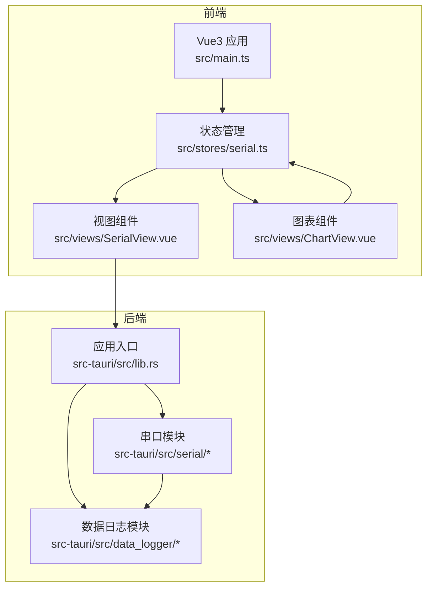
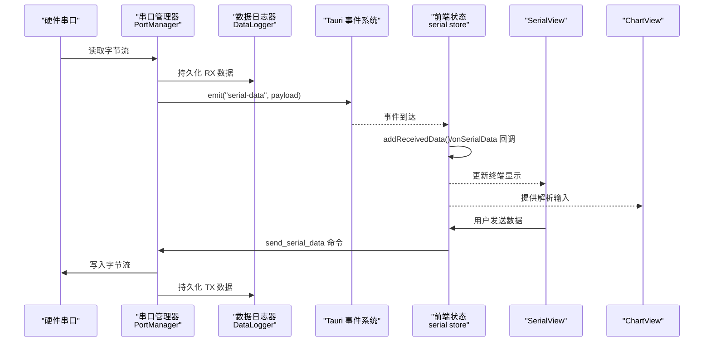
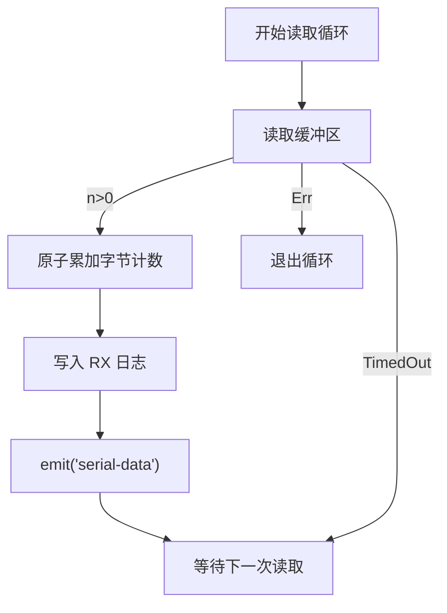
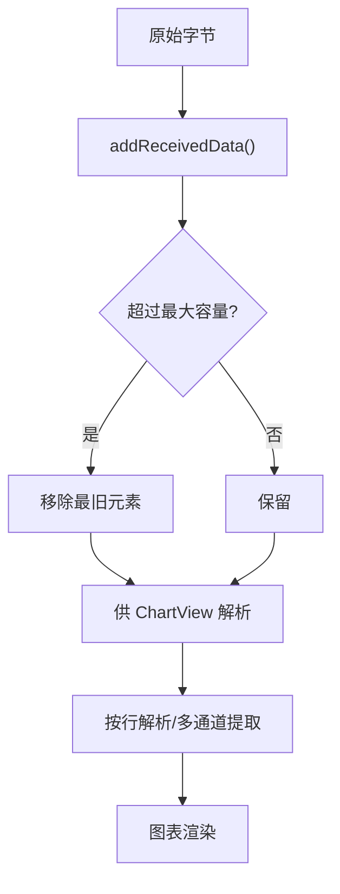
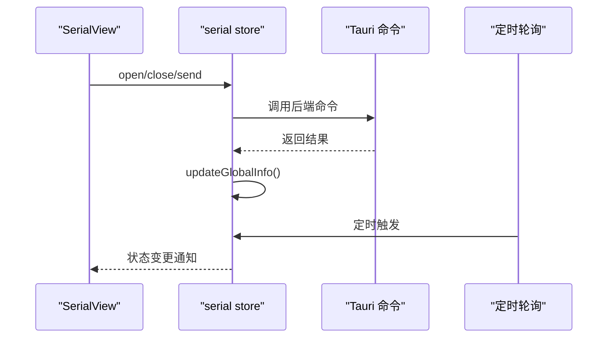
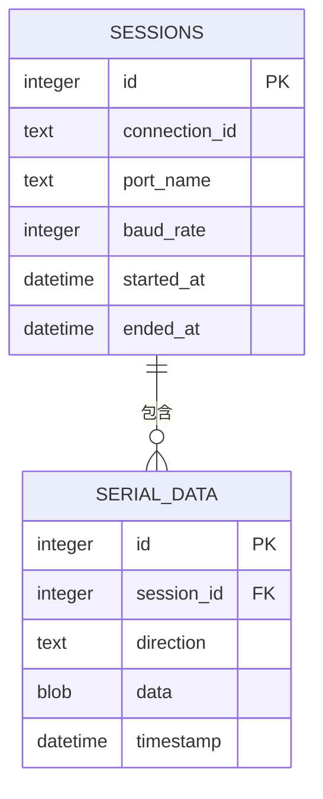
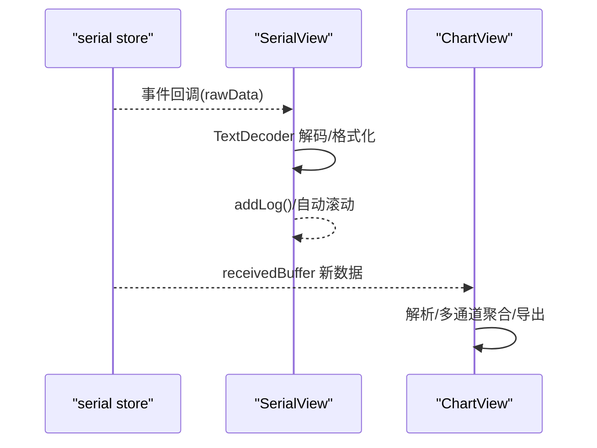
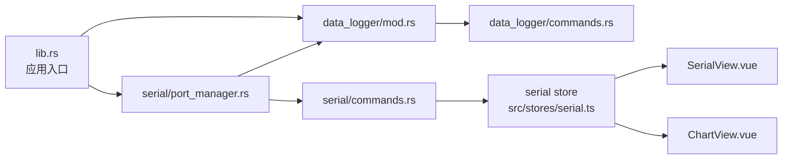

# 数据流设计

<cite>
**本文引用的文件**
- [src-tauri/src/lib.rs](file://src-tauri/src/lib.rs)
- [src-tauri/src/serial/mod.rs](file://src-tauri/src/serial/mod.rs)
- [src-tauri/src/serial/port_manager.rs](file://src-tauri/src/serial/port_manager.rs)
- [src-tauri/src/serial/commands.rs](file://src-tauri/src/serial/commands.rs)
- [src-tauri/src/serial/data_process.rs](file://src-tauri/src/serial/data_process.rs)
- [src-tauri/src/serial/protocol.rs](file://src-tauri/src/serial/protocol.rs)
- [src-tauri/src/data_logger/mod.rs](file://src-tauri/src/data_logger/mod.rs)
- [src-tauri/src/data_logger/commands.rs](file://src-tauri/src/data_logger/commands.rs)
- [src/stores/serial.ts](file://src/stores/serial.ts)
- [src/views/SerialView.vue](file://src/views/SerialView.vue)
- [src/views/ChartView.vue](file://src/views/ChartView.vue)
- [DESIGN.md](file://DESIGN.md)
</cite>

## 目录
1. [引言](#引言)
2. [项目结构](#项目结构)
3. [核心组件](#核心组件)
4. [架构总览](#架构总览)
5. [详细组件分析](#详细组件分析)
6. [依赖关系分析](#依赖关系分析)
7. [性能考量](#性能考量)
8. [故障排查指南](#故障排查指南)
9. [结论](#结论)
10. [附录](#附录)

## 引言
本文件面向 KonSerial 的“数据流设计”，系统性阐述从硬件串口数据采集到前端可视化的完整数据流转路径。重点覆盖以下方面：
- 串口数据读取与事件推送
- 数据预处理与缓冲区管理
- 状态管理与实时更新
- 数据库持久化与历史查询
- 前端渲染与可视化
- 异步数据流、格式转换、编码处理与协议解析
- 缓存策略、性能优化与内存管理
- 数据一致性与错误恢复机制

## 项目结构
KonSerial 采用 Tauri + Vue3 + Rust 的前后端分离架构。后端负责串口、日志、网络、脚本等系统级能力；前端负责 UI、状态管理与可视化。

**图表来源**
- [src-tauri/src/lib.rs:24-84](file://src-tauri/src/lib.rs#L24-L84)
- [src-tauri/src/serial/mod.rs:1-4](file://src-tauri/src/serial/mod.rs#L1-L4)
- [src-tauri/src/data_logger/mod.rs:1-273](file://src-tauri/src/data_logger/mod.rs#L1-L273)

**章节来源**
- [DESIGN.md:15-139](file://DESIGN.md#L15-L139)

## 核心组件
- 串口管理器（PortManager）：负责串口枚举、打开/关闭、读写、状态统计与事件推送。
- 数据日志器（DataLogger）：基于 SQLite 的会话与数据持久化，提供查询与导出。
- 前端状态管理（serial store）：封装 Tauri 命令调用、事件监听、全局运行时信息、接收缓存与发送逻辑。
- 视图组件：SerialView 负责终端显示与发送；ChartView 负责解析与可视化。

**章节来源**
- [src-tauri/src/serial/port_manager.rs:159-401](file://src-tauri/src/serial/port_manager.rs#L159-L401)
- [src-tauri/src/data_logger/mod.rs:47-273](file://src-tauri/src/data_logger/mod.rs#L47-L273)
- [src/stores/serial.ts:1-363](file://src/stores/serial.ts#L1-L363)

## 架构总览
下图展示了从硬件到前端的端到端数据流：

**图表来源**
- [src-tauri/src/serial/port_manager.rs:274-303](file://src-tauri/src/serial/port_manager.rs#L274-L303)
- [src-tauri/src/serial/commands.rs:109-118](file://src-tauri/src/serial/commands.rs#L109-L118)
- [src-tauri/src/data_logger/mod.rs:144-164](file://src-tauri/src/data_logger/mod.rs#L144-L164)
- [src/stores/serial.ts:311-341](file://src/stores/serial.ts#L311-L341)

## 详细组件分析

### 串口数据读取与事件推送
- 串口打开后，后端启动独立线程的读取循环，使用固定超时读取，遇到超时继续循环，异常则退出。
- 每次读取到数据后，先原子累加字节数，再持久化到 SQLite，最后通过 Tauri 事件推送至前端。
- 前端注册事件监听，将原始字节交给回调链，由各组件自行解码与渲染。

**图表来源**
- [src-tauri/src/serial/port_manager.rs:274-303](file://src-tauri/src/serial/port_manager.rs#L274-L303)

**章节来源**
- [src-tauri/src/serial/port_manager.rs:196-272](file://src-tauri/src/serial/port_manager.rs#L196-L272)
- [src-tauri/src/serial/port_manager.rs:274-303](file://src-tauri/src/serial/port_manager.rs#L274-L303)

### 数据预处理与缓冲区管理
- 前端提供全局接收缓存（receivedBuffer），用于跨组件共享原始数据片段，支持最大容量限制与滑动窗口丢弃。
- SerialView 将 RX 数据同步写入该缓存，供 ChartView 解析与可视化。
- 发送数据时，前端支持文本与十六进制两种模式，分别进行编码或十六进制解析，并调用后端命令发送。

**图表来源**
- [src/stores/serial.ts:96-117](file://src/stores/serial.ts#L96-L117)
- [src/views/ChartView.vue:100-114](file://src/views/ChartView.vue#L100-L114)

**章节来源**
- [src/stores/serial.ts:96-117](file://src/stores/serial.ts#L96-L117)
- [src/views/ChartView.vue:71-98](file://src/views/ChartView.vue#L71-L98)

### 状态管理与实时更新
- 前端通过定时轮询（状态轮询）与事件驱动相结合的方式，保持全局运行时信息与连接状态的实时性。
- 串口状态包括连接、断开、连接中、错误等，前端据此更新 UI 与统计信息。
- 发送/关闭等操作完成后，主动刷新全局信息，确保状态一致。

**图表来源**
- [src/stores/serial.ts:233-240](file://src/stores/serial.ts#L233-L240)
- [src/stores/serial.ts:347-362](file://src/stores/serial.ts#L347-L362)
- [src/views/SerialView.vue:234-253](file://src/views/SerialView.vue#L234-L253)

**章节来源**
- [src/stores/serial.ts:233-240](file://src/stores/serial.ts#L233-L240)
- [src/stores/serial.ts:347-362](file://src/stores/serial.ts#L347-L362)

### 数据库持久化与历史查询
- DataLogger 基于 SQLite，启用 WAL 模式与外键约束，提供会话与数据记录的增删查导能力。
- 会话表记录连接标识、端口名、波特率、起止时间与字节统计；数据表记录方向（TX/RX）、时间戳与原始字节。
- 提供查询接口：列出会话、按会话分页查询、删除会话、导出 CSV。

**图表来源**
- [src-tauri/src/data_logger/mod.rs:84-106](file://src-tauri/src/data_logger/mod.rs#L84-L106)

**章节来源**
- [src-tauri/src/data_logger/mod.rs:113-273](file://src-tauri/src/data_logger/mod.rs#L113-L273)
- [src-tauri/src/data_logger/commands.rs:7-49](file://src-tauri/src/data_logger/commands.rs#L7-L49)

### 前端渲染与可视化
- SerialView：负责终端显示、编码切换、自动滚动、清屏与发送控制。
- ChartView：解析“name:value”格式，按通道聚合，定时处理新增数据，支持导出 CSV 与截图。
- 两者均依赖前端状态管理提供的事件与全局信息。

**图表来源**
- [src/stores/serial.ts:311-341](file://src/stores/serial.ts#L311-L341)
- [src/views/SerialView.vue:234-253](file://src/views/SerialView.vue#L234-L253)
- [src/views/ChartView.vue:100-114](file://src/views/ChartView.vue#L100-L114)

**章节来源**
- [src/views/SerialView.vue:136-138](file://src/views/SerialView.vue#L136-L138)
- [src/views/ChartView.vue:142-177](file://src/views/ChartView.vue#L142-L177)

### 异步数据流处理与实时更新机制
- 后端使用 tokio 任务与互斥结构管理串口读写，避免阻塞主线程。
- 前端使用事件监听与定时轮询，确保 UI 与状态同步。
- 读取循环采用固定超时，既保证及时响应关闭信号，又降低 CPU 占用。

**章节来源**
- [src-tauri/src/serial/port_manager.rs:228-242](file://src-tauri/src/serial/port_manager.rs#L228-L242)
- [src-tauri/src/serial/port_manager.rs:284-302](file://src-tauri/src/serial/port_manager.rs#L284-L302)
- [src/stores/serial.ts:347-362](file://src/stores/serial.ts#L347-L362)

### 缓冲区管理与内存控制
- 前端全局接收缓存与每页日志缓存均设置最大容量，超出阈值时采用滑动窗口丢弃最旧元素，避免内存无限增长。
- ChartView 对每个通道的数据点数量也做限制，防止高频数据导致前端卡顿。

**章节来源**
- [src/stores/serial.ts:102-117](file://src/stores/serial.ts#L102-L117)
- [src/views/ChartView.vue:91-96](file://src/views/ChartView.vue#L91-L96)

### 数据格式转换、编码处理与协议解析
- 编码处理：前端支持 UTF-8/GBK 等编码，通过 TextDecoder 解码原始字节；发送时支持文本与十六进制模式。
- 协议解析：协议模块预留扩展空间，当前 ChartView 采用“name:value”格式解析，后续可扩展为多种协议。

**章节来源**
- [src/views/SerialView.vue:238-244](file://src/views/SerialView.vue#L238-L244)
- [src/views/ChartView.vue:71-98](file://src/views/ChartView.vue#L71-L98)
- [src-tauri/src/serial/protocol.rs:1-2](file://src-tauri/src/serial/protocol.rs#L1-L2)

### 数据一致性与错误恢复
- 串口状态机：连接、连接中、已连接、错误四种状态，错误发生时记录 last_error 并更新状态。
- 会话生命周期：打开串口即创建会话，关闭串口即结束会话，保证日志完整性。
- 错误传播：后端命令返回错误字符串，前端捕获并提示；读取循环遇到非超时常数退出，避免死循环。

**章节来源**
- [src-tauri/src/serial/port_manager.rs:68-75](file://src-tauri/src/serial/port_manager.rs#L68-L75)
- [src-tauri/src/serial/port_manager.rs:370-392](file://src-tauri/src/serial/port_manager.rs#L370-L392)
- [src-tauri/src/serial/port_manager.rs:298-302](file://src-tauri/src/serial/port_manager.rs#L298-L302)

## 依赖关系分析

**图表来源**
- [src-tauri/src/lib.rs:47-80](file://src-tauri/src/lib.rs#L47-L80)
- [src-tauri/src/serial/commands.rs:1-129](file://src-tauri/src/serial/commands.rs#L1-L129)
- [src-tauri/src/data_logger/commands.rs:1-49](file://src-tauri/src/data_logger/commands.rs#L1-L49)

**章节来源**
- [src-tauri/src/lib.rs:47-80](file://src-tauri/src/lib.rs#L47-L80)

## 性能考量
- 后端
  - 串口读取使用固定超时与原子计数，降低阻塞风险。
  - SQLite 启用 WAL 与外键约束，提升并发与一致性。
- 前端
  - 事件驱动与定时轮询结合，平衡实时性与性能。
  - 多处缓存上限控制，避免内存膨胀。
  - 图表解析采用定时批处理，减少频繁渲染。

[本节为通用指导，不涉及具体文件分析]

## 故障排查指南
- 串口打开失败：检查端口占用、权限与配置参数；查看后端日志与前端错误提示。
- 无数据或延迟高：确认读取循环是否正常运行、超时设置是否合理、前端事件监听是否注册。
- 发送失败：检查连接状态、后端错误返回与前端状态轮询是否刷新。
- 数据不一致：核对会话创建/结束时机、TX/RX 记录是否正确写入。

**章节来源**
- [src-tauri/src/serial/port_manager.rs:202-272](file://src-tauri/src/serial/port_manager.rs#L202-L272)
- [src-tauri/src/serial/port_manager.rs:370-392](file://src-tauri/src/serial/port_manager.rs#L370-L392)
- [src/stores/serial.ts:311-341](file://src/stores/serial.ts#L311-L341)

## 结论
KonSerial 的数据流设计以“后端强处理、前端轻渲染”为核心，通过串口管理器与数据日志器实现稳定的数据采集与持久化，借助前端状态管理与事件系统完成实时更新与可视化。整体架构在异步处理、缓冲区管理、缓存策略与错误恢复方面均有明确实现，具备良好的可维护性与扩展性。

[本节为总结性内容，不涉及具体文件分析]

## 附录
- 数据处理与协议解析模块目前处于预留阶段，后续可在此基础上扩展多协议支持与高级解析算法。

**章节来源**
- [src-tauri/src/serial/data_process.rs:1-2](file://src-tauri/src/serial/data_process.rs#L1-L2)
- [src-tauri/src/serial/protocol.rs:1-2](file://src-tauri/src/serial/protocol.rs#L1-L2)