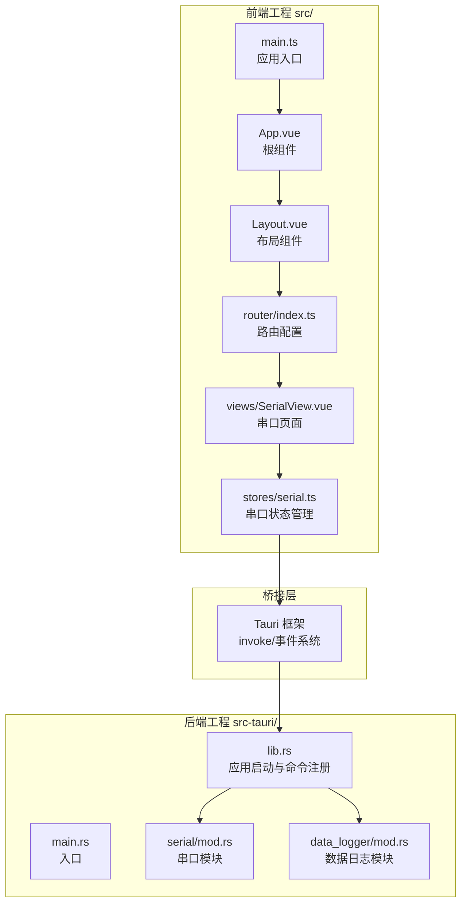
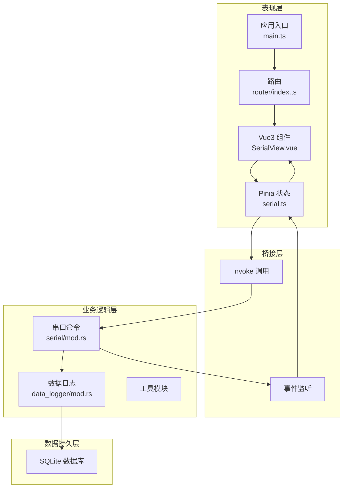
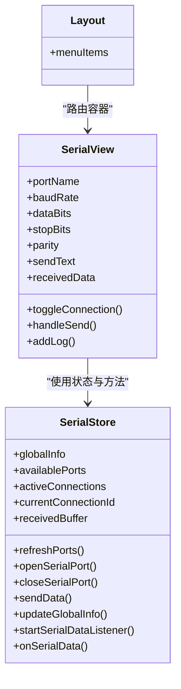
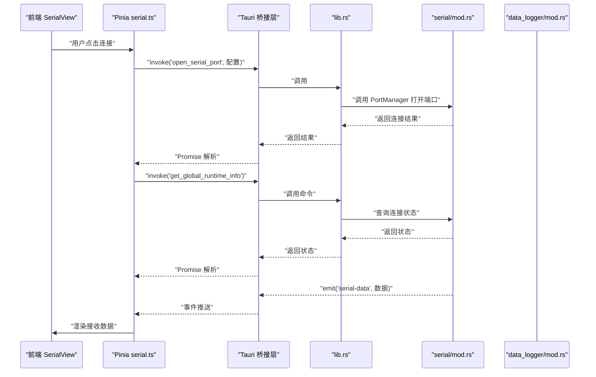
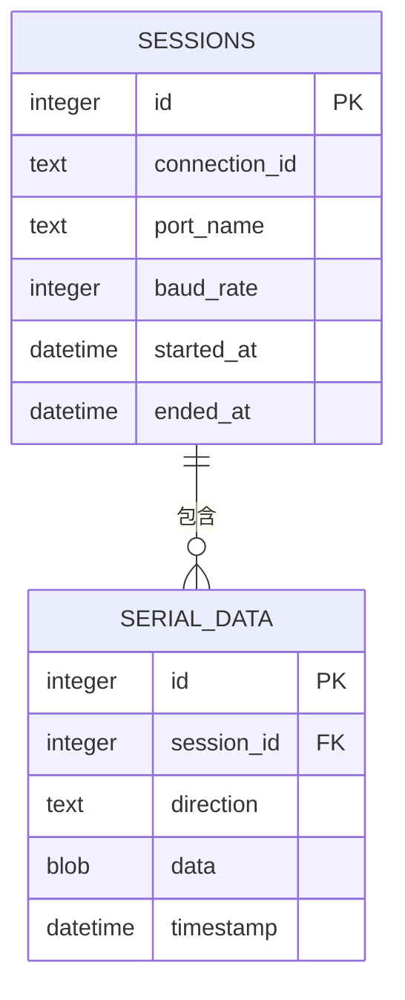
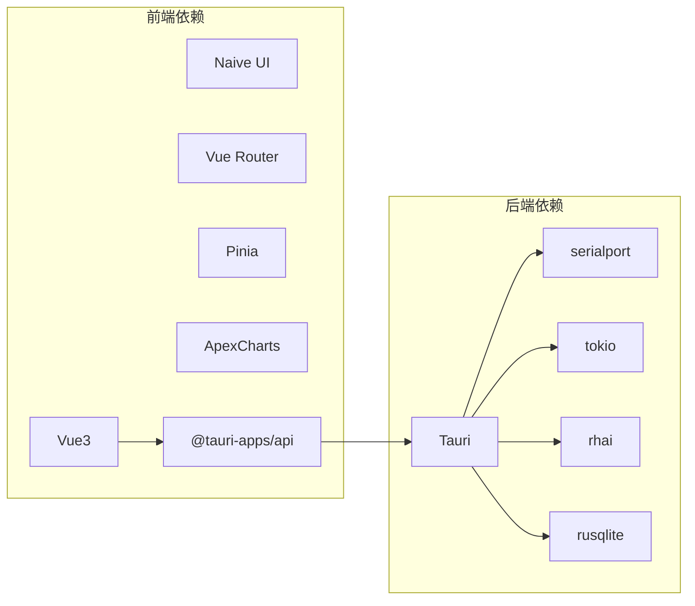

# 整体架构概览

<cite>
**本文档引用的文件**
- [README.md](file://README.md)
- [DESIGN.md](file://DESIGN.md)
- [Cargo.toml](file://src-tauri/Cargo.toml)
- [package.json](file://package.json)
- [tauri.conf.json](file://src-tauri/tauri.conf.json)
- [main.rs](file://src-tauri/src/main.rs)
- [lib.rs](file://src-tauri/src/lib.rs)
- [serial/mod.rs](file://src-tauri/src/serial/mod.rs)
- [data_logger/mod.rs](file://src-tauri/src/data_logger/mod.rs)
- [main.ts](file://src/main.ts)
- [App.vue](file://src/App.vue)
- [Layout.vue](file://src/components/Layout.vue)
- [router/index.ts](file://src/router/index.ts)
- [stores/serial.ts](file://src/stores/serial.ts)
- [views/SerialView.vue](file://src/views/SerialView.vue)
</cite>

## 目录
1. [引言](#引言)
2. [项目结构](#项目结构)
3. [核心组件](#核心组件)
4. [架构总览](#架构总览)
5. [详细组件分析](#详细组件分析)
6. [依赖关系分析](#依赖关系分析)
7. [性能考量](#性能考量)
8. [故障排查指南](#故障排查指南)
9. [结论](#结论)
10. [附录](#附录)

## 引言
本项目 KonSerial 是一款基于 Tauri + Vue3 + Rust 的混合桌面应用，专注于串口调试与数据可视化。系统采用前后端分离的 MVVM 架构模式：前端使用 Vue3 + Naive UI 构建表现层，后端使用 Rust 模块化服务承载业务逻辑，数据持久层基于 SQLite。通过 Tauri 桥接层实现前端与后端的命令调用与事件通信，形成清晰的三层架构：表现层（Vue3 + Naive UI）、业务逻辑层（Rust 模块化服务）、数据持久层（SQLite）。

## 项目结构
项目采用典型的双工程结构：
- 前端工程：src/（Vue3 + TypeScript + Vite）
- 后端工程：src-tauri/（Rust + Tauri）

**图表来源**
- [main.ts:1-14](file://src/main.ts#L1-L14)
- [App.vue:1-33](file://src/App.vue#L1-L33)
- [Layout.vue:1-121](file://src/components/Layout.vue#L1-L121)
- [router/index.ts:1-38](file://src/router/index.ts#L1-L38)
- [stores/serial.ts:1-363](file://src/stores/serial.ts#L1-L363)
- [views/SerialView.vue:1-746](file://src/views/SerialView.vue#L1-L746)
- [main.rs:1-7](file://src-tauri/src/main.rs#L1-L7)
- [lib.rs:1-84](file://src-tauri/src/lib.rs#L1-L84)
- [serial/mod.rs:1-4](file://src-tauri/src/serial/mod.rs#L1-L4)
- [data_logger/mod.rs:1-273](file://src-tauri/src/data_logger/mod.rs#L1-L273)

**章节来源**
- [README.md:1-127](file://README.md#L1-L127)
- [DESIGN.md:104-139](file://DESIGN.md#L104-L139)

## 核心组件
- 前端表现层
  - 应用入口与根组件：负责初始化 UI 框架、主题与国际化，并挂载布局组件。
  - 布局与路由：提供侧边导航与页面路由，串联各视图。
  - 视图组件：如串口调试页面，负责用户交互与数据展示。
  - 状态管理：Pinia 状态管理，封装串口连接、数据缓冲、全局运行时信息等。
- 后端业务逻辑层
  - 应用启动：初始化日志、配置与数据日志管理器，注册 Tauri 命令。
  - 串口模块：提供串口发现、连接、读写、关闭等命令。
  - 数据日志模块：基于 SQLite 的会话与数据记录管理，支持查询与导出。
- 桥接层
  - Tauri 命令与事件：前端通过 invoke 调用后端命令，后端通过 emit 推送事件。

**章节来源**
- [main.ts:1-14](file://src/main.ts#L1-L14)
- [App.vue:1-33](file://src/App.vue#L1-L33)
- [Layout.vue:1-121](file://src/components/Layout.vue#L1-L121)
- [router/index.ts:1-38](file://src/router/index.ts#L1-L38)
- [stores/serial.ts:1-363](file://src/stores/serial.ts#L1-L363)
- [views/SerialView.vue:1-746](file://src/views/SerialView.vue#L1-L746)
- [lib.rs:24-83](file://src-tauri/src/lib.rs#L24-L83)
- [data_logger/mod.rs:47-111](file://src-tauri/src/data_logger/mod.rs#L47-L111)

## 架构总览
系统采用三层架构与 MVVM 模式：
- 表现层（Vue3 + Naive UI）
  - 使用 Composition API 与 Pinia 管理状态，组件通过状态驱动 UI。
  - 通过 @tauri-apps/api 与后端通信，调用 invoke 执行命令并监听事件。
- 业务逻辑层（Rust 模块化服务）
  - 以模块化组织：serial、network、script、data_logger、visualization、utils。
  - 通过 Tauri 命令暴露接口，统一处理系统级操作（串口、网络、文件系统）。
- 数据持久层（SQLite）
  - 使用 rusqlite 与 WAL 模式，提供会话与数据记录的持久化能力。
  - 支持会话统计、数据查询与 CSV 导出。

**图表来源**
- [views/SerialView.vue:1-746](file://src/views/SerialView.vue#L1-L746)
- [stores/serial.ts:1-363](file://src/stores/serial.ts#L1-L363)
- [router/index.ts:1-38](file://src/router/index.ts#L1-L38)
- [main.ts:1-14](file://src/main.ts#L1-L14)
- [serial/mod.rs:1-4](file://src-tauri/src/serial/mod.rs#L1-L4)
- [data_logger/mod.rs:1-273](file://src-tauri/src/data_logger/mod.rs#L1-L273)

## 详细组件分析

### 前端 MVVM 组件分析
- 根组件与应用入口
  - 根组件负责主题、消息与国际化配置，挂载布局组件。
  - 应用入口初始化路由与 UI 框架，挂载应用。
- 状态管理（Pinia）
  - 串口状态：连接状态、配置、统计数据、全局运行时信息。
  - 数据缓冲：接收数据缓存，供波形图等页面共享。
  - 事件监听：注册串口数据事件回调，解码并渲染。
- 视图组件
  - 串口页面：提供端口选择、连接控制、发送与接收展示、统计信息。
  - 布局组件：侧边导航与路由视图容器。

**图表来源**
- [stores/serial.ts:1-363](file://src/stores/serial.ts#L1-L363)
- [views/SerialView.vue:1-746](file://src/views/SerialView.vue#L1-L746)
- [Layout.vue:1-121](file://src/components/Layout.vue#L1-L121)

**章节来源**
- [App.vue:1-33](file://src/App.vue#L1-L33)
- [main.ts:1-14](file://src/main.ts#L1-L14)
- [stores/serial.ts:1-363](file://src/stores/serial.ts#L1-L363)
- [views/SerialView.vue:1-746](file://src/views/SerialView.vue#L1-L746)
- [Layout.vue:1-121](file://src/components/Layout.vue#L1-L121)

### 后端 Rust 模块化服务分析
- 应用启动与命令注册
  - 初始化日志、配置与数据日志管理器，注册全局状态（串口管理器、数据日志器）。
  - 注册配置、串口、数据日志相关命令。
- 串口模块
  - 提供端口发现、连接、读写、关闭、全局状态查询等命令。
  - 通过 Tokio 异步处理串口读写，避免阻塞 UI。
- 数据日志模块
  - 基于 SQLite 的会话与数据记录管理，支持查询、导出与删除。
  - 使用 WAL 模式提升并发写入性能，启用外键约束保证数据一致性。

**图表来源**
- [views/SerialView.vue:156-189](file://src/views/SerialView.vue#L156-L189)
- [stores/serial.ts:157-240](file://src/stores/serial.ts#L157-L240)
- [lib.rs:56-83](file://src-tauri/src/lib.rs#L56-L83)
- [serial/mod.rs:1-4](file://src-tauri/src/serial/mod.rs#L1-L4)
- [data_logger/mod.rs:168-201](file://src-tauri/src/data_logger/mod.rs#L168-L201)

**章节来源**
- [lib.rs:24-83](file://src-tauri/src/lib.rs#L24-L83)
- [serial/mod.rs:1-4](file://src-tauri/src/serial/mod.rs#L1-L4)
- [data_logger/mod.rs:47-111](file://src-tauri/src/data_logger/mod.rs#L47-L111)

### 数据持久层（SQLite）分析
- 数据模型
  - 会话表：记录连接标识、端口名、波特率、起止时间与字节统计。
  - 数据表：记录会话下的发送/接收数据，带时间戳与方向标记。
- 查询与导出
  - 支持按会话查询数据记录，分页与方向过滤。
  - 导出会话为 CSV 格式字符串，便于外部工具处理。
- 性能与可靠性
  - WAL 模式与外键约束，提升并发写入与数据一致性。
  - 索引优化查询性能。

**图表来源**
- [data_logger/mod.rs:84-106](file://src-tauri/src/data_logger/mod.rs#L84-L106)
- [data_logger/mod.rs:168-201](file://src-tauri/src/data_logger/mod.rs#L168-L201)
- [data_logger/mod.rs:203-244](file://src-tauri/src/data_logger/mod.rs#L203-L244)

**章节来源**
- [data_logger/mod.rs:11-18](file://src-tauri/src/data_logger/mod.rs#L11-L18)
- [data_logger/mod.rs:84-106](file://src-tauri/src/data_logger/mod.rs#L84-L106)
- [data_logger/mod.rs:168-201](file://src-tauri/src/data_logger/mod.rs#L168-L201)

## 依赖关系分析
- 前端依赖
  - Vue3 + Naive UI + Vue Router + Pinia + ApexCharts（用于波形显示）。
  - @tauri-apps/api 用于与后端通信。
- 后端依赖
  - Tauri + serialport（串口通信）+ tokio（异步运行时）+ rhai（脚本引擎）+ rusqlite（SQLite）。
- 构建与打包
  - Vite + pnpm 作为前端构建工具；Tauri 作为桌面应用打包框架。

**图表来源**
- [package.json:12-27](file://package.json#L12-L27)
- [Cargo.toml:20-36](file://src-tauri/Cargo.toml#L20-L36)

**章节来源**
- [package.json:12-27](file://package.json#L12-L27)
- [Cargo.toml:20-36](file://src-tauri/Cargo.toml#L20-L36)

## 性能考量
- 前端性能
  - 使用虚拟滚动与缓冲区裁剪，避免大量数据导致 UI 卡顿。
  - 事件驱动渲染，仅在数据到达时更新对应视图。
- 后端性能
  - 串口读写使用 Tokio 异步任务，避免阻塞主线程。
  - SQLite 使用 WAL 模式与索引，优化并发写入与查询。
- 通信效率
  - 前端通过 invoke 调用命令，后端通过事件推送数据，减少轮询开销。

## 故障排查指南
- 串口连接失败
  - 检查端口权限与占用情况；确认配置参数（波特率、数据位、停止位、校验位）正确。
  - 查看后端日志与错误事件，定位具体异常。
- 数据不显示或显示乱码
  - 检查编码设置（UTF-8/GBK）与十六进制显示开关。
  - 确认事件监听已启动且未被重复注册。
- 数据持久化问题
  - 检查数据库路径与权限，确认 WAL 模式与外键约束已启用。
  - 导出 CSV 时确认会话 ID 正确且数据记录存在。

**章节来源**
- [stores/serial.ts:297-341](file://src/stores/serial.ts#L297-L341)
- [data_logger/mod.rs:76-82](file://src-tauri/src/data_logger/mod.rs#L76-L82)

## 结论
KonSerial 通过 Tauri + Vue3 + Rust 的混合架构，实现了高性能、可维护的桌面串口调试工具。前端负责用户体验与数据展示，后端集中处理系统级操作与业务逻辑，数据持久层提供可靠的会话与数据管理。该架构具备良好的扩展性：新增协议、可视化组件或脚本功能均可在现有桥接层与模块化基础上快速集成。

## 附录
- 系统边界
  - 前端边界：仅负责 UI 展示与用户交互，不直接访问系统资源。
  - 后端边界：集中处理串口、网络、文件系统与数据库操作，通过命令暴露能力。
  - 数据边界：SQLite 作为单一数据源，提供结构化查询与导出能力。
- 技术栈选择依据
  - 前端：Vue3 提供现代开发体验与生态；Naive UI 简化 UI 开发；ApexCharts 满足可视化需求。
  - 后端：Rust 提供内存安全与高性能；Tauri 提供跨平台打包能力；serialport/tokio/rhai/rusqlite 满足串口、异步、脚本与数据持久化需求。
- 扩展性考虑
  - 新增模块：在 src-tauri/src 下新增子模块，注册命令并在 lib.rs 中统一管理。
  - 新增视图：在 src/views 下新增页面，使用 Pinia 管理状态并通过 invoke 与后端交互。
  - 插件化：按需引入 Tauri 插件（如 fs、dialog），避免不必要的依赖。