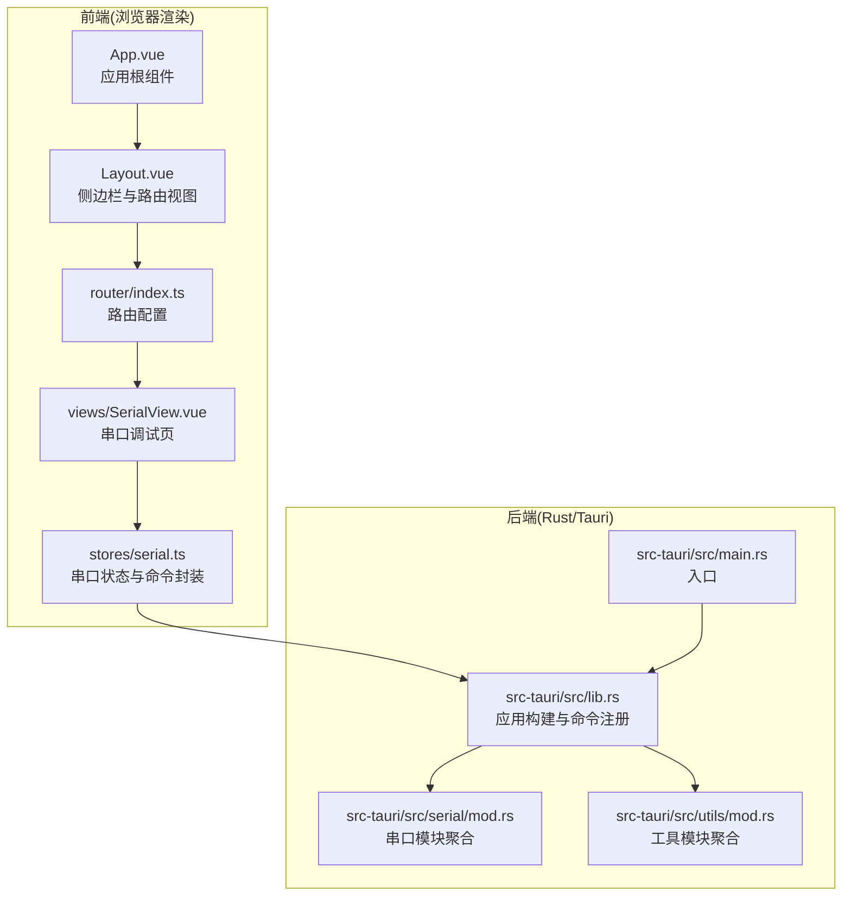
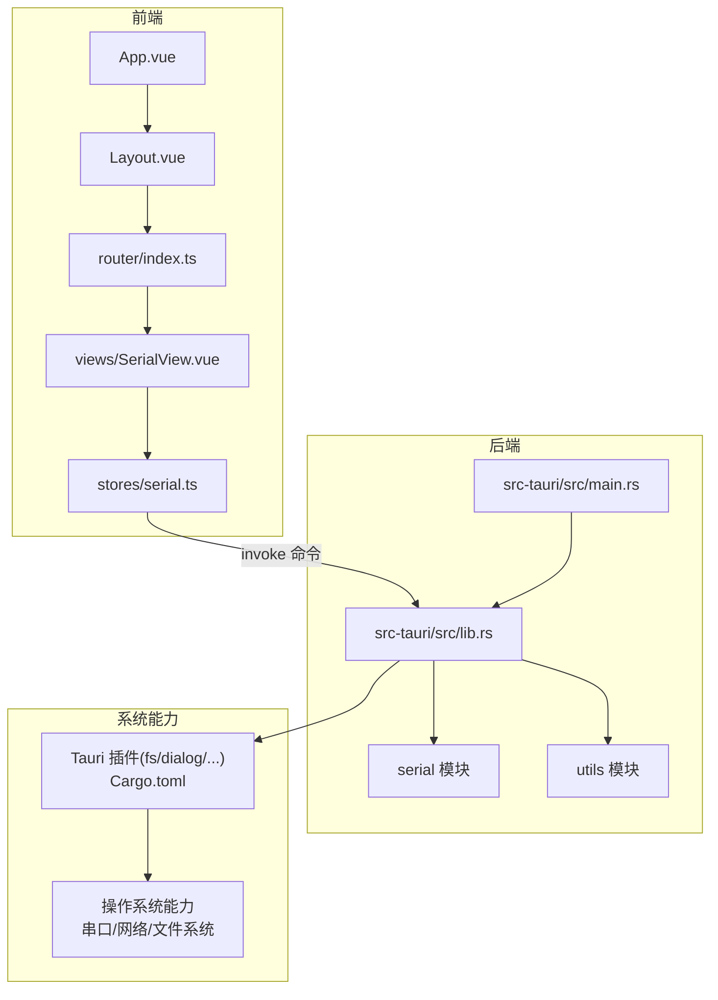
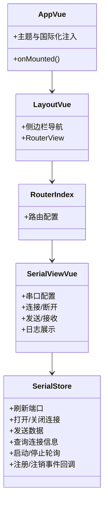
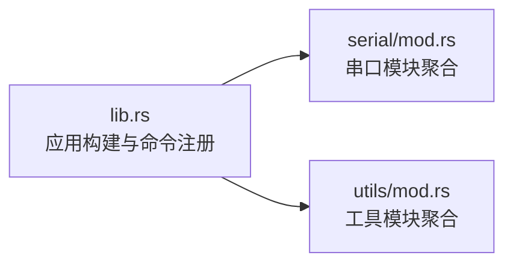
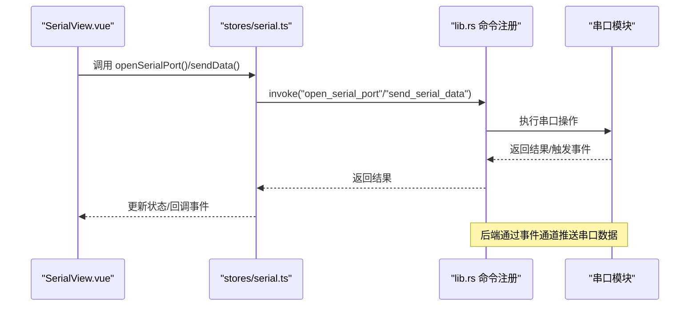
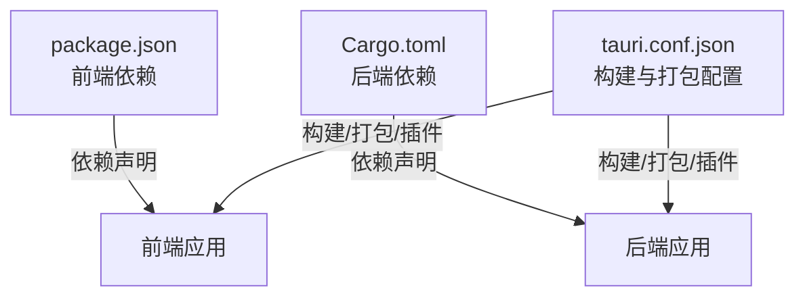

# 架构设计

<cite>
**本文引用的文件**
- [README.md](file://README.md)
- [DESIGN.md](file://DESIGN.md)
- [package.json](file://package.json)
- [Cargo.toml](file://src-tauri/Cargo.toml)
- [tauri.conf.json](file://src-tauri/tauri.conf.json)
- [src/main.ts](file://src/main.ts)
- [src/App.vue](file://src/App.vue)
- [src/router/index.ts](file://src/router/index.ts)
- [src/components/Layout.vue](file://src/components/Layout.vue)
- [src/views/SerialView.vue](file://src/views/SerialView.vue)
- [src/stores/serial.ts](file://src/stores/serial.ts)
- [src-tauri/src/lib.rs](file://src-tauri/src/lib.rs)
- [src-tauri/src/main.rs](file://src-tauri/src/main.rs)
- [src-tauri/src/serial/mod.rs](file://src-tauri/src/serial/mod.rs)
- [src-tauri/src/utils/mod.rs](file://src-tauri/src/utils/mod.rs)
</cite>

## 目录
1. [引言](#引言)
2. [项目结构](#项目结构)
3. [核心组件](#核心组件)
4. [架构总览](#架构总览)
5. [详细组件分析](#详细组件分析)
6. [依赖分析](#依赖分析)
7. [性能考量](#性能考量)
8. [故障排查指南](#故障排查指南)
9. [结论](#结论)
10. [附录](#附录)

## 引言
本项目为一款基于 Tauri + Vue3 的现代化串口调试工具，目标是在桌面平台上提供多串口并发管理、数据收发、波形显示、协议支持与自动化脚本能力。整体采用前后端分离架构：前端使用 Vue3 + TypeScript + Pinia + Naive UI 构建，后端使用 Rust + Tauri 提供系统级能力（串口、网络、文件系统、脚本执行等）。通过 Tauri 的命令通道与事件通道实现前后端无缝通信，既保证了用户体验，又确保了系统级操作的安全与高性能。

## 项目结构
项目采用“前端 src + 后端 src-tauri”的双根目录组织方式，清晰划分职责边界：
- 前端层：Vue3 应用，包含路由、状态管理、视图组件、通用工具与样式。
- 后端层：Rust 应用，通过 Tauri 暴露命令与事件，管理串口、网络、脚本、数据日志与可视化等模块。

**图表来源**
- [src/main.ts:1-14](file://src/main.ts#L1-L14)
- [src/App.vue:1-33](file://src/App.vue#L1-L33)
- [src/components/Layout.vue:1-121](file://src/components/Layout.vue#L1-L121)
- [src/router/index.ts:1-38](file://src/router/index.ts#L1-L38)
- [src/views/SerialView.vue:1-746](file://src/views/SerialView.vue#L1-L746)
- [src/stores/serial.ts:1-363](file://src/stores/serial.ts#L1-L363)
- [src-tauri/src/main.rs:1-7](file://src-tauri/src/main.rs#L1-L7)
- [src-tauri/src/lib.rs:1-84](file://src-tauri/src/lib.rs#L1-L84)
- [src-tauri/src/serial/mod.rs:1-4](file://src-tauri/src/serial/mod.rs#L1-L4)
- [src-tauri/src/utils/mod.rs:1-6](file://src-tauri/src/utils/mod.rs#L1-L6)

**章节来源**
- [README.md:1-127](file://README.md#L1-L127)
- [DESIGN.md:101-139](file://DESIGN.md#L101-L139)
- [src/main.ts:1-14](file://src/main.ts#L1-L14)
- [src-tauri/src/main.rs:1-7](file://src-tauri/src/main.rs#L1-L7)

## 核心组件
- 前端应用入口与根组件：负责应用初始化、主题与国际化注入、启动串口事件监听。
- 路由与布局：提供页面导航与侧边栏菜单，承载各功能视图。
- 串口视图与状态：提供串口配置、连接/断开、发送/接收、统计与日志展示。
- 串口状态管理：封装 Tauri 命令调用、事件监听、全局运行时信息与接收缓冲。
- 后端应用构建：集中注册命令、注入全局状态（如串口管理器、数据日志器），并启用所需插件。

**章节来源**
- [src/App.vue:1-33](file://src/App.vue#L1-L33)
- [src/router/index.ts:1-38](file://src/router/index.ts#L1-L38)
- [src/components/Layout.vue:1-121](file://src/components/Layout.vue#L1-L121)
- [src/views/SerialView.vue:1-746](file://src/views/SerialView.vue#L1-L746)
- [src/stores/serial.ts:1-363](file://src/stores/serial.ts#L1-L363)
- [src-tauri/src/lib.rs:1-84](file://src-tauri/src/lib.rs#L1-L84)

## 架构总览
KonSerial 的整体架构围绕“前端 UI + Rust 后端”的 Tauri 模式展开，前端负责展示与交互，后端负责系统级能力与高性能计算。二者通过 Tauri 的 invoke 与事件通道通信，形成清晰的职责边界与高内聚低耦合的模块化结构。

**图表来源**
- [src/App.vue:1-33](file://src/App.vue#L1-L33)
- [src/components/Layout.vue:1-121](file://src/components/Layout.vue#L1-L121)
- [src/router/index.ts:1-38](file://src/router/index.ts#L1-L38)
- [src/views/SerialView.vue:1-746](file://src/views/SerialView.vue#L1-L746)
- [src/stores/serial.ts:1-363](file://src/stores/serial.ts#L1-L363)
- [src-tauri/src/main.rs:1-7](file://src-tauri/src/main.rs#L1-L7)
- [src-tauri/src/lib.rs:1-84](file://src-tauri/src/lib.rs#L1-L84)
- [Cargo.toml:20-40](file://src-tauri/Cargo.toml#L20-L40)

## 详细组件分析

### 前端组件层次与状态管理
- 根组件与应用初始化：在挂载时加载配置、应用主题与字号、启动串口数据监听。
- 布局与路由：侧边栏导航与路由视图，承载各功能页面。
- 串口视图：提供串口配置、连接/断开、发送/接收、统计与日志展示；内部通过状态管理封装命令调用与事件订阅。
- 状态管理（Pinia）：集中管理串口连接、全局运行时信息、接收缓冲、连接状态轮询与事件回调注册。

**图表来源**
- [src/App.vue:1-33](file://src/App.vue#L1-L33)
- [src/components/Layout.vue:1-121](file://src/components/Layout.vue#L1-L121)
- [src/router/index.ts:1-38](file://src/router/index.ts#L1-L38)
- [src/views/SerialView.vue:1-746](file://src/views/SerialView.vue#L1-L746)
- [src/stores/serial.ts:1-363](file://src/stores/serial.ts#L1-L363)

**章节来源**
- [src/App.vue:1-33](file://src/App.vue#L1-L33)
- [src/components/Layout.vue:1-121](file://src/components/Layout.vue#L1-L121)
- [src/router/index.ts:1-38](file://src/router/index.ts#L1-L38)
- [src/views/SerialView.vue:1-746](file://src/views/SerialView.vue#L1-L746)
- [src/stores/serial.ts:1-363](file://src/stores/serial.ts#L1-L363)

### 后端模块组织与命令注册
- 应用入口与构建：在 lib.rs 中初始化日志、配置与数据日志器，注入全局状态，并注册命令与插件。
- 串口模块：通过 mod.rs 聚合 port_manager、commands、data_process、protocol 等子模块，提供串口生命周期管理与数据处理。
- 工具模块：通过 mod.rs 聚合 config、logger、commands 等子模块，提供配置管理与日志工具。

**图表来源**
- [src-tauri/src/lib.rs:1-84](file://src-tauri/src/lib.rs#L1-L84)
- [src-tauri/src/serial/mod.rs:1-4](file://src-tauri/src/serial/mod.rs#L1-L4)
- [src-tauri/src/utils/mod.rs:1-6](file://src-tauri/src/utils/mod.rs#L1-L6)

**章节来源**
- [src-tauri/src/lib.rs:1-84](file://src-tauri/src/lib.rs#L1-L84)
- [src-tauri/src/serial/mod.rs:1-4](file://src-tauri/src/serial/mod.rs#L1-L4)
- [src-tauri/src/utils/mod.rs:1-6](file://src-tauri/src/utils/mod.rs#L1-L6)

### 数据流与组件通信机制
- 前端通过 invoke 调用后端命令（如打开/关闭串口、发送数据、刷新端口列表等）。
- 后端通过事件通道向前端推送串口数据，前端通过事件监听器接收并解码显示。
- 状态管理封装命令调用与事件回调，提供统一的 API 供视图组件使用。
- 全局运行时信息通过轮询或事件驱动更新，保证 UI 与后端状态一致。

**图表来源**
- [src/views/SerialView.vue:1-746](file://src/views/SerialView.vue#L1-L746)
- [src/stores/serial.ts:1-363](file://src/stores/serial.ts#L1-L363)
- [src-tauri/src/lib.rs:1-84](file://src-tauri/src/lib.rs#L1-L84)

**章节来源**
- [src/views/SerialView.vue:1-746](file://src/views/SerialView.vue#L1-L746)
- [src/stores/serial.ts:1-363](file://src/stores/serial.ts#L1-L363)
- [src-tauri/src/lib.rs:1-84](file://src-tauri/src/lib.rs#L1-L84)

### 技术选型与架构权衡
- 前端：Vue3 + TypeScript + Pinia + Naive UI，提供现代化、响应式与可维护的 UI 层。
- 后端：Rust + Tauri，提供高性能与安全的系统级能力，避免 UI 线程阻塞。
- 通信：Tauri 命令与事件通道，兼顾易用性与可控性。
- 插件策略：按需启用 fs、dialog、clipboard 等插件，减少不必要的依赖。
- 性能：计算密集型任务在后端执行，前端专注渲染与交互；通过事件驱动与轮询相结合更新状态。

**章节来源**
- [DESIGN.md:17-33](file://DESIGN.md#L17-L33)
- [package.json:12-27](file://package.json#L12-L27)
- [Cargo.toml:20-40](file://src-tauri/Cargo.toml#L20-L40)
- [tauri.conf.json:24-34](file://src-tauri/tauri.conf.json#L24-L34)

## 依赖分析
- 前端依赖：Vue3、Vue Router、Pinia、Naive UI、ApexCharts 等，支撑 UI 与可视化。
- 后端依赖：Tauri、serialport、tokio、rhai、rusqlite、log 等，支撑系统能力与性能。
- 构建与打包：Vite + pnpm（前端），Tauri CLI（后端），统一在 tauri.conf.json 中配置。

**图表来源**
- [package.json:12-39](file://package.json#L12-L39)
- [Cargo.toml:20-40](file://src-tauri/Cargo.toml#L20-L40)
- [tauri.conf.json:6-11](file://src-tauri/tauri.conf.json#L6-L11)

**章节来源**
- [package.json:12-39](file://package.json#L12-L39)
- [Cargo.toml:20-40](file://src-tauri/Cargo.toml#L20-L40)
- [tauri.conf.json:6-11](file://src-tauri/tauri.conf.json#L6-L11)

## 性能考量
- 异步与非阻塞：后端使用 tokio 处理串口读写与事件推送，避免阻塞 UI 线程。
- 事件驱动与轮询结合：对高频状态更新采用轮询，对实时事件采用事件通道，平衡性能与延迟。
- 数据缓冲与裁剪：前端接收缓冲区限制最大容量，防止内存膨胀。
- 前端渲染优化：组件内按需渲染与虚拟滚动，降低 DOM 压力。
- 插件按需启用：仅启用必要插件，减少运行时开销。

**章节来源**
- [DESIGN.md:300-346](file://DESIGN.md#L300-L346)
- [src/stores/serial.ts:102-112](file://src/stores/serial.ts#L102-L112)
- [src/views/SerialView.vue:212-228](file://src/views/SerialView.vue#L212-L228)

## 故障排查指南
- 串口无法打开/无数据：检查后端命令调用链路与事件通道是否正常；确认前端事件监听是否注册。
- 端口列表为空：确认刷新端口命令与后端可用端口枚举逻辑。
- 发送失败：检查发送数据编码（文本/十六进制）、连接状态与后端命令返回值。
- 性能问题：检查前端缓冲区大小、轮询频率与事件推送频率，避免过度更新。

**章节来源**
- [src/stores/serial.ts:146-155](file://src/stores/serial.ts#L146-L155)
- [src/stores/serial.ts:158-188](file://src/stores/serial.ts#L158-L188)
- [src/stores/serial.ts:242-274](file://src/stores/serial.ts#L242-L274)
- [src/stores/serial.ts:312-332](file://src/stores/serial.ts#L312-L332)

## 结论
KonSerial 通过 Tauri 将 Vue3 前端与 Rust 后端有机结合，实现了安全、高性能且可维护的串口调试工具。模块化设计使前后端职责清晰，命令与事件通道提供了稳定的通信机制。未来可在协议扩展、脚本引擎增强与可视化算法优化方面持续演进，进一步提升用户体验与系统能力。

## 附录
- 系统边界：前端负责 UI 与交互，后端负责系统级能力与数据处理；两者通过 Tauri 命令与事件通道通信。
- 关键设计模式：命令模式（invoke）、事件发布/订阅（listen/emit）、状态管理模式（Pinia）。
- 架构约束：最小化前端计算负载、最大化后端能力利用；严格区分安全敏感操作与普通 UI 逻辑。