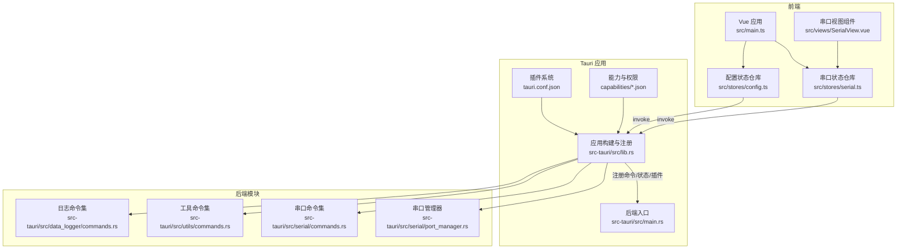
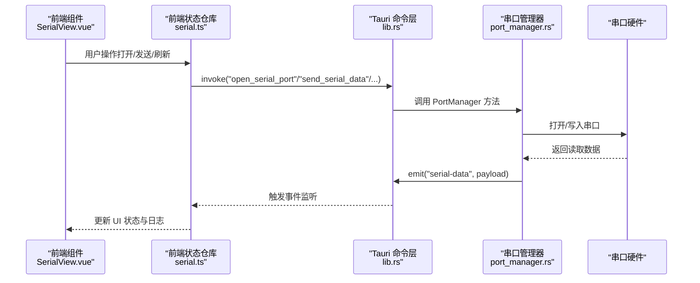
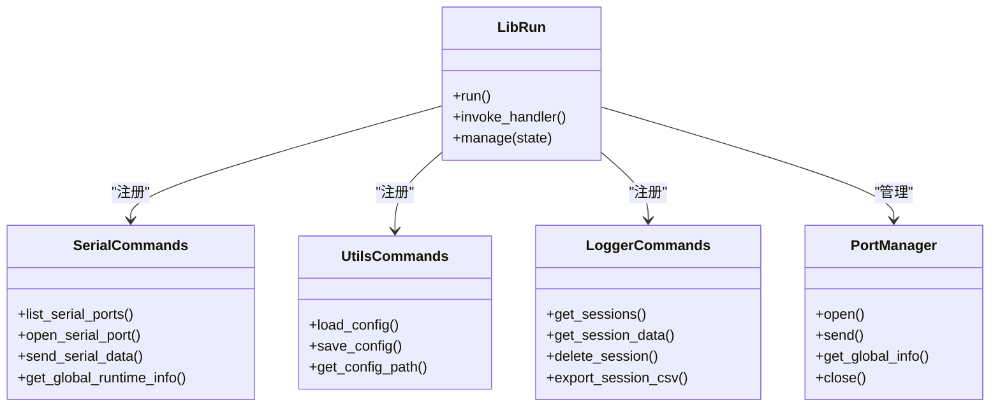
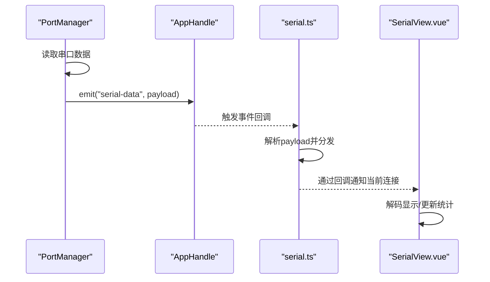
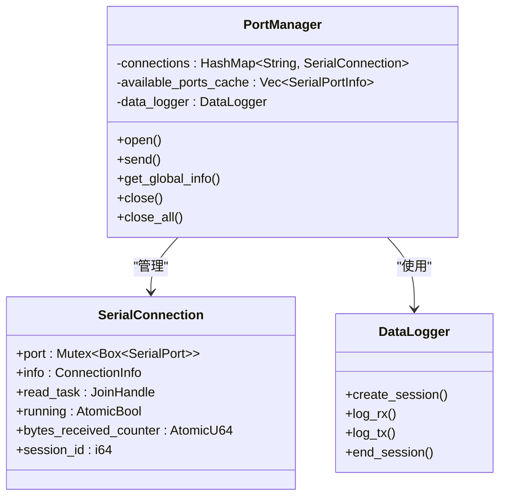
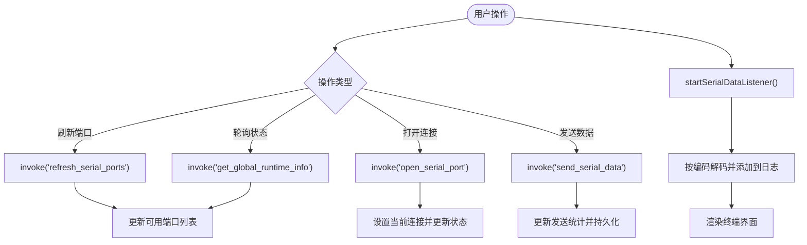
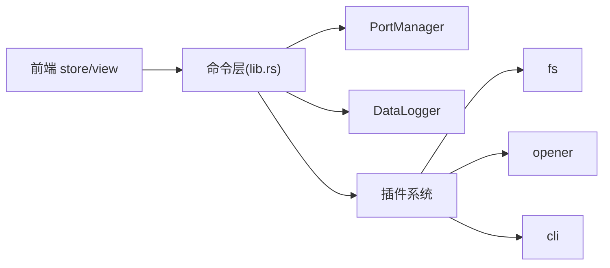

# 通信机制设计

<cite>
**本文引用的文件**
- [src-tauri/src/lib.rs](file://src-tauri/src/lib.rs)
- [src-tauri/src/main.rs](file://src-tauri/src/main.rs)
- [src-tauri/tauri.conf.json](file://src-tauri/tauri.conf.json)
- [src-tauri/Cargo.toml](file://src-tauri/Cargo.toml)
- [src-tauri/src/utils/commands.rs](file://src-tauri/src/utils/commands.rs)
- [src-tauri/src/serial/commands.rs](file://src-tauri/src/serial/commands.rs)
- [src-tauri/src/data_logger/commands.rs](file://src-tauri/src/data_logger/commands.rs)
- [src-tauri/src/serial/port_manager.rs](file://src-tauri/src/serial/port_manager.rs)
- [src/stores/serial.ts](file://src/stores/serial.ts)
- [src/stores/config.ts](file://src/stores/config.ts)
- [src/views/SerialView.vue](file://src/views/SerialView.vue)
- [src-tauri/capabilities/default.json](file://src-tauri/capabilities/default.json)
- [src-tauri/capabilities/desktop.json](file://src-tauri/capabilities/desktop.json)
</cite>

## 目录
1. [引言](#引言)
2. [项目结构](#项目结构)
3. [核心组件](#核心组件)
4. [架构总览](#架构总览)
5. [详细组件分析](#详细组件分析)
6. [依赖关系分析](#依赖关系分析)
7. [性能考量](#性能考量)
8. [故障排查指南](#故障排查指南)
9. [结论](#结论)
10. [附录](#附录)

## 引言
本文件面向 KonSerial 的通信机制设计，系统性阐述 Tauri 框架在该应用中的前后端通信方式：命令系统、事件系统与状态共享；详解 Rust 后端通过 #[tauri::command] 宏暴露的 API 接口与前端 invoke 调用流程；说明全局状态管理、插件系统与能力配置；解释 IPC 通信的实现原理、消息序列化与反序列化过程，并覆盖错误处理、超时控制与重连策略、安全与权限控制等主题。文档同时提供具体通信示例与最佳实践建议。

## 项目结构
KonSerial 采用典型的 Tauri 2.x 前后端分离架构：
- 前端：Vue 3 + TypeScript，通过 @tauri-apps/api 与后端交互，使用自定义状态仓库（store）管理 UI 与串口状态。
- 后端：Rust，通过 tauri::Builder 注册命令与插件，管理全局状态并通过事件向前端推送数据。

图表来源
- [src-tauri/src/main.rs:1-7](file://src-tauri/src/main.rs#L1-L7)
- [src-tauri/src/lib.rs:24-83](file://src-tauri/src/lib.rs#L24-L83)
- [src-tauri/tauri.conf.json:1-47](file://src-tauri/tauri.conf.json#L1-L47)
- [src-tauri/src/serial/port_manager.rs:159-401](file://src-tauri/src/serial/port_manager.rs#L159-L401)
- [src-tauri/src/serial/commands.rs:1-129](file://src-tauri/src/serial/commands.rs#L1-L129)
- [src-tauri/src/utils/commands.rs:1-31](file://src-tauri/src/utils/commands.rs#L1-L31)
- [src-tauri/src/data_logger/commands.rs:1-49](file://src-tauri/src/data_logger/commands.rs#L1-L49)
- [src/stores/serial.ts:1-363](file://src/stores/serial.ts#L1-L363)
- [src/stores/config.ts:1-89](file://src/stores/config.ts#L1-L89)
- [src/views/SerialView.vue:1-746](file://src/views/SerialView.vue#L1-L746)

章节来源
- [src-tauri/src/main.rs:1-7](file://src-tauri/src/main.rs#L1-L7)
- [src-tauri/src/lib.rs:24-83](file://src-tauri/src/lib.rs#L24-L83)
- [src-tauri/tauri.conf.json:1-47](file://src-tauri/tauri.conf.json#L1-L47)
- [src-tauri/Cargo.toml:1-40](file://src-tauri/Cargo.toml#L1-L40)

## 核心组件
- 命令系统（Invoke）
  - 后端通过 #[tauri::command] 宏声明命令，统一在 lib.rs 中集中注册，前端通过 invoke 调用。
  - 包含串口管理、配置管理、数据日志三大类命令。
- 事件系统（Emit/Listen）
  - 后端通过 Emitter 在串口读取循环中推送“serial-data”事件，前端通过 listen 接收并分发到组件。
- 全局状态管理
  - 后端通过 manage 注入 PortManager 与 DataLogger，前端通过 store 与后端命令交互，形成“后端状态 + 前端 UI 状态”的协作。
- 插件系统与能力配置
  - 通过 tauri.conf.json 与 capabilities/*.json 配置插件与权限，限定窗口与能力范围。

章节来源
- [src-tauri/src/lib.rs:56-80](file://src-tauri/src/lib.rs#L56-L80)
- [src-tauri/src/serial/commands.rs:1-129](file://src-tauri/src/serial/commands.rs#L1-L129)
- [src-tauri/src/utils/commands.rs:1-31](file://src-tauri/src/utils/commands.rs#L1-L31)
- [src-tauri/src/data_logger/commands.rs:1-49](file://src-tauri/src/data_logger/commands.rs#L1-L49)
- [src-tauri/src/serial/port_manager.rs:274-303](file://src-tauri/src/serial/port_manager.rs#L274-L303)
- [src/stores/serial.ts:297-341](file://src/stores/serial.ts#L297-L341)
- [src-tauri/tauri.conf.json:24-34](file://src-tauri/tauri.conf.json#L24-L34)
- [src-tauri/capabilities/default.json:1-13](file://src-tauri/capabilities/default.json#L1-L13)
- [src-tauri/capabilities/desktop.json:1-14](file://src-tauri/capabilities/desktop.json#L1-L14)

## 架构总览
下图展示从前端到后端的典型通信链路：前端通过 invoke 调用后端命令，后端执行业务逻辑并返回结果；后端在串口读取循环中通过事件向前端推送数据，前端通过 store 与组件联动。

图表来源
- [src/views/SerialView.vue:157-189](file://src/views/SerialView.vue#L157-L189)
- [src/stores/serial.ts:158-188](file://src/stores/serial.ts#L158-L188)
- [src/stores/serial.ts:243-285](file://src/stores/serial.ts#L243-L285)
- [src-tauri/src/lib.rs:56-80](file://src-tauri/src/lib.rs#L56-L80)
- [src-tauri/src/serial/commands.rs:49-59](file://src-tauri/src/serial/commands.rs#L49-L59)
- [src-tauri/src/serial/commands.rs:109-118](file://src-tauri/src/serial/commands.rs#L109-L118)
- [src-tauri/src/serial/port_manager.rs:274-303](file://src-tauri/src/serial/port_manager.rs#L274-L303)

## 详细组件分析

### 命令系统与状态共享
- 命令注册
  - 后端在 lib.rs 中通过 generate_handler! 将命令集中注册，涵盖基础、配置、串口、日志四类。
- 状态注入
  - 通过 manage 注入 PortManager 与 DataLogger，前端通过 State<'_, Arc<Mutex<...>>> 或 State<'_, Arc<DataLogger>> 获取。
- 前端调用
  - 前端 store 使用 invoke 调用命令，如 open_serial_port、send_serial_data、get_global_runtime_info 等。

图表来源
- [src-tauri/src/lib.rs:47-82](file://src-tauri/src/lib.rs#L47-L82)
- [src-tauri/src/serial/commands.rs:1-129](file://src-tauri/src/serial/commands.rs#L1-L129)
- [src-tauri/src/utils/commands.rs:1-31](file://src-tauri/src/utils/commands.rs#L1-L31)
- [src-tauri/src/data_logger/commands.rs:1-49](file://src-tauri/src/data_logger/commands.rs#L1-L49)
- [src-tauri/src/serial/port_manager.rs:173-401](file://src-tauri/src/serial/port_manager.rs#L173-L401)

章节来源
- [src-tauri/src/lib.rs:47-82](file://src-tauri/src/lib.rs#L47-L82)
- [src-tauri/src/serial/commands.rs:1-129](file://src-tauri/src/serial/commands.rs#L1-L129)
- [src-tauri/src/utils/commands.rs:1-31](file://src-tauri/src/utils/commands.rs#L1-L31)
- [src-tauri/src/data_logger/commands.rs:1-49](file://src-tauri/src/data_logger/commands.rs#L1-L49)

### 事件系统与数据推送
- 事件定义与触发
  - 后端在读取循环中构造 SerialDataPayload 并通过 Emitter emit "serial-data" 事件。
- 前端监听与分发
  - 前端 store 注册事件监听，收到原始字节数组，按需解码显示或转发至全局接收缓冲。

图表来源
- [src-tauri/src/serial/port_manager.rs:274-303](file://src-tauri/src/serial/port_manager.rs#L274-L303)
- [src/stores/serial.ts:312-341](file://src/stores/serial.ts#L312-L341)
- [src/views/SerialView.vue:237-248](file://src/views/SerialView.vue#L237-L248)

章节来源
- [src-tauri/src/serial/port_manager.rs:274-303](file://src-tauri/src/serial/port_manager.rs#L274-L303)
- [src/stores/serial.ts:297-341](file://src/stores/serial.ts#L297-L341)
- [src/views/SerialView.vue:237-248](file://src/views/SerialView.vue#L237-L248)

### 串口管理与多连接架构
- 多连接模型
  - PortManager 维护 HashMap 存储多个连接，每个连接包含独立读取任务、计数器与会话 ID。
- 生命周期管理
  - 打开连接时创建会话并启动读取任务；关闭连接时终止任务并结束会话。
- 状态聚合
  - get_global_info 聚合可用串口与活跃连接状态，供前端轮询更新。

图表来源
- [src-tauri/src/serial/port_manager.rs:159-401](file://src-tauri/src/serial/port_manager.rs#L159-L401)

章节来源
- [src-tauri/src/serial/port_manager.rs:159-401](file://src-tauri/src/serial/port_manager.rs#L159-L401)

### 前端状态管理与 UI 交互
- 串口状态仓库
  - 提供刷新端口、打开/关闭连接、发送数据、轮询状态、事件监听等方法；维护全局运行时信息与接收缓冲。
- 配置状态仓库
  - 提供加载/保存配置、更新各项参数的方法。
- 视图组件
  - 串口视图组件订阅数据事件、轮询状态、处理用户输入与编码转换。

图表来源
- [src/stores/serial.ts:146-240](file://src/stores/serial.ts#L146-L240)
- [src/stores/serial.ts:243-285](file://src/stores/serial.ts#L243-L285)
- [src/stores/serial.ts:312-341](file://src/stores/serial.ts#L312-L341)
- [src/views/SerialView.vue:141-189](file://src/views/SerialView.vue#L141-L189)

章节来源
- [src/stores/serial.ts:146-240](file://src/stores/serial.ts#L146-L240)
- [src/stores/serial.ts:243-285](file://src/stores/serial.ts#L243-L285)
- [src/stores/serial.ts:312-341](file://src/stores/serial.ts#L312-L341)
- [src/views/SerialView.vue:141-189](file://src/views/SerialView.vue#L141-L189)

### IPC 通信、序列化与反序列化
- 序列化机制
  - 后端命令返回值与事件载荷均实现 Serialize；前端通过 @tauri-apps/api 的 invoke/listen 自动进行 JSON 序列化/反序列化。
- 数据类型映射
  - 串口配置、连接信息、端口信息等结构体在 Rust 与 TS 之间保持字段一致，确保跨语言传输稳定。
- 错误传播
  - Rust 命令返回 Result，错误字符串通过 IPC 传回前端，前端捕获并提示用户。

章节来源
- [src-tauri/src/serial/commands.rs:8-13](file://src-tauri/src/serial/commands.rs#L8-L13)
- [src-tauri/src/serial/port_manager.rs:89-94](file://src-tauri/src/serial/port_manager.rs#L89-L94)
- [src/stores/serial.ts:146-155](file://src/stores/serial.ts#L146-L155)

### 错误处理、超时控制与重连机制
- 错误处理
  - 后端命令对 IO 错误与业务异常统一返回错误字符串；前端 store 捕获错误并记录日志与消息提示。
- 超时控制
  - 串口读取使用固定超时（毫秒级），确保在关闭信号到来时能及时退出读取循环。
- 重连机制
  - 当前实现未内置自动重连；建议在 UI 层检测连接断开后，基于轮询与用户操作触发重新打开。

章节来源
- [src-tauri/src/serial/port_manager.rs:225-226](file://src-tauri/src/serial/port_manager.rs#L225-L226)
- [src-tauri/src/serial/port_manager.rs:298-299](file://src-tauri/src/serial/port_manager.rs#L298-L299)
- [src/stores/serial.ts:288-295](file://src/stores/serial.ts#L288-L295)

### 安全性考虑与权限控制
- 能力与权限
  - 通过 capabilities/*.json 声明窗口与权限集合，限制默认权限范围。
- 插件与配置
  - 通过 tauri.conf.json 配置 CLI 插件参数，避免不必要的开放面。
- 最佳实践
  - 仅授予必要权限；对敏感操作（如文件系统访问）进行二次确认；避免在命令中直接执行不受控的系统命令。

章节来源
- [src-tauri/capabilities/default.json:1-13](file://src-tauri/capabilities/default.json#L1-L13)
- [src-tauri/capabilities/desktop.json:1-14](file://src-tauri/capabilities/desktop.json#L1-L14)
- [src-tauri/tauri.conf.json:24-34](file://src-tauri/tauri.conf.json#L24-L34)

## 依赖关系分析
- 组件耦合
  - 前端 store 与后端命令强耦合于数据结构一致性；后端 PortManager 与 DataLogger 松耦合，便于扩展。
- 外部依赖
  - serialport、tokio、serde、tauri-plugin-* 等，分别用于串口通信、异步并发、序列化与插件生态。
- 能力与插件
  - 默认能力包含 core、opener、fs；桌面平台能力包含 cli。

图表来源
- [src-tauri/src/lib.rs:47-82](file://src-tauri/src/lib.rs#L47-L82)
- [src-tauri/Cargo.toml:20-40](file://src-tauri/Cargo.toml#L20-L40)
- [src-tauri/tauri.conf.json:24-34](file://src-tauri/tauri.conf.json#L24-L34)

章节来源
- [src-tauri/src/lib.rs:47-82](file://src-tauri/src/lib.rs#L47-L82)
- [src-tauri/Cargo.toml:20-40](file://src-tauri/Cargo.toml#L20-L40)
- [src-tauri/tauri.conf.json:24-34](file://src-tauri/tauri.conf.json#L24-L34)

## 性能考量
- 异步与并发
  - 串口读取在独立线程中进行，避免阻塞主线程；发送与状态查询使用互斥锁保护共享状态。
- 缓冲与轮询
  - 前端维护接收缓冲与最大容量限制；通过定时轮询减少频繁请求带来的开销。
- 序列化成本
  - 事件载荷为原始字节，前端按需解码，降低序列化负担。

章节来源
- [src-tauri/src/serial/port_manager.rs:236-303](file://src-tauri/src/serial/port_manager.rs#L236-L303)
- [src/stores/serial.ts:102-117](file://src/stores/serial.ts#L102-L117)
- [src/stores/serial.ts:348-362](file://src/stores/serial.ts#L348-L362)

## 故障排查指南
- 常见问题
  - 打开端口失败：检查端口占用、权限与配置参数；查看后端日志与前端错误提示。
  - 无数据接收：确认事件监听已启动、编码设置正确、连接处于已连接状态。
  - 发送失败：检查连接状态、数据格式（十六进制/文本）、后端错误信息。
- 排查步骤
  - 启用日志：后端初始化日志；前端 store 记录 invoke 与事件回调日志。
  - 验证命令：逐个调用命令（如 get_global_runtime_info）确认命令层工作正常。
  - 检查权限：核对 capabilities 与 tauri.conf.json 配置，确保所需权限已启用。

章节来源
- [src-tauri/src/lib.rs:25-45](file://src-tauri/src/lib.rs#L25-L45)
- [src/stores/serial.ts:146-155](file://src/stores/serial.ts#L146-L155)
- [src/stores/serial.ts:297-341](file://src/stores/serial.ts#L297-L341)

## 结论
KonSerial 的通信机制以 Tauri 命令系统为核心，结合事件系统与全局状态管理，实现了稳定的前后端协作。通过清晰的模块划分与严格的序列化契约，系统在保证易用性的同时兼顾了可维护性与扩展性。建议后续增强自动重连、更细粒度的错误分类与可视化诊断能力，以进一步提升用户体验与稳定性。

## 附录
- 通信示例（路径参考）
  - 打开端口：前端调用 openSerialPort → invoke("open_serial_port") → 后端 PortManager::open
  - 发送数据：前端调用 sendData → invoke("send_serial_data") → 后端 PortManager::send
  - 接收数据：后端 read_loop → emit("serial-data") → 前端 onSerialData 回调
- 最佳实践
  - 命令参数尽量使用结构化对象，保持前后端一致的接口契约。
  - 对长耗时操作使用异步命令与进度反馈，避免 UI 卡顿。
  - 事件载荷尽量轻量化，前端按需解码与渲染。
  - 严格区分命令错误与业务错误，提供明确的用户提示与日志记录。