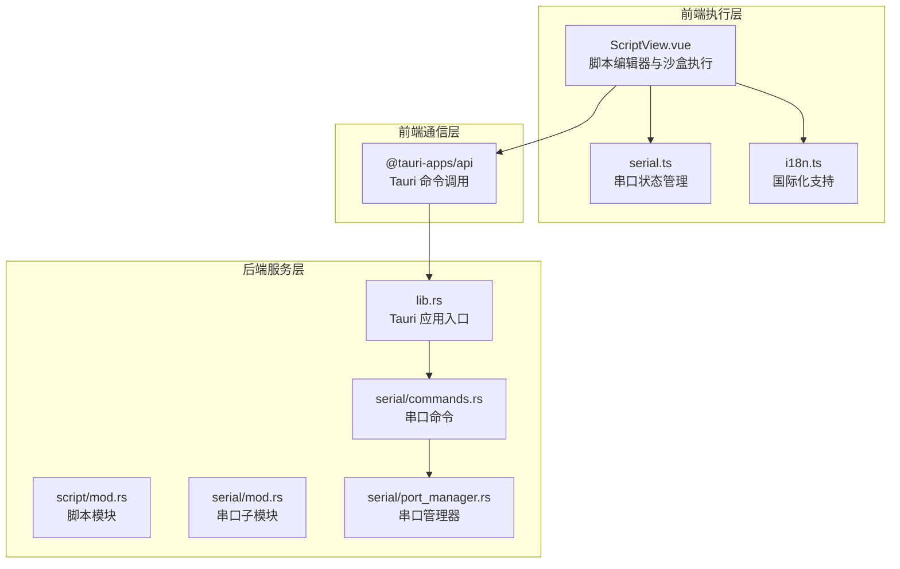
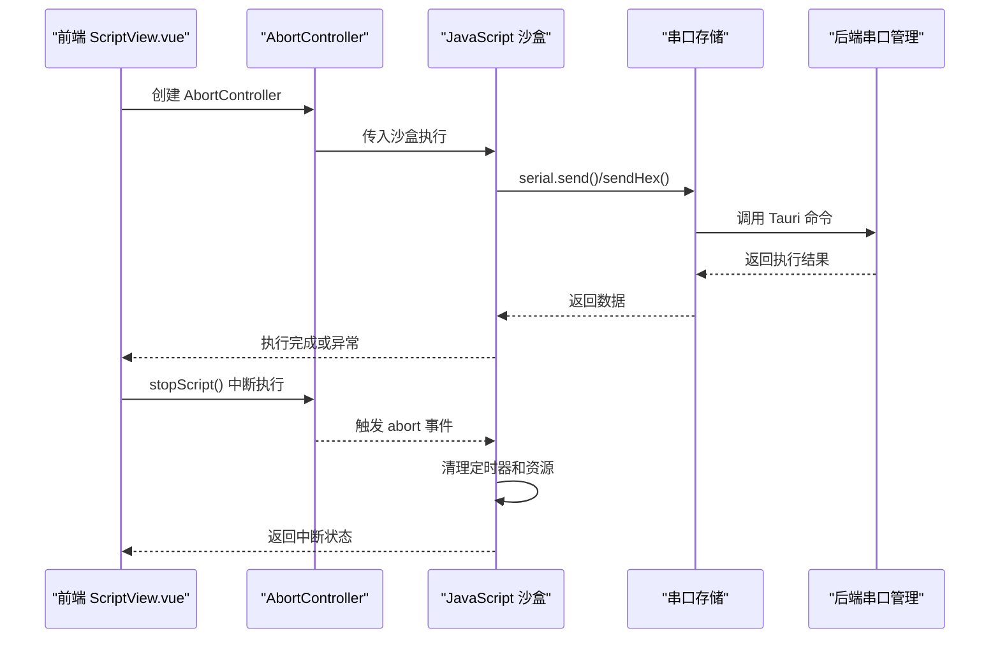
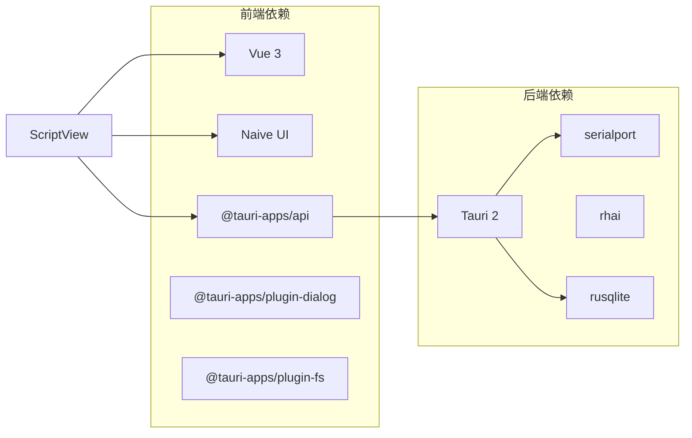

# 脚本系统

<cite>
**本文引用的文件**
- [src/views/ScriptView.vue](file://src/views/ScriptView.vue)
- [src/stores/serial.ts](file://src/stores/serial.ts)
- [src/stores/i18n.ts](file://src/stores/i18n.ts)
- [src-tauri/src/lib.rs](file://src-tauri/src/lib.rs)
- [src-tauri/src/script/mod.rs](file://src-tauri/src/script/mod.rs)
- [src-tauri/Cargo.toml](file://src-tauri/Cargo.toml)
- [src/router/index.ts](file://src/router/index.ts)
</cite>

## 更新摘要
**所做更改**
- 新增沙盒 API 实现章节，详细说明 JavaScript 沙盒执行机制
- 增强错误处理与脚本执行可靠性章节，包含完整的异常处理流程
- 新增脚本执行状态反馈机制章节，涵盖运行状态监控与用户界面反馈
- 更新脚本 API 设计章节，反映实际实现的 serial.send 和 serial.sendHex 方法
- 完善脚本执行环境安全机制章节，强调 AbortController 和定时器管理

## 目录
1. [简介](#简介)
2. [项目结构](#项目结构)
3. [核心组件](#核心组件)
4. [架构总览](#架构总览)
5. [详细组件分析](#详细组件分析)
6. [依赖关系分析](#依赖关系分析)
7. [性能考虑](#性能考虑)
8. [故障排查指南](#故障排查指南)
9. [结论](#结论)
10. [附录](#附录)

## 简介
本文档详细介绍 KonSerial 的脚本系统，该系统现已实现完整的 JavaScript 脚本执行环境。脚本系统采用前端 JavaScript 沙盒执行机制，通过 AsyncFunction 构建受控的脚本执行环境，提供串口通信、数据处理和系统控制功能。

当前版本的核心特性包括：
- **沙盒 API**：提供受限的串口通信接口（serial.send、serial.sendHex）
- **增强错误处理**：完整的异常捕获、错误分类和用户反馈
- **执行可靠性**：AbortController 机制确保脚本可中断执行
- **状态反馈**：实时的运行状态监控和用户界面反馈
- **定时器管理**：智能的定时器生命周期管理

## 项目结构
KonSerial 的脚本系统采用三层架构：
- **前端执行层**：Vue 组件负责脚本编辑、沙盒构建和执行控制
- **串口通信层**：通过 Tauri 命令与后端串口管理器交互
- **后端服务层**：Rust 实现的串口管理和数据日志功能



**图表来源**
- [src/views/ScriptView.vue:1-617](file://src/views/ScriptView.vue#L1-L617)
- [src/stores/serial.ts:1-363](file://src/stores/serial.ts#L1-L363)
- [src/stores/i18n.ts:1-358](file://src/stores/i18n.ts#L1-L358)
- [src-tauri/src/lib.rs:1-84](file://src-tauri/src/lib.rs#L1-L84)
- [src-tauri/src/script/mod.rs:1-3](file://src-tauri/src/script/mod.rs#L1-L3)

**章节来源**
- [src/views/ScriptView.vue:1-617](file://src/views/ScriptView.vue#L1-L617)
- [src/stores/serial.ts:1-363](file://src/stores/serial.ts#L1-L363)
- [src/stores/i18n.ts:1-358](file://src/stores/i18n.ts#L1-L358)
- [src-tauri/src/lib.rs:1-84](file://src-tauri/src/lib.rs#L1-L84)
- [src-tauri/src/script/mod.rs:1-3](file://src-tauri/src/script/mod.rs#L1-L3)

## 核心组件
- **脚本执行引擎**：基于 JavaScript AsyncFunction 的沙盒执行环境
- **串口通信接口**：受限的串口操作 API（send、sendHex）
- **定时器管理系统**：智能的定时器生命周期控制
- **错误处理机制**：完整的异常捕获和用户反馈系统
- **状态监控系统**：实时的运行状态跟踪和界面反馈

**章节来源**
- [src/views/ScriptView.vue:104-185](file://src/views/ScriptView.vue#L104-L185)
- [src/views/ScriptView.vue:120-141](file://src/views/ScriptView.vue#L120-L141)
- [src/views/ScriptView.vue:143-157](file://src/views/ScriptView.vue#L143-L157)

## 架构总览
脚本执行采用异步沙盒机制，通过 AbortController 确保执行的可控性和可中断性。



**图表来源**
- [src/views/ScriptView.vue:104-185](file://src/views/ScriptView.vue#L104-L185)
- [src/views/ScriptView.vue:187-194](file://src/views/ScriptView.vue#L187-L194)
- [src/stores/serial.ts:276-285](file://src/stores/serial.ts#L276-L285)

## 详细组件分析

### 沙盒 API 实现
脚本系统实现了完整的 JavaScript 沙盒执行环境，通过 AsyncFunction 构建受控的执行上下文。

**沙盒 API 构建流程**：
1. 创建 AbortController 管理脚本生命周期
2. 构建 serial 对象包含 send 和 sendHex 方法
3. 创建 sleep 函数实现异步延迟
4. 构建 console 对象拦截日志输出
5. 使用 AsyncFunction 执行脚本代码

**串口通信 API**：
- `serial.send(data: string)`：发送文本数据到当前串口连接
- `serial.sendHex(hex: string)`：发送十六进制数据到当前串口连接

**定时器管理**：
- `sleep(ms: number)`：异步睡眠函数，支持中断
- 内部维护 activeTimers 数组跟踪所有活动定时器
- 执行中断时自动清理所有定时器

**章节来源**
- [src/views/ScriptView.vue:120-141](file://src/views/ScriptView.vue#L120-L141)
- [src/views/ScriptView.vue:143-157](file://src/views/ScriptView.vue#L143-L157)
- [src/views/ScriptView.vue:160-165](file://src/views/ScriptView.vue#L160-L165)

### 增强错误处理机制
脚本系统实现了多层次的错误处理机制，确保执行过程的稳定性和用户体验。

**错误分类与处理**：
- **脚本异常**：try-catch 包装，区分脚本停止和运行时错误
- **串口通信错误**：捕获底层串口操作异常并转换为友好消息
- **连接状态错误**：检查当前串口连接状态，提供明确的错误提示

**错误处理流程**：
1. 执行前检查串口连接状态
2. 执行过程中捕获所有异常
3. 区分脚本停止（正常中断）和异常错误
4. 通过日志面板和消息提示反馈用户
5. 清理资源并恢复执行状态

**章节来源**
- [src/views/ScriptView.vue:104-110](file://src/views/ScriptView.vue#L104-L110)
- [src/views/ScriptView.vue:121-129](file://src/views/ScriptView.vue#L121-L129)
- [src/views/ScriptView.vue:131-139](file://src/views/ScriptView.vue#L131-L139)
- [src/views/ScriptView.vue:175-184](file://src/views/ScriptView.vue#L175-L184)

### 脚本执行状态反馈机制
系统提供了完整的执行状态监控和用户界面反馈机制。

**状态管理**：
- `isRunning`：实时跟踪脚本执行状态
- `runningAbort`：AbortController 实例管理执行生命周期
- `activeTimers`：数组跟踪所有活动定时器

**用户界面反馈**：
- **运行状态标签**：显示"运行中"状态
- **按钮状态切换**：运行时显示停止按钮，停止时显示运行按钮
- **消息通知**：通过 Naive UI 提供成功、警告、错误消息
- **日志面板**：详细记录执行过程和错误信息

**章节来源**
- [src/views/ScriptView.vue:58-64](file://src/views/ScriptView.vue#L58-L64)
- [src/views/ScriptView.vue:101-102](file://src/views/ScriptView.vue#L101-L102)
- [src/views/ScriptView.vue:187-194](file://src/views/ScriptView.vue#L187-L194)
- [src/views/ScriptView.vue:363-384](file://src/views/ScriptView.vue#L363-L384)

### 脚本 API 设计（实际实现）
基于前端 JavaScript 实现，脚本系统提供以下可用 API：

**串口通信 API**：
```javascript
// 发送文本数据
await serial.send("Hello World");

// 发送十六进制数据
await serial.sendHex("48 65 6C 6C 6F");
```

**系统工具 API**：
```javascript
// 延迟等待
await sleep(1000); // 等待1秒

// 日志输出
console.log("调试信息");
console.warn("警告信息");
console.error("错误信息");
```

**API 特性**：
- 所有 API 调用都经过 AbortController 检查
- 支持异步执行和错误处理
- 自动记录 TX/RX 数据到日志面板
- 与当前串口连接状态绑定

**章节来源**
- [src/views/ScriptView.vue:120-141](file://src/views/ScriptView.vue#L120-L141)
- [src/views/ScriptView.vue:143-157](file://src/views/ScriptView.vue#L143-L157)
- [src/views/ScriptView.vue:160-165](file://src/views/ScriptView.vue#L160-L165)

### 脚本执行环境安全机制
脚本系统采用多重安全机制确保执行环境的安全性和稳定性。

**沙盒隔离**：
- 仅暴露必要的 API（serial、sleep、console）
- 禁止直接访问 DOM、文件系统、网络等
- 通过 AsyncFunction 构建独立的执行上下文

**执行控制**：
- AbortController 确保脚本可随时中断
- 定时器自动清理防止内存泄漏
- 资源清理确保执行完成后恢复环境

**权限限制**：
- 串口操作必须通过受控 API
- 禁止直接访问底层串口管理器
- 所有操作都经过 Tauri 命令层

**章节来源**
- [src/views/ScriptView.vue:101-102](file://src/views/ScriptView.vue#L101-L102)
- [src/views/ScriptView.vue:196-199](file://src/views/ScriptView.vue#L196-L199)
- [src/views/ScriptView.vue:169-171](file://src/views/ScriptView.vue#L169-L171)

### 脚本生命周期管理
系统实现了完整的脚本生命周期管理，确保资源的有效利用和环境的整洁。

**生命周期阶段**：
1. **创建阶段**：初始化 AbortController 和执行环境
2. **运行阶段**：执行脚本代码，处理异步操作
3. **中断阶段**：响应用户停止请求，清理资源
4. **清理阶段**：释放所有资源，恢复初始状态

**资源管理**：
- 定时器自动清理：stopScript() 时清除所有活动定时器
- AbortController 管理：统一的执行中断机制
- 状态恢复：执行完成后重置 isRunning 状态

**章节来源**
- [src/views/ScriptView.vue:104-185](file://src/views/ScriptView.vue#L104-L185)
- [src/views/ScriptView.vue:187-194](file://src/views/ScriptView.vue#L187-L194)
- [src/views/ScriptView.vue:196-199](file://src/views/ScriptView.vue#L196-L199)

### 脚本编写最佳实践
基于实际实现经验，总结以下最佳实践：

**代码组织**：
- 使用 await 关键字处理异步操作
- 合理使用 sleep() 函数控制执行节奏
- 将重复代码封装为函数提高可维护性

**错误处理**：
- 脚本内部进行必要的错误检查
- 利用 console.log() 记录调试信息
- 避免长时间阻塞执行

**性能优化**：
- 控制定时器数量，避免过多并发操作
- 合理使用串口发送频率
- 及时清理不需要的数据

**章节来源**
- [src/views/ScriptView.vue:37-53](file://src/views/ScriptView.vue#L37-L53)
- [src/views/ScriptView.vue:143-157](file://src/views/ScriptView.vue#L143-L157)

### 示例脚本
以下是一些基于实际 API 的示例脚本：

**基础发送脚本**：
```javascript
// 发送问候消息
await serial.send("Hello from KonSerial!\n");
console.log("消息已发送");

// 发送十六进制数据
await serial.sendHex("48 65 6C 6C 6F");
console.log("十六进制数据已发送");
```

**循环发送脚本**：
```javascript
// 发送递增计数
for (let i = 0; i < 5; i++) {
  await serial.send("count:" + i + "\n");
  await sleep(1000);
}
console.log("发送完成");
```

**章节来源**
- [src/views/ScriptView.vue:37-53](file://src/views/ScriptView.vue#L37-L53)

## 依赖关系分析
脚本系统的主要依赖关系如下：

**前端依赖**：
- Vue 3：响应式状态管理和组件系统
- Naive UI：用户界面组件库
- @tauri-apps/api：Tauri 命令调用接口
- @tauri-apps/plugin-dialog：对话框插件
- @tauri-apps/plugin-fs：文件系统插件

**后端依赖**：
- Tauri 2：应用框架和命令系统
- serialport：串口底层通信库
- rhai：脚本引擎（声明但未使用）
- rusqlite：SQLite 数据库访问



**图表来源**
- [src-tauri/Cargo.toml:20-36](file://src-tauri/Cargo.toml#L20-L36)

**章节来源**
- [src-tauri/Cargo.toml:1-40](file://src-tauri/Cargo.toml#L1-L40)

## 性能考虑
脚本系统的性能优化主要体现在以下几个方面：

**执行效率**：
- 使用 AbortController 确保快速响应中断
- 智能的定时器管理避免资源泄漏
- 异步执行避免阻塞主线程

**内存管理**：
- 执行完成后自动清理定时器
- 限制日志面板的最大条目数量
- 及时释放执行环境资源

**串口通信优化**：
- 批量发送减少命令调用次数
- 异步操作避免阻塞执行
- 错误重试机制提高成功率

**章节来源**
- [src/views/ScriptView.vue:95-96](file://src/views/ScriptView.vue#L95-L96)
- [src/views/ScriptView.vue:196-199](file://src/views/ScriptView.vue#L196-L199)

## 故障排查指南
针对脚本系统可能出现的问题提供排查指导：

**脚本无法运行**：
- 检查是否已连接串口（currentConnectionId 必须存在）
- 确认脚本语法正确，无语法错误
- 查看日志面板中的错误信息

**串口通信失败**：
- 检查串口连接状态
- 验证串口权限和占用情况
- 确认发送的数据格式正确

**脚本执行中断**：
- 检查 AbortController 是否被意外触发
- 确认定时器是否正确清理
- 查看是否有未捕获的异常

**性能问题**：
- 检查定时器数量是否过多
- 确认日志输出是否过于频繁
- 优化脚本算法和数据处理

**章节来源**
- [src/views/ScriptView.vue:106-110](file://src/views/ScriptView.vue#L106-L110)
- [src/views/ScriptView.vue:175-184](file://src/views/ScriptView.vue#L175-L184)
- [src/stores/serial.ts:281-285](file://src/stores/serial.ts#L281-L285)

## 结论
KonSerial 的脚本系统现已实现完整的 JavaScript 沙盒执行环境，具备以下核心优势：

**技术成就**：
- 成功实现 JavaScript 沙盒执行机制
- 建立了可靠的错误处理和状态反馈系统
- 提供了完整的串口通信 API
- 实现了智能的资源管理和执行控制

**实用性价值**：
- 为串口设备自动化测试提供强大工具
- 支持复杂的串口通信场景
- 提供良好的用户体验和开发效率
- 具备良好的扩展性和维护性

**未来发展**：
- 可以考虑集成更强大的脚本引擎（如 Rhai）
- 扩展更多系统 API 和功能模块
- 增强脚本调试和性能分析能力
- 支持脚本文件的导入导出和版本管理

## 附录

### 国际化支持
脚本系统完全支持国际化，包含中英文双语界面：

**中文界面**：
- "脚本开始执行"、"脚本已启动"、"脚本已停止"
- "脚本执行完成"、"脚本已保存"、"运行中"等状态提示

**英文界面**：
- "Script started"、"Script started"、"Script stopped"
- "Script completed"、"Script saved"、"Running" 等状态提示

**章节来源**
- [src/stores/i18n.ts:139-161](file://src/stores/i18n.ts#L139-L161)
- [src/stores/i18n.ts:295-317](file://src/stores/i18n.ts#L295-L317)

### 路由配置
脚本页面通过 Vue Router 正确配置：

**路由定义**：
- 路径：`/script`
- 组件：`ScriptView.vue`
- 标题：`脚本编辑`

**章节来源**
- [src/router/index.ts:22-26](file://src/router/index.ts#L22-L26)

### 后端命令注册
脚本系统依赖的后端串口命令已在 Tauri 中注册：

**串口相关命令**：
- `send_serial_data`：发送串口数据
- `get_connection_info`：获取连接信息
- `is_serial_connected`：检查连接状态

**章节来源**
- [src-tauri/src/lib.rs:63-74](file://src-tauri/src/lib.rs#L63-L74)