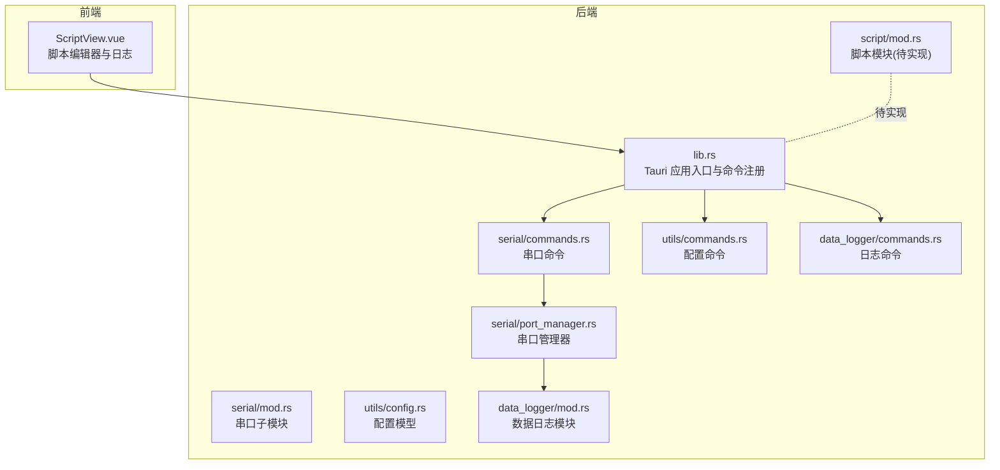
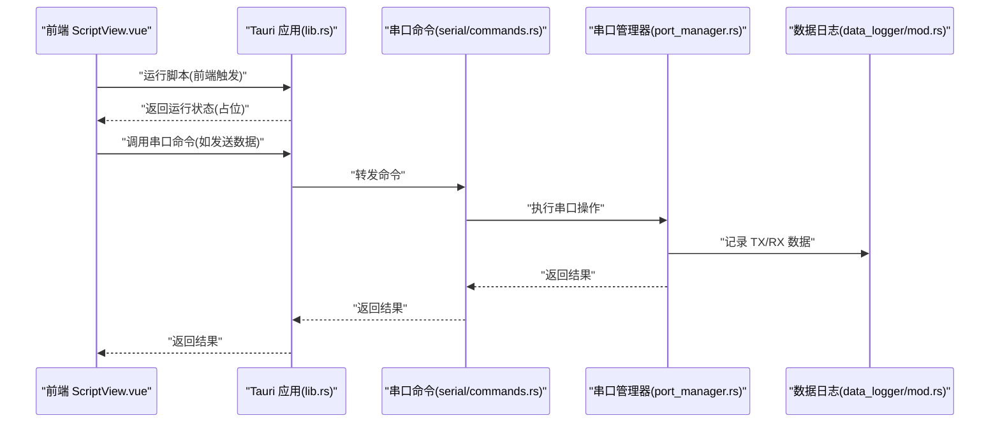
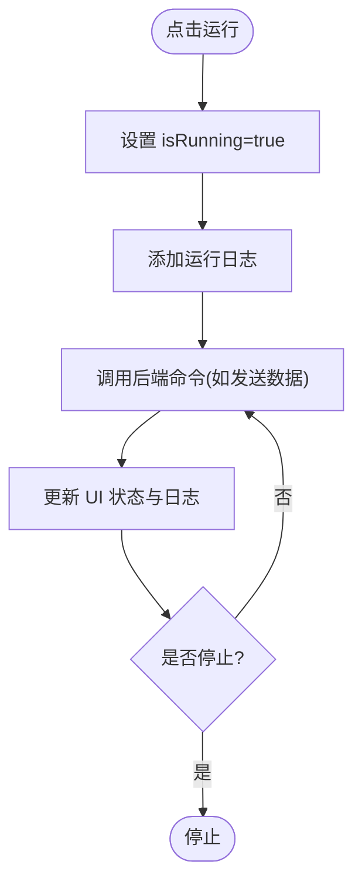
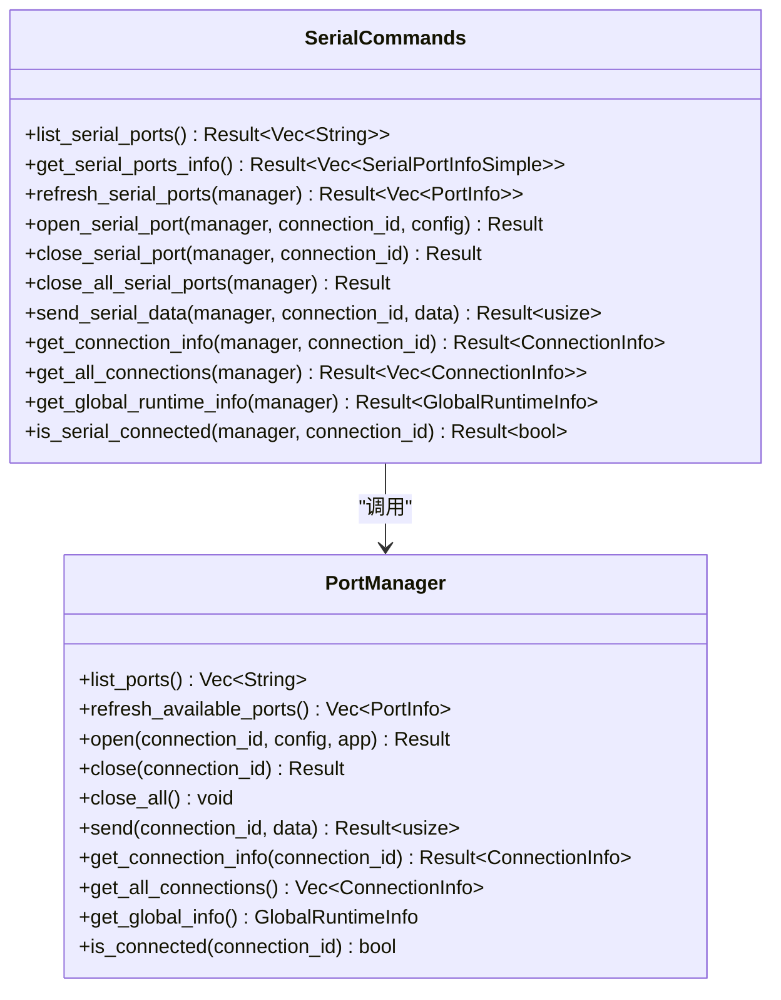
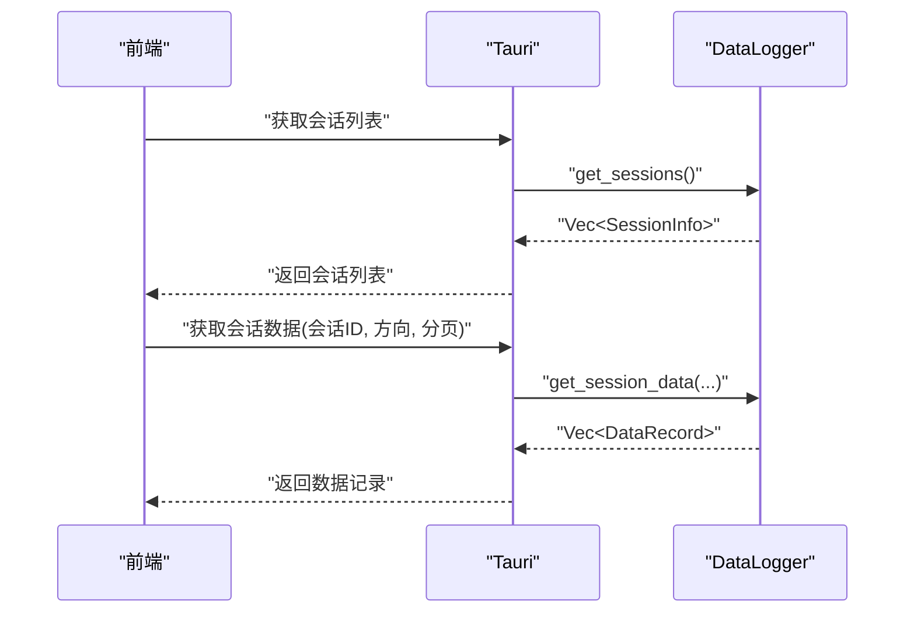
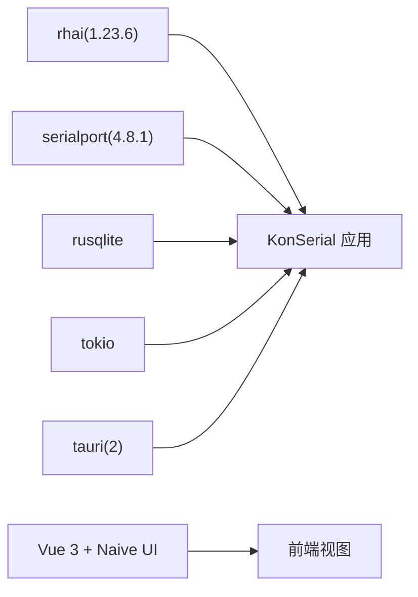

# 脚本系统

<cite>
**本文引用的文件**
- [src-tauri/src/script/mod.rs](file://src-tauri/src/script/mod.rs)
- [src/views/ScriptView.vue](file://src/views/ScriptView.vue)
- [src-tauri/src/lib.rs](file://src-tauri/src/lib.rs)
- [src-tauri/Cargo.toml](file://src-tauri/Cargo.toml)
- [src-tauri/src/serial/mod.rs](file://src-tauri/src/serial/mod.rs)
- [src-tauri/src/serial/commands.rs](file://src-tauri/src/serial/commands.rs)
- [src-tauri/src/serial/port_manager.rs](file://src-tauri/src/serial/port_manager.rs)
- [src-tauri/src/utils/commands.rs](file://src-tauri/src/utils/commands.rs)
- [src-tauri/src/utils/config.rs](file://src-tauri/src/utils/config.rs)
- [src-tauri/src/data_logger/mod.rs](file://src-tauri/src/data_logger/mod.rs)
- [src-tauri/src/data_logger/commands.rs](file://src-tauri/src/data_logger/commands.rs)
</cite>

## 目录
1. [简介](#简介)
2. [项目结构](#项目结构)
3. [核心组件](#核心组件)
4. [架构总览](#架构总览)
5. [详细组件分析](#详细组件分析)
6. [依赖关系分析](#依赖关系分析)
7. [性能考虑](#性能考虑)
8. [故障排查指南](#故障排查指南)
9. [结论](#结论)
10. [附录](#附录)

## 简介
本文件面向 KonSerial 的“脚本系统”，目标是为开发者与高级用户提供一份全面、可操作的技术文档。当前仓库中，脚本系统处于“前端编辑器 + 待实现的后端脚本引擎”阶段：前端提供了脚本编辑器与日志输出面板，后端已声明脚本模块但尚未实现具体脚本引擎与 API 注入逻辑；串口通信能力由后端的串口管理模块提供，并通过 Tauri 命令暴露给前端。

本文件将：
- 解释脚本编辑器的现状与扩展方向
- 说明如何在现有串口 API 基础上设计脚本 API（如 serial.send、定时器等）
- 提供脚本执行环境的安全建议与沙箱思路
- 给出脚本生命周期、错误处理与性能监控的实践建议
- 总结最佳实践与常见模式，并给出使用场景与示例指引

## 项目结构
KonSerial 的脚本系统涉及三层：
- 前端：Vue 单文件组件负责脚本编辑、运行控制与日志展示
- 后端：Tauri 命令层提供串口与数据日志能力；脚本模块预留位置
- 数据层：SQLite 数据日志模块负责会话与数据持久化

图表来源
- [src/views/ScriptView.vue:1-442](file://src/views/ScriptView.vue#L1-L442)
- [src-tauri/src/lib.rs:1-84](file://src-tauri/src/lib.rs#L1-L84)
- [src-tauri/src/script/mod.rs:1-3](file://src-tauri/src/script/mod.rs#L1-L3)
- [src-tauri/src/serial/mod.rs:1-4](file://src-tauri/src/serial/mod.rs#L1-L4)
- [src-tauri/src/serial/commands.rs:1-129](file://src-tauri/src/serial/commands.rs#L1-L129)
- [src-tauri/src/serial/port_manager.rs:1-402](file://src-tauri/src/serial/port_manager.rs#L1-L402)
- [src-tauri/src/utils/commands.rs:1-31](file://src-tauri/src/utils/commands.rs#L1-L31)
- [src-tauri/src/utils/config.rs:1-176](file://src-tauri/src/utils/config.rs#L1-L176)
- [src-tauri/src/data_logger/mod.rs:1-273](file://src-tauri/src/data_logger/mod.rs#L1-L273)
- [src-tauri/src/data_logger/commands.rs:1-49](file://src-tauri/src/data_logger/commands.rs#L1-L49)

章节来源
- [src/views/ScriptView.vue:1-442](file://src/views/ScriptView.vue#L1-L442)
- [src-tauri/src/lib.rs:1-84](file://src-tauri/src/lib.rs#L1-L84)
- [src-tauri/src/script/mod.rs:1-3](file://src-tauri/src/script/mod.rs#L1-L3)
- [src-tauri/src/serial/mod.rs:1-4](file://src-tauri/src/serial/mod.rs#L1-L4)
- [src-tauri/src/serial/commands.rs:1-129](file://src-tauri/src/serial/commands.rs#L1-L129)
- [src-tauri/src/serial/port_manager.rs:1-402](file://src-tauri/src/serial/port_manager.rs#L1-L402)
- [src-tauri/src/utils/commands.rs:1-31](file://src-tauri/src/utils/commands.rs#L1-L31)
- [src-tauri/src/utils/config.rs:1-176](file://src-tauri/src/utils/config.rs#L1-L176)
- [src-tauri/src/data_logger/mod.rs:1-273](file://src-tauri/src/data_logger/mod.rs#L1-L273)
- [src-tauri/src/data_logger/commands.rs:1-49](file://src-tauri/src/data_logger/commands.rs#L1-L49)

## 核心组件
- 脚本编辑器（前端）：提供脚本内容编辑、运行/停止、保存/新建、日志输出与统计信息展示
- 串口命令与管理器（后端）：提供枚举串口、打开/关闭连接、发送数据、查询状态等命令
- 数据日志模块（后端）：提供会话管理、数据记录、查询与导出 CSV 的命令
- 配置模块（后端）：提供配置加载/保存与默认路径计算

章节来源
- [src/views/ScriptView.vue:1-442](file://src/views/ScriptView.vue#L1-L442)
- [src-tauri/src/serial/commands.rs:1-129](file://src-tauri/src/serial/commands.rs#L1-L129)
- [src-tauri/src/serial/port_manager.rs:1-402](file://src-tauri/src/serial/port_manager.rs#L1-L402)
- [src-tauri/src/data_logger/commands.rs:1-49](file://src-tauri/src/data_logger/commands.rs#L1-L49)
- [src-tauri/src/utils/commands.rs:1-31](file://src-tauri/src/utils/commands.rs#L1-L31)

## 架构总览
下图展示了从前端脚本编辑器到后端命令与串口管理器的整体交互流程。

图表来源
- [src/views/ScriptView.vue:60-75](file://src/views/ScriptView.vue#L60-L75)
- [src-tauri/src/lib.rs:56-80](file://src-tauri/src/lib.rs#L56-L80)
- [src-tauri/src/serial/commands.rs:110-118](file://src-tauri/src/serial/commands.rs#L110-L118)
- [src-tauri/src/serial/port_manager.rs:369-392](file://src-tauri/src/serial/port_manager.rs#L369-L392)
- [src-tauri/src/data_logger/mod.rs:144-164](file://src-tauri/src/data_logger/mod.rs#L144-L164)

## 详细组件分析

### 脚本编辑器（前端）
- 功能概览
  - 脚本内容编辑区：支持文本输入与行号显示
  - 文件列表：展示脚本文件（当前为静态示例）
  - 工具栏：新建、打开、保存、运行/停止
  - 日志输出：记录运行事件与错误信息
  - 统计信息：行数与字符数
- 当前状态
  - 运行/停止按钮仅更新前端状态与日志占位
  - 未接入实际脚本引擎或 API 注入
- 建议扩展点
  - 引入脚本引擎（如 Rhai）并在后端实现 API 注入
  - 在前端增加语法高亮与调试断点（需配合后端调试协议）

图表来源
- [src/views/ScriptView.vue:60-75](file://src/views/ScriptView.vue#L60-L75)
- [src/views/ScriptView.vue:88-96](file://src/views/ScriptView.vue#L88-L96)

章节来源
- [src/views/ScriptView.vue:1-442](file://src/views/ScriptView.vue#L1-L442)

### 串口 API 设计（脚本可用接口）
基于现有串口命令与管理器，可为脚本提供如下 API（以函数形式示意）：
- 列出串口：列出系统可用串口名称
- 打开串口：以连接 ID 与完整配置打开串口
- 关闭串口：按连接 ID 关闭串口
- 关闭全部：关闭所有活动连接
- 发送数据：向指定连接发送字节数据
- 查询状态：获取连接状态与统计
- 全局信息：获取可用端口与活动连接汇总

图表来源
- [src-tauri/src/serial/commands.rs:1-129](file://src-tauri/src/serial/commands.rs#L1-L129)
- [src-tauri/src/serial/port_manager.rs:173-401](file://src-tauri/src/serial/port_manager.rs#L173-L401)

章节来源
- [src-tauri/src/serial/commands.rs:1-129](file://src-tauri/src/serial/commands.rs#L1-L129)
- [src-tauri/src/serial/port_manager.rs:1-402](file://src-tauri/src/serial/port_manager.rs#L1-L402)

### 数据日志 API（脚本可用接口）
- 获取会话列表
- 获取会话数据（支持方向过滤、分页）
- 删除会话
- 导出会话为 CSV

图表来源
- [src-tauri/src/data_logger/commands.rs:7-48](file://src-tauri/src/data_logger/commands.rs#L7-L48)
- [src-tauri/src/data_logger/mod.rs:168-244](file://src-tauri/src/data_logger/mod.rs#L168-L244)

章节来源
- [src-tauri/src/data_logger/commands.rs:1-49](file://src-tauri/src/data_logger/commands.rs#L1-L49)
- [src-tauri/src/data_logger/mod.rs:1-273](file://src-tauri/src/data_logger/mod.rs#L1-L273)

### 脚本 API 设计建议（面向脚本的接口蓝图）
以下为面向脚本的 API 设计蓝图（概念性描述，非现有实现）：
- 命名空间：serial
  - serial.listPorts(): 列出可用串口
  - serial.open(connectionId, config): 打开串口
  - serial.close(connectionId): 关闭串口
  - serial.closeAll(): 关闭全部
  - serial.send(connectionId, data): 发送数据
  - serial.info(connectionId): 获取连接信息
  - serial.allInfo(): 获取全局信息
  - serial.isConnected(connectionId): 检查连接状态
- 系统工具
  - setTimeout(fn, delayMs)
  - clearTimeout(handle)
  - setInterval(fn, periodMs)
  - clearInterval(handle)
  - console.log(msg)
  - console.error(msg)
- 数据处理
  - hex.encode(bytes)
  - hex.decode(hexStr)
  - ascii.encode(str)
  - ascii.decode(bytes)
- 会话与日志
  - session.list()
  - session.get(id)
  - session.exportCSV(id)

说明
- 以上接口仅为设计建议，当前仓库未实现脚本引擎与 API 注入
- 实际实现时，应在后端引入脚本引擎并在 Tauri 命令层注入上述 API

章节来源
- [src-tauri/src/serial/commands.rs:1-129](file://src-tauri/src/serial/commands.rs#L1-L129)
- [src-tauri/src/data_logger/commands.rs:1-49](file://src-tauri/src/data_logger/commands.rs#L1-L49)

### 脚本执行环境与安全机制
- 当前状态
  - 未集成脚本引擎，无沙箱限制
- 安全建议（概念性）
  - 限制脚本访问范围：仅允许通过 Tauri 命令访问串口与日志
  - 限制 I/O 与网络：禁止直接文件系统与网络访问
  - 限制超时与资源：设置最大执行时间、内存与 CPU 使用阈值
  - 限制并发：限制定时器数量与并发任务数
  - 日志审计：记录脚本执行与错误事件
  - 权限控制：按用户会话隔离脚本执行上下文

章节来源
- [src-tauri/src/lib.rs:47-82](file://src-tauri/src/lib.rs#L47-L82)

### 脚本生命周期、错误处理与性能监控
- 生命周期
  - 创建：加载脚本内容与上下文
  - 运行：执行脚本主流程与回调
  - 停止：终止定时器与清理资源
  - 销毁：释放上下文与清理日志
- 错误处理
  - 语法错误：在解析阶段捕获并提示
  - 运行时错误：捕获异常并向控制台输出
  - 串口错误：将底层错误映射为脚本可读信息
- 性能监控
  - 执行耗时：记录脚本执行时间
  - 定时器数量：限制最大定时器数
  - 内存占用：限制脚本上下文大小
  - 串口吞吐：统计发送/接收速率

章节来源
- [src/views/ScriptView.vue:88-96](file://src/views/ScriptView.vue#L88-L96)

### 脚本编写最佳实践与常用模式
- 最佳实践
  - 明确作用域：仅在脚本内使用受控 API
  - 资源管理：及时清理定时器与连接
  - 错误优先：对每次串口操作进行错误检查
  - 可观测性：使用 console 输出关键事件
- 常用模式
  - 定时轮询：周期性查询串口状态或发送心跳
  - 自动应答：监听串口数据并按规则回复
  - 数据解析：将二进制数据转换为可读格式
  - 会话导出：定期导出会话数据用于离线分析

章节来源
- [src/views/ScriptView.vue:18-35](file://src/views/ScriptView.vue#L18-L35)

### 示例与使用场景
- 示例脚本（概念性）
  - 发送 Hello 并打印日志
  - 每秒发送递增计数，超过阈值后停止
- 场景
  - 设备握手与自动应答
  - 数据采集与格式转换
  - 会话记录与导出

章节来源
- [src/views/ScriptView.vue:18-35](file://src/views/ScriptView.vue#L18-L35)

## 依赖关系分析
- Rust 依赖
  - Tauri 2：应用框架与命令系统
  - serialport：串口底层库
  - rhai：脚本引擎（已声明，待实现）
  - rusqlite：SQLite 访问
  - tokio：异步运行时
- 前端依赖
  - Vue 3 + Naive UI：界面与组件
  - TypeScript：类型安全

图表来源
- [src-tauri/Cargo.toml:20-36](file://src-tauri/Cargo.toml#L20-L36)

章节来源
- [src-tauri/Cargo.toml:1-40](file://src-tauri/Cargo.toml#L1-L40)

## 性能考虑
- 串口读写
  - 使用固定超时避免阻塞，降低 CPU 占用
  - 批量读取与缓冲，减少事件发射频率
- 数据日志
  - 使用 WAL 模式提升写入性能
  - 合理分页查询，避免一次性加载大量数据
- 脚本执行
  - 限制脚本执行时间与资源
  - 控制定时器数量，避免高频事件

章节来源
- [src-tauri/src/serial/port_manager.rs:274-303](file://src-tauri/src/serial/port_manager.rs#L274-L303)
- [src-tauri/src/data_logger/mod.rs:76-106](file://src-tauri/src/data_logger/mod.rs#L76-L106)

## 故障排查指南
- 串口无法打开
  - 检查端口名称与权限
  - 查看连接状态与最后错误信息
- 发送失败
  - 检查连接是否已建立
  - 查看底层错误并重试
- 日志为空
  - 确认会话是否创建与未被删除
  - 检查导出路径与权限
- 脚本不生效
  - 确认脚本引擎已集成与 API 注入完成
  - 检查控制台是否有错误输出

章节来源
- [src-tauri/src/serial/commands.rs:109-128](file://src-tauri/src/serial/commands.rs#L109-L128)
- [src-tauri/src/serial/port_manager.rs:305-331](file://src-tauri/src/serial/port_manager.rs#L305-L331)
- [src-tauri/src/data_logger/commands.rs:32-48](file://src-tauri/src/data_logger/commands.rs#L32-L48)

## 结论
- 当前 KonSerial 的脚本系统处于“前端编辑器 + 后端 API 准备就绪”的阶段
- 串口与数据日志能力已完备，可作为脚本 API 的基础
- 建议尽快引入脚本引擎并在后端注入受控 API，同时完善安全与性能策略
- 通过本文档的设计蓝图与最佳实践，可快速构建稳定、可观测的脚本系统

## 附录
- 配置路径与默认行为
  - 配置文件路径：跨平台默认路径
  - 数据库路径：与配置同目录
- 命令注册
  - 应用启动时集中注册串口、日志与配置相关命令

章节来源
- [src-tauri/src/utils/config.rs:8-16](file://src-tauri/src/utils/config.rs#L8-L16)
- [src-tauri/src/data_logger/mod.rs:11-18](file://src-tauri/src/data_logger/mod.rs#L11-L18)
- [src-tauri/src/lib.rs:56-80](file://src-tauri/src/lib.rs#L56-L80)