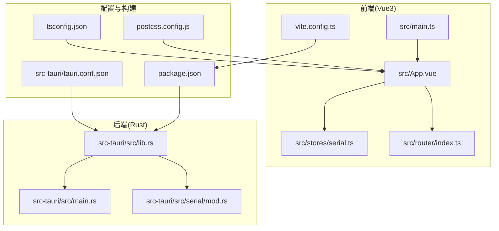
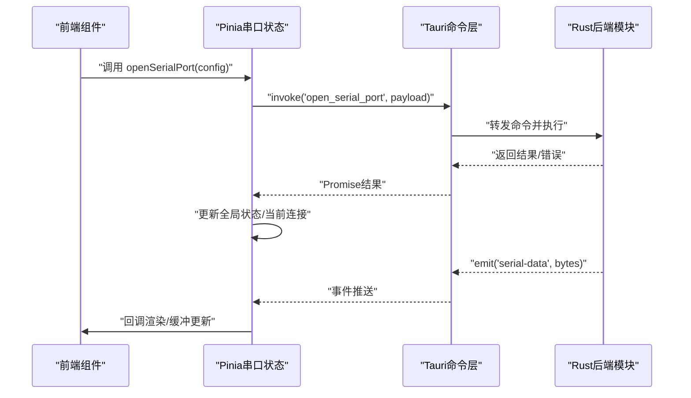
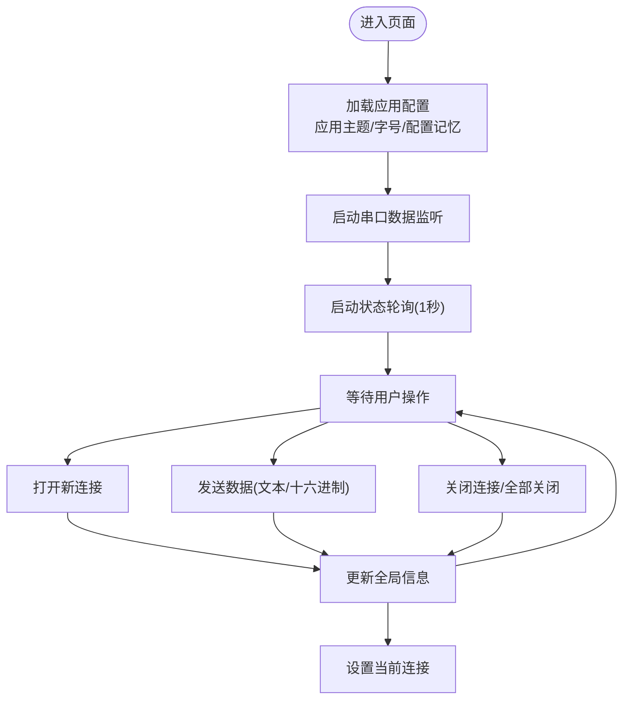
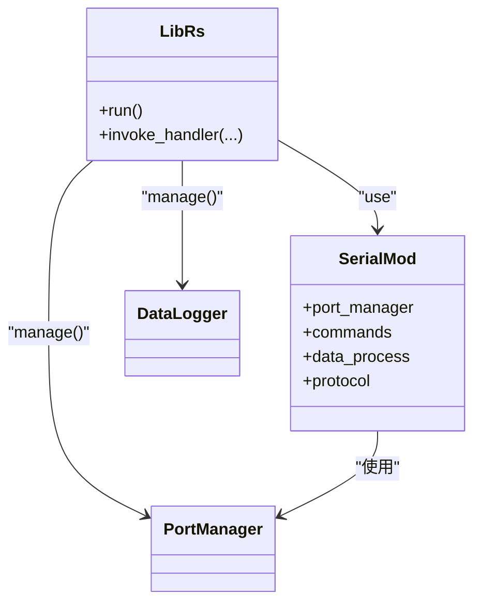
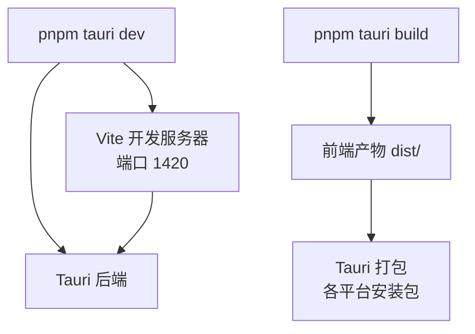
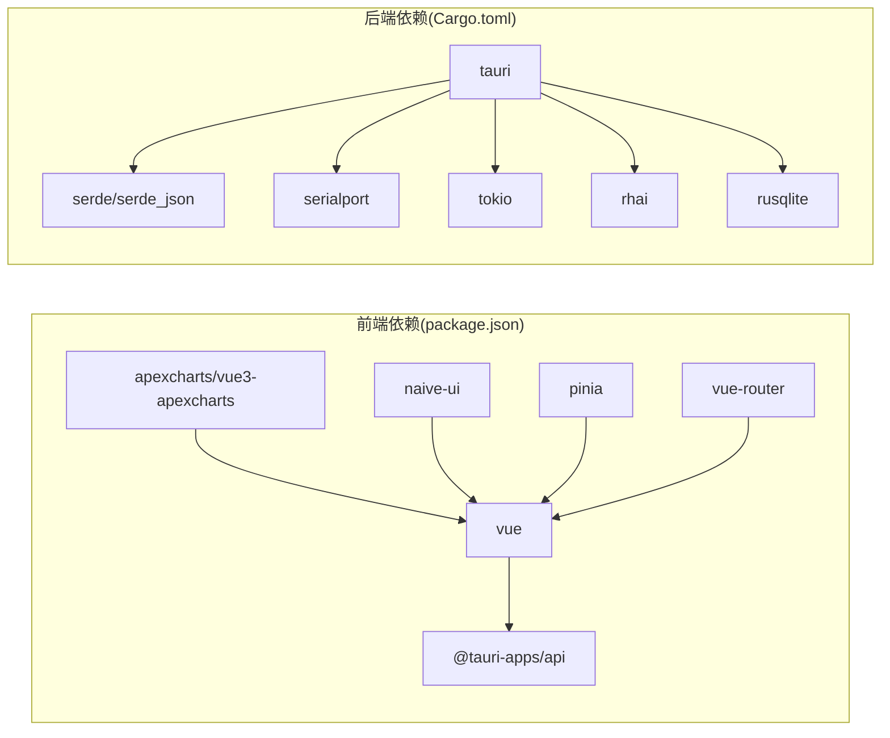

# 贡献指南

<cite>
**本文引用的文件**
- [README.md](file://README.md)
- [DESIGN.md](file://DESIGN.md)
- [package.json](file://package.json)
- [Cargo.toml](file://src-tauri/Cargo.toml)
- [vite.config.ts](file://vite.config.ts)
- [tauri.conf.json](file://src-tauri/tauri.conf.json)
- [tsconfig.json](file://tsconfig.json)
- [postcss.config.js](file://postcss.config.js)
- [src/main.ts](file://src/main.ts)
- [src/App.vue](file://src/App.vue)
- [src/stores/serial.ts](file://src/stores/serial.ts)
- [src-tauri/src/lib.rs](file://src-tauri/src/lib.rs)
- [src-tauri/src/main.rs](file://src-tauri/src/main.rs)
- [src-tauri/src/serial/mod.rs](file://src-tauri/src/serial/mod.rs)
</cite>

## 目录
1. [简介](#简介)
2. [项目结构](#项目结构)
3. [核心组件](#核心组件)
4. [架构总览](#架构总览)
5. [详细组件分析](#详细组件分析)
6. [依赖关系分析](#依赖关系分析)
7. [性能考量](#性能考量)
8. [故障排查指南](#故障排查指南)
9. [结论](#结论)
10. [附录](#附录)

## 简介
本指南面向希望参与 KonSerial 项目的开发者，提供从环境搭建、代码贡献流程、分支与 PR 规范、代码风格与测试要求、文档标准、问题与功能请求模板、社区行为准则、版本发布与变更日志维护，以及新贡献者入门与导师制度的完整参与指南。KonSerial 是一款基于 Tauri + Vue3 + Rust + TypeScript 的现代化串口调试工具，前后端职责清晰、模块化良好，适合多语言背景的贡献者协作。

## 项目结构
KonSerial 采用前后端分离架构：
- 前端：Vue 3 + TypeScript，使用 Vite 构建，Pinia 状态管理，Naive UI 组件库，ApexCharts 可视化，Tailwind CSS 样式体系。
- 后端：Rust + Tauri，通过命令接口与前端通信，使用 serialport 进行串口通信，tokio 异步运行时，rhai 脚本引擎，SQLite 数据持久化。
- 构建与打包：Vite + Tauri CLI，统一在 package.json 中定义脚本，tauri.conf.json 配置应用窗口、安全策略与打包目标。

**图表来源**
- [src/main.ts:1-14](file://src/main.ts#L1-L14)
- [src/App.vue:1-33](file://src/App.vue#L1-L33)
- [src/stores/serial.ts:1-363](file://src/stores/serial.ts#L1-L363)
- [src-tauri/src/lib.rs:1-84](file://src-tauri/src/lib.rs#L1-L84)
- [src-tauri/src/main.rs:1-7](file://src-tauri/src/main.rs#L1-L7)
- [src-tauri/src/serial/mod.rs:1-4](file://src-tauri/src/serial/mod.rs#L1-L4)
- [vite.config.ts:1-40](file://vite.config.ts#L1-L40)
- [tauri.conf.json:1-47](file://src-tauri/tauri.conf.json#L1-L47)
- [tsconfig.json:1-32](file://tsconfig.json#L1-L32)
- [postcss.config.js:1-6](file://postcss.config.js#L1-L6)
- [package.json:1-40](file://package.json#L1-L40)

**章节来源**
- [README.md: 30-56:30-56](file://README.md#L30-L56)
- [DESIGN.md: 34-139:34-139](file://DESIGN.md#L34-L139)
- [package.json: 1-40:1-40](file://package.json#L1-L40)
- [vite.config.ts: 1-40:1-40](file://vite.config.ts#L1-L40)
- [tauri.conf.json: 1-47:1-47](file://src-tauri/tauri.conf.json#L1-L47)
- [tsconfig.json: 1-32:1-32](file://tsconfig.json#L1-L32)
- [postcss.config.js: 1-6:1-6](file://postcss.config.js#L1-L6)

## 核心组件
- 前端应用入口与挂载：应用在 main.ts 创建并挂载，在 App.vue 中统一注入主题、消息与布局。
- 串口状态管理：stores/serial.ts 提供多连接模型、连接生命周期管理、数据缓冲与事件监听、轮询更新等能力。
- 后端命令注册：lib.rs 中集中注册命令（配置、串口、数据日志），并注入全局状态（如 PortManager、DataLogger）。
- 构建与开发：package.json 定义脚本，tauri.conf.json 指定开发/构建前置命令与前端产物目录，vite.config.ts 固定端口与 HMR 配置。

**章节来源**
- [src/main.ts: 1-14:1-14](file://src/main.ts#L1-L14)
- [src/App.vue: 1-L33:1-33](file://src/App.vue#L1-L33)
- [src/stores/serial.ts: 1-L363:1-363](file://src/stores/serial.ts#L1-L363)
- [src-tauri/src/lib.rs: 1-L84:1-84](file://src-tauri/src/lib.rs#L1-L84)
- [package.json: 6-11:6-11](file://package.json#L6-L11)
- [tauri.conf.json: 6-L11:6-11](file://src-tauri/tauri.conf.json#L6-L11)
- [vite.config.ts: 23-L38:23-38](file://vite.config.ts#L23-L38)

## 架构总览
KonSerial 的前后端边界清晰：前端负责 UI、状态与事件；后端负责系统级能力（串口、网络、文件系统、脚本执行）。前端通过 Tauri invoke 调用后端命令，后端通过事件推送数据到前端。

**图表来源**
- [src/stores/serial.ts: 157-L221:157-221](file://src/stores/serial.ts#L157-L221)
- [src-tauri/src/lib.rs: 56-L80:56-80](file://src-tauri/src/lib.rs#L56-L80)

**章节来源**
- [DESIGN.md: 7-L14:7-14](file://DESIGN.md#L7-L14)
- [src/stores/serial.ts: 297-L342:297-342](file://src/stores/serial.ts#L297-L342)
- [src-tauri/src/lib.rs: 47-L83:47-83](file://src-tauri/src/lib.rs#L47-L83)

## 详细组件分析

### 串口状态管理（Pinia Store）
- 多连接模型：每个连接拥有唯一 ID、状态机（断开/连接中/已连接/错误）、统计信息（收发字节数）。
- 事件监听：统一监听后端推送的串口数据事件，回调给订阅者，组件自行解码显示。
- 轮询更新：定时拉取全局运行时信息，保证 UI 与后端状态一致。
- 数据缓冲：全局接收缓冲限制长度，避免内存膨胀。

**图表来源**
- [src/App.vue: 14-L19:14-19](file://src/App.vue#L14-L19)
- [src/stores/serial.ts: 157-L221:157-221](file://src/stores/serial.ts#L157-L221)
- [src/stores/serial.ts: 344-L362:344-362](file://src/stores/serial.ts#L344-L362)

**章节来源**
- [src/stores/serial.ts: 1-L363:1-363](file://src/stores/serial.ts#L1-L363)
- [src/App.vue: 1-L33:1-33](file://src/App.vue#L1-L33)

### 后端命令与模块组织
- 命令注册：集中于 lib.rs 的 Builder.invoke_handler，涵盖配置、串口、数据日志等命令。
- 模块划分：serial、network、script、data_logger、visualization、utils 等子模块清晰。
- 全局状态：PortManager、DataLogger 作为单例注入，供命令使用。

**图表来源**
- [src-tauri/src/lib.rs: 1-L84:1-84](file://src-tauri/src/lib.rs#L1-L84)
- [src-tauri/src/serial/mod.rs: 1-L4:1-4](file://src-tauri/src/serial/mod.rs#L1-L4)

**章节来源**
- [src-tauri/src/lib.rs: 1-L84:1-84](file://src-tauri/src/lib.rs#L1-L84)
- [src-tauri/src/serial/mod.rs: 1-L4:1-4](file://src-tauri/src/serial/mod.rs#L1-L4)

### 开发与构建流程
- 开发：pnpm tauri dev 启动前端开发服务器与后端，固定前端端口 1420，HMR 通过 WebSocket 推送。
- 构建：pnpm tauri build 生成各平台安装包，产物位于 src-tauri/target/release/bundle。
- 配置：tauri.conf.json 指定 devUrl、前端构建产物目录、窗口尺寸与安全策略；package.json scripts 定义命令。

**图表来源**
- [vite.config.ts: 23-L38:23-38](file://vite.config.ts#L23-L38)
- [tauri.conf.json: 6-L11:6-11](file://src-tauri/tauri.conf.json#L6-L11)
- [package.json: 6-L11:6-11](file://package.json#L6-L11)

**章节来源**
- [README.md: 37-L56:37-56](file://README.md#L37-L56)
- [vite.config.ts: 1-L40:1-40](file://vite.config.ts#L1-L40)
- [tauri.conf.json: 1-L47:1-47](file://src-tauri/tauri.conf.json#L1-L47)
- [package.json: 1-L40:1-40](file://package.json#L1-L40)

## 依赖关系分析
- 前端依赖：Vue3、Pinia、vue-router、ApexCharts、Naive UI、@tauri-apps/* 插件等。
- 后端依赖：tauri、serialport、tokio、rhai、serde、rusqlite、chrono、log 等。
- 构建工具：Vite、TypeScript、Tailwind CSS、PostCSS。

**图表来源**
- [package.json: 12-L38:12-38](file://package.json#L12-L38)
- [Cargo.toml: 20-L40:20-40](file://src-tauri/Cargo.toml#L20-L40)

**章节来源**
- [package.json: 1-L40:1-40](file://package.json#L1-L40)
- [Cargo.toml: 1-L40:1-40](file://src-tauri/Cargo.toml#L1-L40)

## 性能考量
- 异步与并发：后端使用 tokio 异步读取串口数据，避免阻塞主线程。
- 前端渲染：ApexCharts 与 Tailwind CSS 提升交互与视觉性能；串口数据缓冲限制长度，防止内存暴涨。
- 构建优化：Vite 按需打包，严格端口与 HMR 配置减少开发时干扰。
- 数据处理：Rhai 脚本引擎在后端执行，减少前端负担。

**章节来源**
- [DESIGN.md: 300-L346:300-346](file://DESIGN.md#L300-L346)
- [src/stores/serial.ts: 102-L112:102-112](file://src/stores/serial.ts#L102-L112)
- [vite.config.ts: 23-L38:23-38](file://vite.config.ts#L23-L38)

## 故障排查指南
- 开发端口冲突：确保端口 1420 未被占用；若启用 HMR，确认主机与协议配置正确。
- 前端无法热更新：检查 vite.config.ts 的 host、strictPort、hmr 配置；确认忽略 src-tauri 目录。
- Tauri 命令调用失败：核对命令是否在 lib.rs 的 invoke_handler 中注册；检查前端 invoke 名称与参数。
- 串口无数据：确认串口权限与驱动；检查后端日志与事件推送；验证前端监听是否启动。
- 构建失败：确认 package.json 脚本顺序与 tauri.conf.json 的 beforeBuildCommand/前端产物目录一致。

**章节来源**
- [vite.config.ts: 23-L38:23-38](file://vite.config.ts#L23-L38)
- [tauri.conf.json: 6-L11:6-11](file://src-tauri/tauri.conf.json#L6-L11)
- [src-tauri/src/lib.rs: 56-L80:56-80](file://src-tauri/src/lib.rs#L56-L80)
- [src/App.vue: 14-L19:14-19](file://src/App.vue#L14-L19)

## 结论
KonSerial 提供清晰的前后端边界与模块化结构，适合多语言背景的贡献者协作。遵循本文档的流程与规范，可高效完成从环境搭建到代码贡献、从问题报告到版本发布的全流程工作。

## 附录

### 代码贡献流程与规范
- Fork 仓库并在本地克隆，创建功能分支，遵循语义化命名（如 feature/xxx、fix/xxx、docs/xxx）。
- 提交前请完成本地构建与运行验证，确保 Tauri 开发服务器与应用可正常启动。
- 提交信息使用英文，采用类型+主题格式（如 feat(serial): add new command）。
- 保持最小改动范围，避免无关格式化；必要时拆分为多个 PR。

### 分支管理与 Pull Request 要求
- 从主分支（main）派生功能分支，PR 目标分支为主分支。
- PR 必须包含变更摘要、影响范围说明与测试验证步骤。
- 至少一名维护者审查并通过 CI 校验后方可合并。

### 代码风格指南
- 前端（TypeScript/Vue）：遵循 tsconfig.json 的严格模式；组件命名采用 PascalCase；样式使用 Tailwind CSS 类。
- 后端（Rust）：遵循 Rust 社区风格（cargo fmt），模块组织清晰，错误处理使用 Result/Option，日志使用 log 宏。
- 命名规范：变量与函数使用 snake_case，常量使用 UPPER_SNAKE_CASE，类型使用 PascalCase。

### 测试要求
- 前端：为关键组件与组合式函数补充单元测试；对串口状态管理的关键流程（打开/关闭/发送/监听）进行端到端验证。
- 后端：为命令与模块编写单元测试；对串口读写、脚本执行、日志记录等关键路径进行集成测试。
- 构建与打包：确保 pnpm tauri build 可在本地与 CI 环境成功执行。

### 文档标准
- 新增功能需同步更新 README 与 DESIGN.md 对应章节。
- API 变更需在 DESIGN.md 中记录，并在 PR 描述中列出迁移指引。
- 示例与教程可放入 docs/ 目录，遵循 Markdown 语法与一致性格式。

### 开发环境设置与调试
- 环境要求：Node.js（LTS）、Rust（稳定版）、pnpm。
- 安装依赖后，使用 pnpm tauri dev 启动开发；如需远程 HMR，设置 TAURI_DEV_HOST。
- 如遇串口权限问题，请参考平台文档配置权限或管理员运行。

**章节来源**
- [README.md: 32-L48:32-48](file://README.md#L32-L48)
- [vite.config.ts: 6-L38:6-38](file://vite.config.ts#L6-L38)

### 问题报告与功能请求模板
- 问题报告模板（请在提交 Issue 时填写）：
  - 复现步骤
  - 预期行为
  - 实际行为
  - 环境信息（操作系统、Node/Rust 版本、Tauri 版本）
  - 日志与截图（如有）
- 功能请求模板（请在提交 Feature Request 时填写）：
  - 背景与动机
  - 期望功能描述
  - 影响范围与兼容性
  - 可选的实现思路

### 社区行为准则与沟通规范
- 尊重与包容：保持友善、尊重不同观点与背景。
- 建设性反馈：提出问题时附带可行的修复建议或替代方案。
- 积极沟通：在 Issue/PR 中及时回复与跟进，避免长时间无人响应。

### 版本发布流程与变更日志维护
- 版本号：遵循语义化版本（MAJOR.MINOR.PATCH）。
- 发布流程：维护者在主分支上打标签并创建 Release，CI 自动构建各平台安装包。
- 变更日志：在每次发布前汇总本次变更，记录新增、修复、破坏性变更与迁移指引。

### 新贡献者入门与导师制度
- 新贡献者可从文档完善、小 Bug 修复、UI 细节优化等入手，逐步深入核心模块。
- 导师制度：为每位新贡献者分配一位维护者导师，协助其完成首次贡献并融入社区。