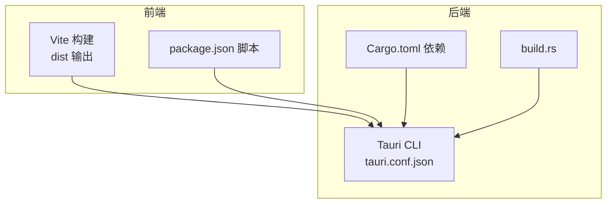
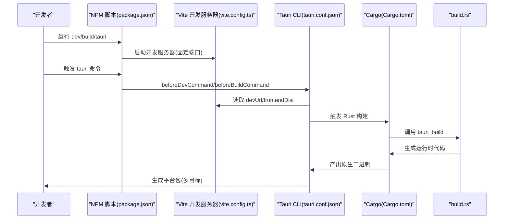
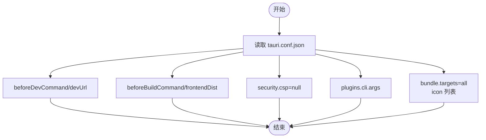
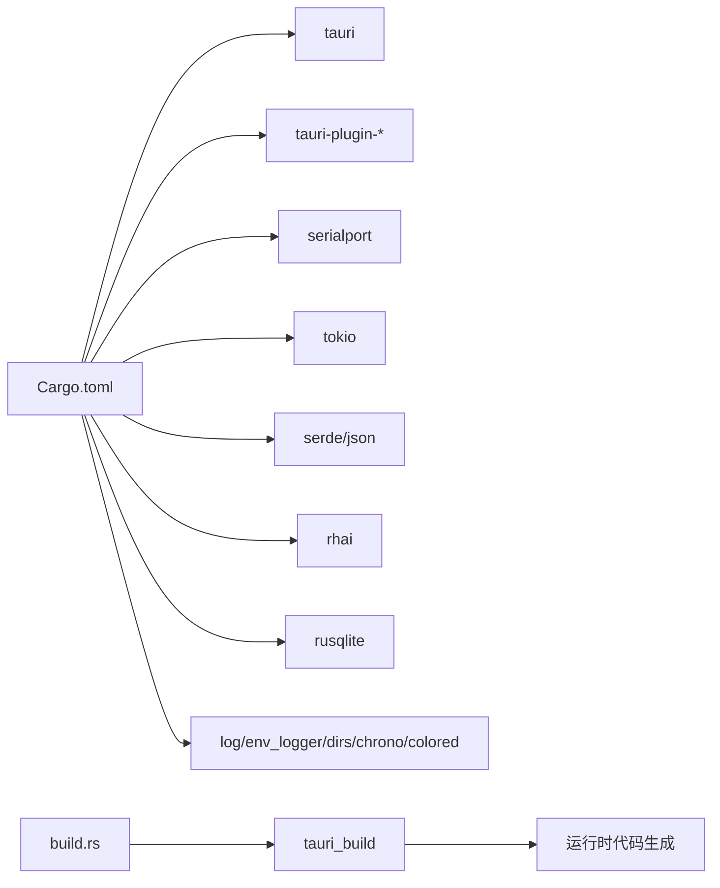
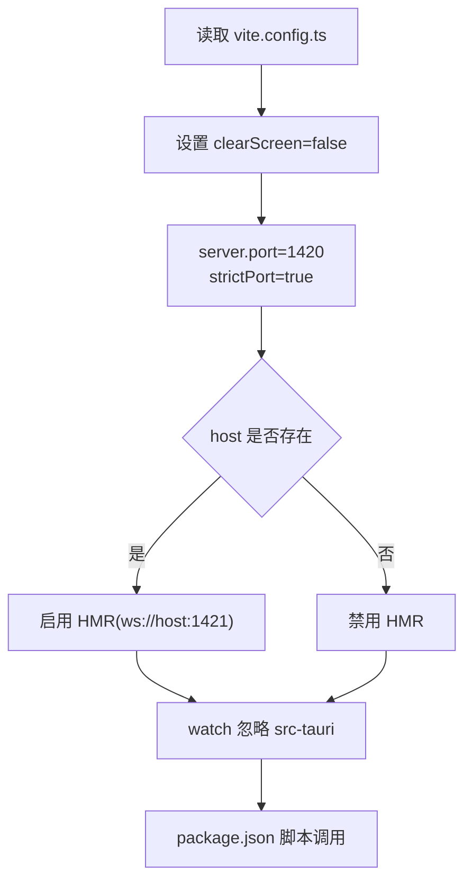
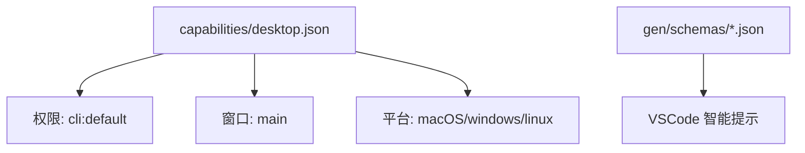
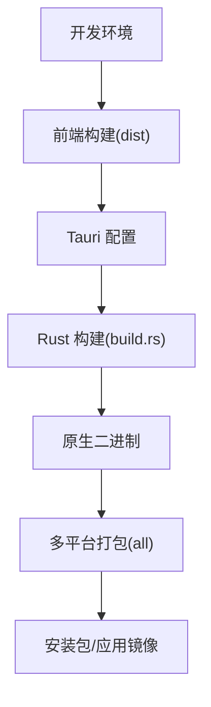
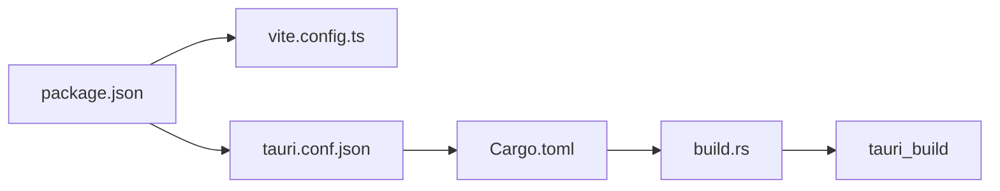

# 部署指南

<cite>
**本文引用的文件**
- [Cargo.toml](file://src-tauri/Cargo.toml)
- [tauri.conf.json](file://src-tauri/tauri.conf.json)
- [package.json](file://package.json)
- [vite.config.ts](file://vite.config.ts)
- [build.rs](file://src-tauri/build.rs)
- [desktop.json](file://src-tauri/capabilities/desktop.json)
- [.gitignore](file://src-tauri/.gitignore)
- [desktop-schema.json](file://src-tauri/gen/schemas/desktop-schema.json)
- [linux-schema.json](file://src-tauri/gen/schemas/linux-schema.json)
- [DESIGN.md](file://DESIGN.md)
</cite>

## 目录
1. [简介](#简介)
2. [项目结构](#项目结构)
3. [核心组件](#核心组件)
4. [架构总览](#架构总览)
5. [详细组件分析](#详细组件分析)
6. [依赖关系分析](#依赖关系分析)
7. [性能考量](#性能考量)
8. [故障排查指南](#故障排查指南)
9. [结论](#结论)
10. [附录](#附录)

## 简介
本指南面向运维与 DevOps 工程师，提供 KonSerial 的完整跨平台部署方案，涵盖 Windows、macOS、Linux 的打包与发布要点，解释 Tauri 配置中的部署相关选项与优化设置，阐述应用签名与安全策略，并给出持续集成与自动化部署的实践思路、生产环境性能优化与监控建议，以及分发渠道与版本管理策略。

## 项目结构
KonSerial 采用 Tauri + Vue3 + Rust 的混合架构，前端通过 Vite 构建，后端通过 Tauri CLI 与 Rust 生态集成。关键目录与文件如下：
- 前端：Vite + Vue3 + TypeScript，构建产物输出至 dist
- 后端：Tauri + Rust，配置位于 src-tauri/tauri.conf.json，依赖于 Cargo.toml
- 构建与打包：Tauri CLI 负责前端静态资源注入与平台打包；Rust Cargo 负责原生二进制与依赖编译
- 权限与能力：通过 capabilities/*.json 定义窗口与权限边界

**图示来源**
- [package.json:1-40](file://package.json#L1-L40)
- [vite.config.ts:1-40](file://vite.config.ts#L1-L40)
- [tauri.conf.json:1-47](file://src-tauri/tauri.conf.json#L1-L47)
- [Cargo.toml:1-40](file://src-tauri/Cargo.toml#L1-L40)
- [build.rs:1-4](file://src-tauri/build.rs#L1-L4)

**章节来源**
- [package.json:1-40](file://package.json#L1-L40)
- [vite.config.ts:1-40](file://vite.config.ts#L1-L40)
- [tauri.conf.json:1-47](file://src-tauri/tauri.conf.json#L1-L47)
- [Cargo.toml:1-40](file://src-tauri/Cargo.toml#L1-L40)
- [build.rs:1-4](file://src-tauri/build.rs#L1-L4)

## 核心组件
- 前端构建与开发服务器
  - Vite 固定端口与严格模式，确保 Tauri dev 与 build 场景的一致性
  - 忽略 src-tauri 目录，避免不必要的文件监听
- Tauri 应用配置
  - 开发与构建命令、前端产物路径、窗口尺寸与安全策略
  - 插件与打包目标配置
- Rust 依赖与构建
  - Tauri 2、tauri-plugin-* 插件、串口与异步运行时、数据库与日志等
  - build.rs 触发 tauri_build，生成运行时代码

**章节来源**
- [vite.config.ts:18-39](file://vite.config.ts#L18-L39)
- [tauri.conf.json:6-11](file://src-tauri/tauri.conf.json#L6-L11)
- [tauri.conf.json:20-23](file://src-tauri/tauri.conf.json#L20-L23)
- [tauri.conf.json:34-34](file://src-tauri/tauri.conf.json#L34-L34)
- [tauri.conf.json:35-45](file://src-tauri/tauri.conf.json#L35-L45)
- [Cargo.toml:20-39](file://src-tauri/Cargo.toml#L20-L39)
- [build.rs:1-4](file://src-tauri/build.rs#L1-L4)

## 架构总览
下图展示了从开发到打包的关键流程，以及各配置文件之间的协作关系。

**图示来源**
- [package.json:6-11](file://package.json#L6-L11)
- [vite.config.ts:18-39](file://vite.config.ts#L18-L39)
- [tauri.conf.json:6-11](file://src-tauri/tauri.conf.json#L6-L11)
- [Cargo.toml:17-19](file://src-tauri/Cargo.toml#L17-L19)
- [build.rs:1-4](file://src-tauri/build.rs#L1-L4)

## 详细组件分析

### Tauri 配置与打包目标
- 应用元信息与窗口
  - productName、version、identifier、窗口宽高
- 开发与构建命令
  - beforeDevCommand、devUrl、beforeBuildCommand、frontendDist
- 安全策略
  - security.csp 设置为 null，表示不强制 CSP
- 插件
  - cli 插件注册短参与参数
- 打包
  - bundle.targets 设置为 all，启用多平台打包
  - icon 列表包含多尺寸 PNG 与 icns、ico

**图示来源**
- [tauri.conf.json:1-47](file://src-tauri/tauri.conf.json#L1-L47)

**章节来源**
- [tauri.conf.json:1-47](file://src-tauri/tauri.conf.json#L1-L47)

### Rust 依赖与构建链路
- 依赖类别
  - 核心框架：tauri、tauri-plugin-*
  - 串口与网络：serialport、tokio
  - 数据处理：serde、serde_json、rhai、rusqlite
  - 日志与工具：log、env_logger、dirs、chrono、colored
  - 平台条件依赖：仅在非移动端启用 tauri-plugin-cli
- 构建链路
  - build.rs 调用 tauri_build
  - tauri-build 生成运行时代码与能力文件

**图示来源**
- [Cargo.toml:20-39](file://src-tauri/Cargo.toml#L20-L39)
- [build.rs:1-4](file://src-tauri/build.rs#L1-L4)

**章节来源**
- [Cargo.toml:1-40](file://src-tauri/Cargo.toml#L1-L40)
- [build.rs:1-4](file://src-tauri/build.rs#L1-L4)

### 前端构建与开发服务器
- Vite 配置要点
  - clearScreen=false，避免隐藏 Rust 错误
  - 固定端口 1420，strictPort=true
  - host 可通过环境变量 TAURI_DEV_HOST 控制
  - HMR 配置在 host 存在时启用
  - 忽略 src-tauri/watch 配置，避免误触发
- NPM 脚本
  - dev、build、preview、tauri

**图示来源**
- [vite.config.ts:18-39](file://vite.config.ts#L18-L39)
- [package.json:6-11](file://package.json#L6-L11)

**章节来源**
- [vite.config.ts:1-40](file://vite.config.ts#L1-L40)
- [package.json:1-40](file://package.json#L1-L40)

### 权限与能力配置
- 能力文件
  - desktop.json 定义桌面平台能力，包含 main 窗口与 cli:default 权限
  - 生成的 desktop-schema.json、linux-schema.json 提供能力 JSON Schema
- 作用
  - 限定窗口对 IPC 的访问范围，提升安全性

**图示来源**
- [desktop.json:1-14](file://src-tauri/capabilities/desktop.json#L1-L14)
- [desktop-schema.json:1-67](file://src-tauri/gen/schemas/desktop-schema.json#L1-L67)
- [linux-schema.json:1-67](file://src-tauri/gen/schemas/linux-schema.json#L1-L67)

**章节来源**
- [desktop.json:1-14](file://src-tauri/capabilities/desktop.json#L1-L14)
- [desktop-schema.json:1-67](file://src-tauri/gen/schemas/desktop-schema.json#L1-L67)
- [linux-schema.json:1-67](file://src-tauri/gen/schemas/linux-schema.json#L1-L67)

### 概念总览
下图为应用从开发到发布的概念流程，帮助理解各组件在部署阶段的职责。

[此图为概念流程，不对应具体源码文件，故无“图示来源”]

## 依赖关系分析
- 组件耦合
  - package.json 与 vite.config.ts 耦合于开发服务器端口与 HMR
  - tauri.conf.json 与 package.json 耦合于 beforeDevCommand/beforeBuildCommand 与 frontendDist
  - build.rs 与 tauri-build 耦合于运行时代码生成
- 外部依赖
  - Tauri 2 与插件生态
  - Rust 生态（serialport、tokio、rhai、rusqlite 等）
- 潜在环路
  - 未见直接循环依赖；若自定义脚本或插件扩展，需避免在构建阶段引入反向依赖

**图示来源**
- [package.json:6-11](file://package.json#L6-L11)
- [vite.config.ts:18-39](file://vite.config.ts#L18-L39)
- [tauri.conf.json:6-11](file://src-tauri/tauri.conf.json#L6-L11)
- [Cargo.toml:17-19](file://src-tauri/Cargo.toml#L17-L19)
- [build.rs:1-4](file://src-tauri/build.rs#L1-L4)

**章节来源**
- [package.json:1-40](file://package.json#L1-L40)
- [vite.config.ts:1-40](file://vite.config.ts#L1-L40)
- [tauri.conf.json:1-47](file://src-tauri/tauri.conf.json#L1-L47)
- [Cargo.toml:1-40](file://src-tauri/Cargo.toml#L1-L40)
- [build.rs:1-4](file://src-tauri/build.rs#L1-L4)

## 性能考量
- 前端性能
  - 固定开发端口与严格模式减少网络与热更新干扰
  - 忽略 src-tauri 监听降低文件系统压力
- 后端性能
  - 异步运行时 tokio 与串口库配合，避免阻塞主线程
  - 数据库 rusqlite(bundled) 适合桌面场景，注意 I/O 优化
- 打包体积
  - 使用 Tauri 2 的精简运行时，结合插件按需启用
  - 仅在非移动端启用 cli 插件，减少冗余依赖

[本节为通用性能建议，不直接分析具体文件，故无“章节来源”]

## 故障排查指南
- 开发服务器端口冲突
  - 现象：启动失败或端口被占用
  - 处理：确认 vite.config.ts 中 server.port=1420 且 strictPort=true；必要时调整端口或释放占用
- HMR 不生效
  - 现象：修改前端代码不热更新
  - 处理：检查 TAURI_DEV_HOST 环境变量与 HMR 配置；确认 vite.config.ts 的 host 与 ws 配置
- 打包目标缺失
  - 现象：仅生成部分平台包
  - 处理：确认 tauri.conf.json 中 bundle.targets 为 all；确保各平台工具链就绪
- 权限不足导致功能异常
  - 现象：文件系统或串口操作失败
  - 处理：核对 capabilities/desktop.json 的权限声明；必要时扩展允许路径或接口
- 构建失败
  - 现象：Rust 编译报错或 tauri_build 生成失败
  - 处理：查看 build.rs 输出与 Cargo.toml 依赖；确保 tauri-build 版本与配置兼容

**章节来源**
- [vite.config.ts:23-33](file://vite.config.ts#L23-L33)
- [tauri.conf.json:35-45](file://src-tauri/tauri.conf.json#L35-L45)
- [desktop.json:11-13](file://src-tauri/capabilities/desktop.json#L11-L13)
- [build.rs:1-4](file://src-tauri/build.rs#L1-L4)

## 结论
KonSerial 的部署以 Tauri 2 为核心，结合 Vite 前端与 Rust 后端，形成跨平台原生体验。通过合理的 Tauri 配置、严格的开发服务器设置、最小化依赖与能力权限控制，可在 Windows、macOS、Linux 上稳定打包与发布。建议在 CI 中固化构建步骤与签名流程，在生产环境中关注性能与可观测性，并建立规范的版本与渠道管理。

[本节为总结性内容，不直接分析具体文件，故无“章节来源”]

## 附录

### 跨平台打包与发布清单
- Windows
  - 准备 .exe/.msi 包装材料与代码签名证书
  - 确认 tauri.conf.json 中 icon 包含 .ico
- macOS
  - 准备 .app/.dmg/.pkg 包装材料与公证流程
  - 确认 tauri.conf.json 中 icon 包含 .icns
- Linux
  - 准备 AppImage、deb、rpm 等包格式
  - 确认 tauri.conf.json 中 icon 包含 PNG 多尺寸

**章节来源**
- [tauri.conf.json:38-44](file://src-tauri/tauri.conf.json#L38-L44)

### 安全与签名策略
- 应用签名
  - Windows：使用代码签名证书，启用驱动程序签名（如适用）
  - macOS：使用 Developer ID 或 Apple Silicon 适配，启用公证
  - Linux：AppImage 可不签名，但建议提供校验摘要
- 代码完整性与安全策略
  - 保持 Tauri 与插件版本更新
  - 使用能力文件限制窗口权限，避免过度授权
  - 关注 CSP 设置与内容来源策略

**章节来源**
- [tauri.conf.json:20-23](file://src-tauri/tauri.conf.json#L20-L23)
- [desktop.json:11-13](file://src-tauri/capabilities/desktop.json#L11-L13)

### 持续集成与自动化部署
- 建议流水线步骤
  - 安装 Node、Rust、平台 SDK
  - 运行 npm install 与 cargo fetch
  - 执行 npm run build 与 tauri build
  - 上传产物至制品库并生成发布说明
- 环境变量与密钥
  - 为签名与发布配置必要的环境变量与密钥存储

[本节为通用实践建议，不直接分析具体文件，故无“章节来源”]

### 生产环境优化与监控
- 性能优化
  - 前端：启用压缩与缓存策略，合理拆分代码
  - 后端：优化串口与 I/O 操作，避免阻塞事件循环
- 监控与日志
  - 后端：使用 env_logger 或结构化日志，收集运行时指标
  - 前端：上报关键错误与性能指标

[本节为通用实践建议，不直接分析具体文件，故无“章节来源”]

### 分发渠道与版本管理
- 渠道建议
  - 官方网站直发、GitHub Releases、应用商店（按平台政策）
- 版本管理
  - 使用语义化版本号，区分主次版本与补丁
  - 为每个平台维护独立变更日志

[本节为通用实践建议，不直接分析具体文件，故无“章节来源”]