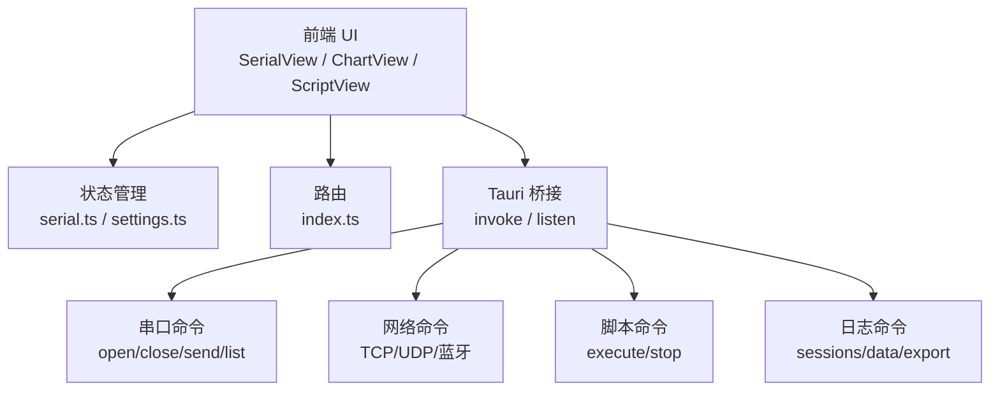
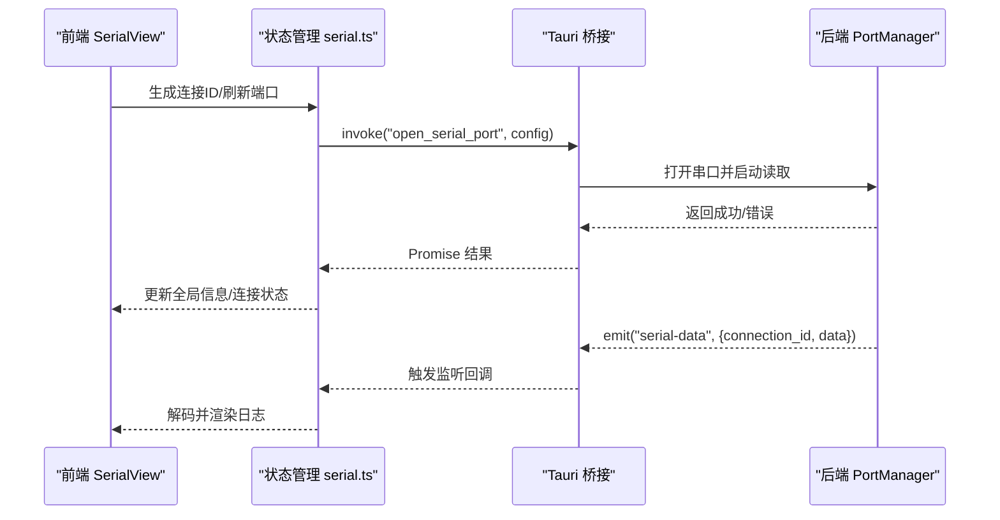
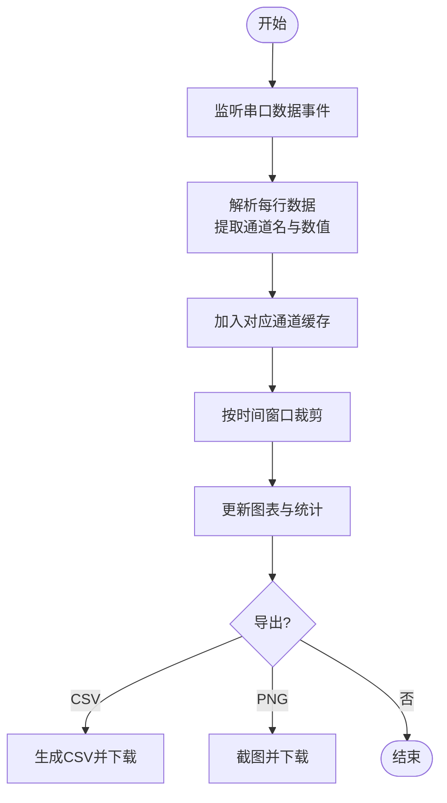
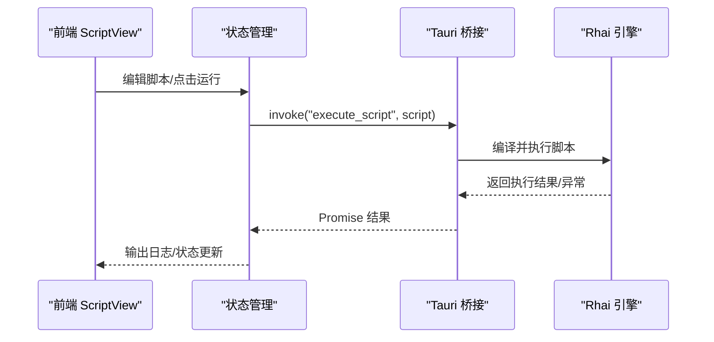
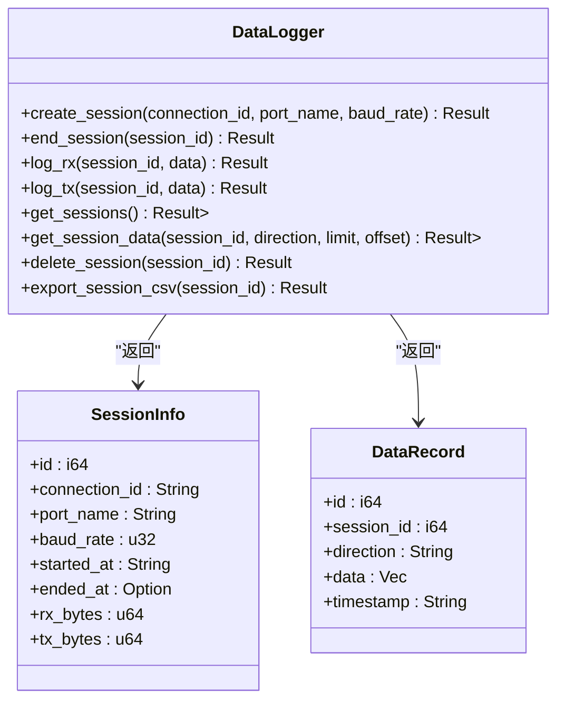
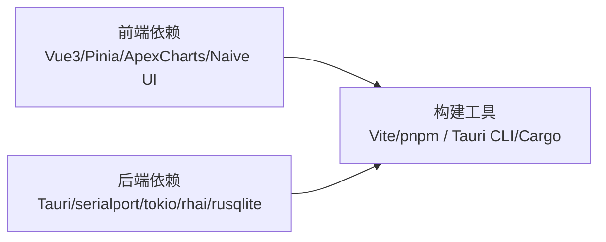

# 项目概述

<cite>
**本文引用的文件**
- [README.md](file://README.md)
- [DESIGN.md](file://DESIGN.md)
- [package.json](file://package.json)
- [Cargo.toml](file://src-tauri/Cargo.toml)
- [tauri.conf.json](file://src-tauri/tauri.conf.json)
- [main.ts](file://src/main.ts)
- [lib.rs](file://src-tauri/src/lib.rs)
- [serial.ts](file://src/stores/serial.ts)
- [SerialView.vue](file://src/views/SerialView.vue)
- [ChartView.vue](file://src/views/ChartView.vue)
- [ScriptView.vue](file://src/views/ScriptView.vue)
- [index.ts](file://src/router/index.ts)
- [data_logger/mod.rs](file://src-tauri/src/data_logger/mod.rs)
</cite>

## 目录
1. [引言](#引言)
2. [项目结构](#项目结构)
3. [核心组件](#核心组件)
4. [架构总览](#架构总览)
5. [详细组件分析](#详细组件分析)
6. [依赖关系分析](#依赖关系分析)
7. [性能考量](#性能考量)
8. [故障排查指南](#故障排查指南)
9. [结论](#结论)
10. [附录](#附录)

## 引言
KonSerial 是一款基于 Tauri + Vue3 + Rust + TypeScript 构建的现代化、轻量化串口调试工具。项目融合了 VOFA+ 与串口调试助手的能力，提供多串口同时管理、数据收发、波形显示、文件发送、自定义脚本、数据保存与多协议调试等综合能力。其设计强调“安全优先、前后端分离、性能优化、可维护性”，通过 Rust 后端处理系统级操作（串口、网络、文件），前端负责展示与交互，实现高性能与易维护性的平衡。

## 项目结构
项目采用“前后端分离 + 桌面应用打包”的组织方式：
- 前端（Vue3 + TypeScript）位于 src/，包含页面视图、组件、状态管理、路由与工具函数。
- 后端（Rust + Tauri）位于 src-tauri/，包含串口通信、网络通信、脚本引擎、数据日志、可视化等模块。
- 构建与打包通过 Vite（前端）与 Tauri CLI（桌面应用）完成；依赖管理分别由 package.json（Node）与 Cargo.toml（Rust）负责。

```mermaid
graph TB
subgraph "前端(src)"
FE_App["App.vue<br/>main.ts"]
FE_Router["路由: index.ts"]
FE_Views["页面视图<br/>SerialView.vue / ChartView.vue / ScriptView.vue"]
FE_Stores["状态管理<br/>serial.ts 等"]
FE_Assets["样式与资源"]
end
subgraph "后端(src-tauri)"
BE_Lib["lib.rs<br/>应用入口与命令注册"]
BE_Serial["串口模块<br/>port_manager.rs / commands.rs"]
BE_Network["网络模块<br/>tcp/udp/bluetooth"]
BE_Script["脚本模块<br/>engine/context/api"]
BE_DataLogger["数据日志模块<br/>SQLite 会话与数据"]
BE_Visualization["可视化模块"]
BE_Utils["工具模块<br/>logger/config"]
end
subgraph "构建与打包"
Build["Vite + pnpm (前端)"]
Bundle["Tauri CLI (桌面应用)"]
end
FE_App --> FE_Router
FE_Router --> FE_Views
FE_Views --> FE_Stores
FE_Views --> FE_App
FE_App < --> BE_Lib
BE_Lib --> BE_Serial
BE_Lib --> BE_Network
BE_Lib --> BE_Script
BE_Lib --> BE_DataLogger
BE_Lib --> BE_Visualization
BE_Lib --> BE_Utils
Build --> Bundle
Bundle --> FE_App
```

**图表来源**
- [main.ts:1-14](file://src/main.ts#L1-L14)
- [index.ts:1-38](file://src/router/index.ts#L1-L38)
- [lib.rs:24-84](file://src-tauri/src/lib.rs#L24-L84)

**章节来源**
- [README.md:104-119](file://README.md#L104-L119)
- [package.json:1-40](file://package.json#L1-L40)
- [Cargo.toml:1-40](file://src-tauri/Cargo.toml#L1-L40)
- [tauri.conf.json:1-47](file://src-tauri/tauri.conf.json#L1-L47)

## 核心组件
- 多串口同时管理：前端通过标签页切换不同串口连接，后端以连接 ID 管理多个串口实例，支持并发收发与状态统计。
- 数据收发：前端支持 ASCII/十六进制发送与显示，后端通过 serialport 库实现串口读写，并通过事件推送接收数据。
- 波形显示：前端解析“name:value”格式数据，按通道聚合并绘制折线图；后端提供数据缓存与导出能力。
- 文件发送：前端选择文件并通过后端分块发送，支持进度跟踪与大文件处理。
- 自定义脚本：前端脚本编辑器，后端集成 Rhai 引擎，提供串口与网络操作 API。
- 数据保存：后端基于 SQLite 的数据日志模块，支持会话管理、数据查询与 CSV 导出。
- 多协议调试：除串口外，支持 TCP/UDP 与蓝牙串口（设计文档中明确列出）。

**章节来源**
- [README.md:5-19](file://README.md#L5-L19)
- [DESIGN.md:26-32](file://DESIGN.md#L26-L32)
- [serial.ts:145-240](file://src/stores/serial.ts#L145-L240)
- [ChartView.vue:71-114](file://src/views/ChartView.vue#L71-L114)
- [data_logger/mod.rs:22-44](file://src-tauri/src/data_logger/mod.rs#L22-L44)

## 架构总览
KonSerial 采用“前端展示 + 后端能力”的分层架构：
- 前端：Vue3 Composition API + TypeScript + Naive UI + Pinia + Vue Router，负责用户交互、状态展示与事件驱动。
- 后端：Rust + Tauri，提供系统级能力（串口、网络、文件）、异步处理（tokio）、脚本执行（Rhai）、数据持久化（SQLite）。
- 通信：前端通过 Tauri invoke 调用后端命令，后端通过 emit 推送事件，实现松耦合交互。



**图表来源**
- [lib.rs:56-80](file://src-tauri/src/lib.rs#L56-L80)
- [serial.ts:145-240](file://src/stores/serial.ts#L145-L240)
- [index.ts:5-34](file://src/router/index.ts#L5-L34)

**章节来源**
- [DESIGN.md:7-14](file://DESIGN.md#L7-L14)
- [lib.rs:47-84](file://src-tauri/src/lib.rs#L47-L84)

## 详细组件分析

### 串口通信与多连接管理
- 前端通过 Pinia 管理全局串口状态，支持生成唯一连接 ID、刷新端口列表、打开/关闭连接、发送数据与监听事件。
- 后端以 PortManager 管理多个串口连接，提供异步读取与事件推送，配合 DataLogger 记录会话与数据。
- 支持多连接标签页切换，每个连接独立配置与统计。



**图表来源**
- [SerialView.vue:157-189](file://src/views/SerialView.vue#L157-L189)
- [serial.ts:157-179](file://src/stores/serial.ts#L157-L179)
- [lib.rs:63-75](file://src-tauri/src/lib.rs#L63-L75)

**章节来源**
- [SerialView.vue:1-746](file://src/views/SerialView.vue#L1-L746)
- [serial.ts:1-363](file://src/stores/serial.ts#L1-L363)
- [lib.rs:63-75](file://src-tauri/src/lib.rs#L63-L75)

### 波形显示与数据解析
- 前端解析“name:value”格式的串口数据，按通道聚合并维护滑动窗口，支持时间范围、自动缩放、网格与线条宽度等配置。
- 支持导出 CSV 与截图 PNG，便于离线分析与分享。
- 后端提供接收数据缓存，前端按需消费，避免阻塞 UI。



**图表来源**
- [ChartView.vue:71-114](file://src/views/ChartView.vue#L71-L114)
- [ChartView.vue:142-201](file://src/views/ChartView.vue#L142-L201)
- [serial.ts:105-112](file://src/stores/serial.ts#L105-L112)

**章节来源**
- [ChartView.vue:1-800](file://src/views/ChartView.vue#L1-L800)
- [serial.ts:96-118](file://src/stores/serial.ts#L96-L118)

### 自定义脚本与自动化
- 前端提供脚本编辑器，支持新建、保存、运行与停止，具备行号与基本统计。
- 后端集成 Rhai 脚本引擎，暴露串口与网络操作 API，支持定时发送、条件判断等自动化场景。
- 设计文档中明确脚本模块与 API 接口规划。



**图表来源**
- [ScriptView.vue:60-75](file://src/views/ScriptView.vue#L60-L75)
- [DESIGN.md:348-396](file://DESIGN.md#L348-L396)

**章节来源**
- [ScriptView.vue:1-442](file://src/views/ScriptView.vue#L1-L442)
- [DESIGN.md:117-121](file://DESIGN.md#L117-L121)

### 数据保存与历史管理
- 后端基于 SQLite 的 DataLogger 模块，提供会话创建/结束、数据记录（TX/RX）、查询与导出 CSV。
- 前端通过命令调用获取会话列表与数据，支持分页与方向过滤。



**图表来源**
- [data_logger/mod.rs:22-44](file://src-tauri/src/data_logger/mod.rs#L22-L44)
- [data_logger/mod.rs:115-141](file://src-tauri/src/data_logger/mod.rs#L115-L141)
- [data_logger/mod.rs:203-244](file://src-tauri/src/data_logger/mod.rs#L203-L244)
- [data_logger/mod.rs:257-271](file://src-tauri/src/data_logger/mod.rs#L257-L271)

**章节来源**
- [data_logger/mod.rs:1-273](file://src-tauri/src/data_logger/mod.rs#L1-L273)
- [lib.rs:75-80](file://src-tauri/src/lib.rs#L75-L80)

### 多协议调试（串口/TCP/UDP/蓝牙）
- 设计文档明确支持串口协议（UART/RS232/RS485）、TCP/UDP 与蓝牙串口协议。
- 前端路由包含网络与蓝牙页面，后端模块提供相应客户端实现（TCP/UDP/蓝牙）。

**章节来源**
- [README.md:93-98](file://README.md#L93-L98)
- [DESIGN.md:112-116](file://DESIGN.md#L112-L116)
- [index.ts:16-32](file://src/router/index.ts#L16-L32)

## 依赖关系分析
- 前端依赖：Vue3、Naive UI、Pinia、Vue Router、ApexCharts、Rust Tauri 插件（fs/dialog/clipboard/opener）。
- 后端依赖：Tauri、serialport、tokio、rhai、rusqlite、chrono、log/env_logger、dirs 等。
- 构建工具：Vite、pnpm（前端），Tauri CLI、Cargo（后端）。



**图表来源**
- [package.json:12-38](file://package.json#L12-L38)
- [Cargo.toml:20-40](file://src-tauri/Cargo.toml#L20-L40)

**章节来源**
- [package.json:1-40](file://package.json#L1-L40)
- [Cargo.toml:1-40](file://src-tauri/Cargo.toml#L1-L40)

## 性能考量
- 异步与非阻塞：后端使用 tokio 处理串口读写与后台任务，避免阻塞 UI 线程。
- 数据缓存与裁剪：前端对接收数据设置最大缓冲区，按时间窗口裁剪，保证图表渲染性能。
- 事件驱动：通过事件推送减少轮询，降低 CPU 占用。
- SQLite 优化：启用 WAL 模式与索引，提升查询与写入性能。

**章节来源**
- [DESIGN.md:308-346](file://DESIGN.md#L308-L346)
- [ChartView.vue:91-96](file://src/views/ChartView.vue#L91-L96)
- [data_logger/mod.rs:76-106](file://src-tauri/src/data_logger/mod.rs#L76-L106)

## 故障排查指南
- 串口无法打开：检查端口权限、设备占用与配置参数；前端刷新端口列表并重试。
- 数据不显示：确认连接状态、编码设置（UTF-8/GBK）与十六进制显示开关；查看日志输出。
- 脚本执行异常：检查语法与 API 使用；查看脚本输出日志定位错误。
- 数据导出失败：确认会话存在与数据完整性；尝试重新导出 CSV。

**章节来源**
- [SerialView.vue:234-253](file://src/views/SerialView.vue#L234-L253)
- [ScriptView.vue:88-96](file://src/views/ScriptView.vue#L88-L96)
- [data_logger/mod.rs:257-271](file://src-tauri/src/data_logger/mod.rs#L257-L271)

## 结论
KonSerial 通过“前端现代化 + 后端高性能”的架构设计，实现了多串口并发管理、实时数据收发与波形展示、文件发送、自定义脚本与数据持久化等核心能力。其技术栈选择兼顾性能与可维护性，适合工程师与爱好者在多平台上进行高效、稳定的串口调试与自动化测试工作。

## 附录
- 项目背景与目标用户：面向嵌入式开发者、硬件工程师与自动化测试人员，提供跨平台、易扩展的串口调试解决方案。
- 与其他工具的差异化：相比传统串口助手，KonSerial 更注重“多连接并发、波形可视化、脚本自动化、数据持久化与跨平台打包”。

**章节来源**
- [README.md:1-127](file://README.md#L1-L127)
- [DESIGN.md:3-14](file://DESIGN.md#L3-L14)